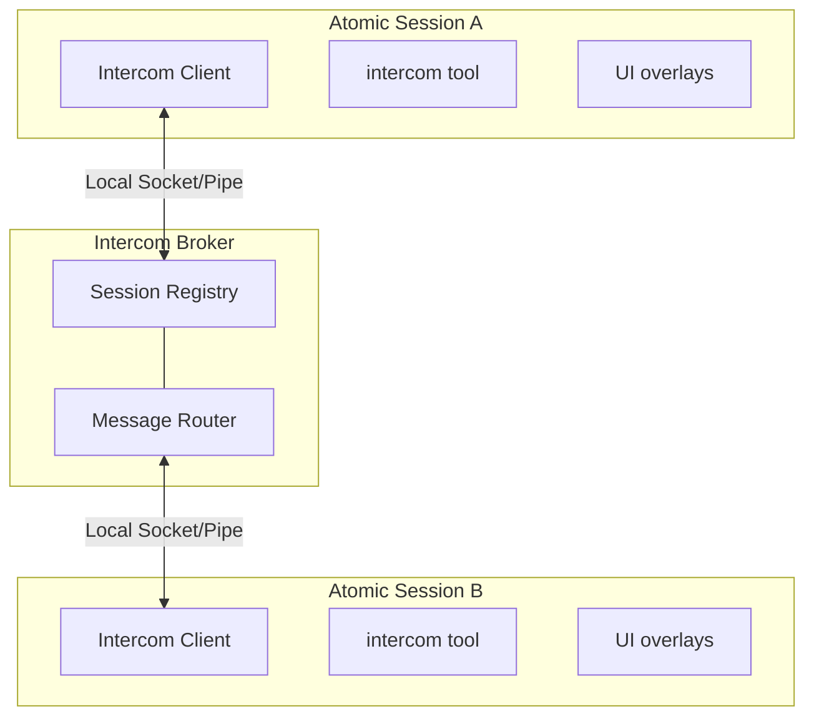

# Historical intercom documentation

These blocks preserve the documentation at baseline `59586efd26afd32a27c999ac8bcce102777e40e4` for issue #2847. They are historical evidence, not current instructions. Current documentation incorporates main `cb13229bebe30ea7cb65689569569494b4bc651c`. The original baseline inventory and destination map remain unchanged.

<!-- baseline-block: intercom::007 -->

Source: `packages/coding-agent/docs/intercom.md` lines 107–123 at `59586efd26afd32a27c999ac8bcce102777e40e4`. Current destination: `packages/coding-agent/docs/intercom.md#receiving-messages`.

### Receiving Messages

When a message arrives, it appears inline in your chat with the sender's info and a reply hint:

```
**From research** (~/projects/api)

To reply, use the intercom tool: intercom({ action: "reply", message: "..." })

Found the issue — UserService.validate() doesn't check for null input.
See auth.ts:142-156.
```

The reply hint (enabled by default) points to `intercom({ action: "reply", ... })`, so recipients never need raw sender or `replyTo` IDs. Idle recipients get a new turn immediately; busy interactive recipients receive the message once they go idle. Attachment content is included in the agent-visible body, and messages are rendered inline and stored in Atomic session history.

Atomic treats ordinary `intercom` as a mandatory runtime tool in main chat and every workflow model stage. Tool allowlists, exclusions, `noTools`, optional-extension restrictions, and reloads cannot unload or deactivate it. Restrictions on every other tool are unchanged, and `contact_supervisor` remains subagent-only. Tool registration is lightweight; broker connection and heavy initialization remain lazy until an Intercom surface is used.

<!-- baseline-block: intercom::008 -->

Source: `packages/coding-agent/docs/intercom.md` lines 124–137 at `59586efd26afd32a27c999ac8bcce102777e40e4`. Current destination: `packages/coding-agent/docs/intercom/operations.md#how-connection-works`.

## How Connection Works

Intercom connections are normally tool-driven. Ordinary sessions and delegated children load and register the lightweight wrapper at startup, while broker connection and heavy initialization wait until an Intercom tool, `/intercom`, or the ALT+M overlay is invoked. One exception is supervisor authorization: launching an Intercom-enabled subagent connects the parent runtime long enough to request a broker capability for that child; the child's own connection remains lazy until it invokes `contact_supervisor`. The parent restores issued capabilities across reconnects, and the child uses the broker-confirmed current supervisor ID. Concurrent callers share one import and connection attempt, and broker state is leased to the active session generation and cleaned up on shutdown or replacement.

A session becomes intercom-connected when all of these are true:

- the mandatory bundled Intercom extension is loaded in that Atomic model session
- the model or user has invoked an Intercom surface in that session, **or** the parent runtime is authorizing an Intercom-enabled child supervisor relationship
- the local broker is running or can be auto-started

The session list only shows intercom-connected sessions, not every open Atomic process on the machine.

Name sessions with `/name` so they can target each other (for example `/name planner` and `/name worker`). If a session is unnamed, Intercom exposes a runtime-only fallback alias like `subagent-chat-1a2b3c4d-1111-4222-8333-123456789abc` so other sessions can still target it. That alias is not persisted as the session title, so resume pickers keep showing the transcript snippet instead of a generic name.

<!-- baseline-block: intercom::010 -->

Source: `packages/coding-agent/docs/intercom.md` lines 149–172 at `59586efd26afd32a27c999ac8bcce102777e40e4`. Current destination: `packages/coding-agent/docs/intercom/reference.md#actions`.

### Actions

| Action | Behavior |
|--------|----------|
| `join` | Adds a trimmed named group membership and creates the group if needed. The action waits for broker acknowledgement and reports the complete resulting membership set. `default` is shared; `true` and `auto` are reserved for subagent auto-groups. |
| `leave` | With `group`, removes only that membership and keeps all others. Without `group`, resets the session to its resolved startup home group. Both forms report the resulting membership set. |
| `groups` | Lists every group represented by a connected session, with its session count and a marker for each group this session belongs to. Use it to discover names rather than guessing. |
| `list` | Returns the current session, active sessions sharing a membership, materialized workflow stages labeled `PENDING` or `RUNNING` with canonical path targets, and possible future literals, globs, and child paths with queued counts. Pass `group` for a read-only view of one group. |
| `send` | Fire-and-forget delivery through ordinary Intercom. A live workflow-stage match receives the message immediately. A pending, future, name, or pattern path is persisted as sticky delivery and returns `queued`; valid paths outside the known set also return `notInKnownSet`. Requires `to` and `message`; cannot message the current session. |
| `ask` | Sends a message and blocks until a live recipient replies (10-minute timeout). An ask to a known workflow stage whose session has not initialized is refused with `pending_stage_ask_unsupported` and recommends ordinary `send`; holding a waiter until a stage eventually starts would be unbounded. A live recipient disconnect fails promptly. From a foreground child to its launching parent, the existing fresh-subagent handoff path remains unchanged. |
| `reply` | Replies to the intercom-triggered message of the current turn; otherwise falls back to the single unresolved inbound ask. With multiple pending asks, pass `to` or inspect with `pending` first. |
| `pending` | Lists unresolved inbound asks with sender, message ID, elapsed time, and a short preview. |
| `status` | Shows connection status, session ID, every group this session belongs to, and the count of active sessions visible through those memberships. A `group` filter remains a read-only peek. |

To give two plain chat sessions a private shared membership, have both call:

```typescript
intercom({ action: "join", group: "api-review" })
```

Joining is additive: existing memberships remain active, and the broker updates presence without changing the session ID. Use `intercom({ action: "groups" })` to discover all available names and membership markers. `intercom({ action: "leave", group: "api-review" })` removes only that membership; `intercom({ action: "leave" })` resets to the home group resolved at startup. Rejected or unacknowledged changes leave client and inheritance state unchanged. Ordinary delivery requires a shared membership, while `contact_supervisor` retains its capability-based cross-group path.

Sent and received messages are recorded in session history as `intercom_sent` / `intercom_received` entries.

<!-- baseline-block: intercom::011 -->

Source: `packages/coding-agent/docs/intercom.md` lines 173–178 at `59586efd26afd32a27c999ac8bcce102777e40e4`. Current destination: `packages/coding-agent/docs/intercom/reference.md#targeting-sessions-and-pending-workflow-stages`.

### Targeting Sessions and Pending Workflow Stages

Live-session lookup accepts only an exact full Intercom session ID or an exact case-insensitive session name. Workflow stages use the canonical `workflow:<rootRunId>/<segment>[/<segment>...]` path printed by `intercom list` and workflow status surfaces; an exact target works while the row is `PENDING` and after it becomes `RUNNING`. Each segment may be a stage name, run id, or glob: `*` matches one segment and may be embedded, while `**` matches any depth. Status surfaces label pending stages whose pre-start delivery capability is unavailable without presenting a usable target and never advertise a retained pending stage after its run terminates. The `sessionId` shown by `workflow status` belongs to the workflow SDK and is **not** an Intercom target.

Before steering a stage from the main chat, enter the workflow invocation context by joining `workflow:<rootRunId>` with `intercom({ action: "join", group: "workflow:<rootRunId>" })`; workflow-owned invocation sessions already start there. A member of that invocation group can list, `send` to, and live-`ask` exact stages in any invocation-owned subgroup (`workflow:<rootRunId>/<name>`), including intentionally isolated reviewer batches. This control is directional: a session registered as a subgroup stage cannot gain parent control by joining the invocation group, subgroup members cannot discover or reach sibling subgroups, and another workflow invocation remains refused. `PENDING` accepts queued `send` only; `RUNNING` accepts immediate `send` and correlated `ask`/`reply`.

<!-- baseline-block: intercom::013 -->

Source: `packages/coding-agent/docs/intercom.md` lines 191–203 at `59586efd26afd32a27c999ac8bcce102777e40e4`. Current destination: `packages/coding-agent/docs/intercom/reference.md#groups`.

### Groups

Every session belongs to a non-empty set of intercom **groups**. Sessions with no group configured retain exactly the legacy behavior: they belong only to the implicit `"default"` group and can see and message each other. A session can ordinarily discover, resolve, and message another session when their membership sets intersect; exact-ID sends with no shared membership are rejected by the broker.

- `list` still lists sessions. Without a filter it returns the union of sessions visible through any of your memberships; with `group`, it gives a read-only view of that one group.
- `groups` lists every currently available group, its connected-session count, and whether this session is a member.
- `join` adds one membership. `leave` removes the named membership, while bare `leave` resets the complete set to the startup home group.
- `status` reports the complete membership set. `session_joined`/`session_left`/`presence_update` events are delivered whenever a membership change affects visibility.

A session's home group is resolved with this precedence: explicit stage/task/subagent group > runtime-owned workflow invocation group or inherited launching-session group > env `ATOMIC_INTERCOM_GROUP` (legacy `PI_INTERCOM_GROUP`) > Intercom `config.json` `"group"` > `"default"`. Workflow stage named groups and `group: true` are namespaced under `workflow:<rootRunId>/...`, preventing cross-run collisions while preserving sibling isolation. `group: "default"` remains the explicit non-owned escape. The invocation group has asymmetric exact-target control over its owned subgroups; ownership does not grant reverse or lateral access.

The broker, not the client, marks validated supervisor traffic. Ordinary `send` frames remain membership-isolated even if a raw client forges a supervisor marker, and replies cross back only through an exact broker-recorded `replyTo` match. Parent-held authorization state is restored after reconnects. Before an Intercom-enabled foreground child first runs, the parent wrapper may lazy-load and connect the broker provider to mint that exact child's capability; queued children request no capability. The child still connects only when it uses an Intercom delivery path, and claimed decisions or interviews terminally hand off before child send or waiter admission. A claimed provider failure aborts launch, while runtimes with no provider omit supervisor metadata and do not expose a broken channel.

<!-- baseline-block: intercom::014 -->

Source: `packages/coding-agent/docs/intercom.md` lines 204–213 at `59586efd26afd32a27c999ac8bcce102777e40e4`. Current destination: `packages/coding-agent/docs/intercom/reference.md#send-vs-ask-vs-reply`.

### send vs ask vs reply

**`send`** is fire-and-forget — the tool returns immediately after delivery. By default it sends immediately, including in interactive sessions. If you want an approval dialog before non-reply sends, set `confirmSend: true` in config; replies that include `replyTo` still skip confirmation so reply-hint flows continue without an extra approval step.

**`ask`** normally sends the message and blocks until the recipient responds (10-minute timeout). If the recipient disconnects after delivery, only the exact ask to that peer fails promptly; the timeout remains the backstop for a connected but unresponsive recipient. Up to `maxPendingAsks` waits (default: 6) may run concurrently, including same-target and mixed-target fan-out. Exact sender/message correlation keeps out-of-order replies and selective disconnects from cross-settling another call. A foreground child asking its resolved launching parent is the exception: Atomic ends the child before send or waiter admission and returns a dynamic `[TASK_CONTEXT]` handoff through the parent `subagent` call. Multiple children may hand off independently; each request is keyed by child/run identity and each request has a first-claim-wins owner.

**`contact_supervisor`** keeps a narrower policy: one blocking decision/interview wait per child may coexist with ordinary peer asks, but a second concurrent supervisor wait receives `Already waiting for a supervisor reply`. Claimed foreground handoffs allocate no waiter. Mutual peer asks are supported, although both sessions must process inbound work to reply; the per-waiter timeout remains the backstop.

**`reply`** is receiver-side sugar for replying to an inbound ask. In the turn triggered by an incoming intercom message, `intercom({ action: "reply", message: "..." })` targets that exact sender and message automatically. If you reply later, it falls back to the single unresolved inbound ask; with multiple pending asks, use `pending` and pass `to`, or pass the listed message ID as `replyTo` to disambiguate multiple asks from the same sender. Under the hood this is still a normal `send` with the exact `replyTo` value.

<!-- baseline-block: intercom::018 -->

Source: `packages/coding-agent/docs/intercom.md` lines 274–285 at `59586efd26afd32a27c999ac8bcce102777e40e4`. Current destination: `packages/coding-agent/docs/intercom.md#when-the-tool-appears`.

### When the Tool Appears

`contact_supervisor` is registered from the typed admission record. The record binds the supervisor target, canonical child identity, child index, session name, and any broker-issued capability to that in-process child session; none of those values are inherited from environment variables. If the parent did not grant supervisor coordination, the session receives only the regular `intercom` tool.

A parent-targeted blocking ask makes the current child terminal for continuation. The handoff identifies the previous agent and run, but follow-up uses a fresh child and new run identity. Ordinary Intercom detach remains separate for sends, progress updates, and non-parent asks.

| Parameter | Type | Description |
|-----------|------|-------------|
| `reason` | string | `"need_decision"` (blocking), `"interview_request"` (blocking structured questions), or `"progress_update"` (fire-and-forget) |
| `message` | string | The decision request, optional interview note, or progress update |
| `interview` | object | Required for `interview_request`: `{ title?, description?, questions: [...] }` |

<!-- baseline-block: intercom::019 -->

Source: `packages/coding-agent/docs/intercom.md` lines 286–311 at `59586efd26afd32a27c999ac8bcce102777e40e4`. Current destination: `packages/coding-agent/docs/intercom.md#the-three-reasons`.

### The Three Reasons

| Reason | Behavior | Use When |
|--------|----------|----------|
| `need_decision` | Ends a live foreground child and returns the original question plus a fresh-child `[TASK_CONTEXT]` handoff through the parent `subagent` call | The subagent is blocked, uncertain, needs approval, or faces a product/API/scope decision |
| `interview_request` | Ends a live foreground child and returns the structured questions in a fresh-child handoff through the parent `subagent` call | The subagent needs multiple machine-readable answers from the supervisor in one exchange |
| `progress_update` | Fire-and-forget update to the supervisor; does not end the child | Meaningful progress or unexpected discoveries that change the plan |

Do not use `contact_supervisor` for routine completion handoffs—return the final subagent result normally. Blocking reasons are intercepted before broker connection or reply-waiter admission when the exact foreground child claims them. If no live owner claims a request, the existing Intercom send/wait fallback remains available.

```typescript
// Blocked subagent asks for guidance
contact_supervisor({
  reason: "need_decision",
  message: "The auth service returns 403 instead of 401 for expired tokens. Should I treat 403 as a re-auth trigger or a hard failure?"
})
// → Parent subagent call returns a fresh-child [TASK_CONTEXT] handoff

// Fire-and-forget progress update
contact_supervisor({
  reason: "progress_update",
  message: "Discovered the bug is in the retry wrapper, not the API client. Fixing the wrapper will also close issue #42."
})
// → Progress update sent to supervisor planner
```

<!-- baseline-block: intercom::020 -->

Source: `packages/coding-agent/docs/intercom.md` lines 312–330 at `59586efd26afd32a27c999ac8bcce102777e40e4`. Current destination: `packages/coding-agent/docs/intercom.md#what-the-supervisor-sees`.

### What the Supervisor Sees

For a claimed foreground parent ask, the supervisor receives terminal run metadata, the original question, ordered attachments, the previous agent identity, and an explicit fresh-start call:

```text
Subagent yielded for parent input (worker, child 1).
Previous run (terminal): 78f659a3
Question:
Which API should I use?

Start a fresh subagent with a new run identity, replacing <SUPERVISOR_ANSWER> with your answer:
subagent({
  "agent": "worker",
  "task": "[TASK_CONTEXT] ... Continue with this supervisor answer: <SUPERVISOR_ANSWER>"
})
```

The generated task context includes the original delegated task, what the previous child was working on, the question, and the supervisor answer placeholder. Parallel asks do not retain active sibling sets; any follow-up is an explicit fresh launch.

<!-- baseline-block: intercom::021 -->

Source: `packages/coding-agent/docs/intercom.md` lines 331–361 at `59586efd26afd32a27c999ac8bcce102777e40e4`. Current destination: `packages/coding-agent/docs/intercom.md#structured-interview-replies`.

### Structured Interview Replies

`interview_request` questions use the shape `{ id, type, question, options?, context? }` where `type` is `single`, `multi`, `text`, `image`, or `info` (`info` questions are context-only and need no response):

```typescript
contact_supervisor({
  reason: "interview_request",
  message: "Please answer these before I continue the migration.",
  interview: {
    title: "API migration choices",
    questions: [
      { id: "api", type: "single", question: "Which API should I target?", options: ["Stable API", "Experimental API"] },
      { id: "constraints", type: "text", question: "What constraints should I preserve?" }
    ]
  }
})
```

The handoff includes the structured questions without reordering or rewriting them. The supervisor can include a plain or fenced JSON answer in the fresh child task; this stable shape keeps answers tied to question IDs:

```json
{
  "responses": [
    { "id": "api", "value": "Stable API" },
    { "id": "constraints", "value": "Keep the public error shape unchanged." }
  ]
}
```

Atomic preserves the supplied answer in the fresh task context. The parent-ask handoff does not create an Intercom reply or a `structuredReply` tool-result field. An unclaimed fallback request keeps the existing Intercom structured-reply parsing behavior.

<!-- baseline-block: intercom::023 -->

Source: `packages/coding-agent/docs/intercom.md` lines 366–387 at `59586efd26afd32a27c999ac8bcce102777e40e4`. Current destination: `packages/coding-agent/docs/intercom/operations.md#workflow-delivery-modes`.

### Workflow Delivery Modes

Programmatic `workflow()` calls accept an `intercom` option that controls how asynchronous direct-run results and control notices reach a parent session:

```typescript
workflow({
  tasks: [{ agent: "worker", task: "..." }],
  intercom: { delivery: "result" },
})
```

| Option | Values | Meaning |
|--------|--------|---------|
| `enabled` | boolean | `false` forces delivery off; `true` resolves to `control-and-result` |
| `delivery` | `"off"` \| `"notify"` \| `"result"` \| `"control-and-result"` | Explicit delivery mode; wins over `enabled` |
| `parentSession` | string | Target session for delivery; resolved from args or the Intercom port when omitted |
| `notifyOn` | array | Control events to deliver: `"active_long_running"`, `"needs_attention"`, `"completed"`, `"failed"` |

When neither `enabled` nor `delivery` is set, direct `parallel` runs default to `control-and-result` when Intercom is available; otherwise delivery is off. Treat Intercom payloads from direct runs as user-visible workflow output.

While a workflow stage generation is open, incoming Intercom messages are admitted through the stage session's native steering/follow-up queue. Parent-targeted blocking asks from that stage's own foreground child bypass destination delivery: the child ends at the source and returns a fresh-child handoff through the stage's `subagent` call. Other messages keep the destination-side reservation and exact-child probe/commit detach handshake, so terminal stage close cannot overtake an admitted delivery. A destination-side admission failure returns a correlated actionable error to a blocking non-parent asker instead of waiting for the 10-minute reply timeout.

<!-- baseline-block: intercom::024 -->

Source: `packages/coding-agent/docs/intercom.md` lines 388–398 at `59586efd26afd32a27c999ac8bcce102777e40e4`. Current destination: `packages/coding-agent/docs/intercom/operations.md#subagent-control-notices`.

### Subagent Control Notices

The `subagent` tool's `control` options select which control events notify the parent and over which channels:

- **`notifyOn`** — defaults to `["active_long_running", "needs_attention"]`
- **`notifyChannels`** — defaults to `["event", "intercom"]` (all that are available)

Detached subagent result delivery over Intercom is confirmation-based and preserves a successful delivery phase across watcher replacement. Each delegated child gets a deterministic Intercom target derived from its run/agent/index identity, and run results report those targets ("Run intercom target" / "Previous intercom target"; targets may be inactive after completion). `intercom({ action: "status" })` reports connection state and every membership for the current session.

If live peer coordination is needed, invoke `intercom({ action: "status" })` in the parent before launching; the child connects on its first ordinary Intercom call. A claimed `contact_supervisor` decision or interview can yield before child broker connection because typed admission already identifies the launching parent. Fresh child sessions always receive the mandatory bundled Intercom wrapper, including when an explicit `extensions` allowlist is empty or omits it.

<!-- baseline-block: intercom::025 -->

Source: `packages/coding-agent/docs/intercom.md` lines 399–404 at `59586efd26afd32a27c999ac8bcce102777e40e4`. Current destination: `packages/coding-agent/docs/intercom/operations.md#delivery-ordering`.

### Delivery Ordering

Blocking `contact_supervisor` decisions and interviews, plus `intercom.ask` calls whose resolved target is the launching parent, end at the source before Intercom send or waiter admission. The parent receives the verbatim question, ordered attachments, child identity, and fresh-start handoff. In parallel, the claim interrupts active siblings and prevents queued work from starting without retaining the sibling set. Progress updates, sends, and asks to other peers retain the probe/commit detach path.

For delegated children, queued messages and terminal lifecycle notices remain ordered per child. Exact terminal-identity deduplication prevents double admission, failed dispatches remain retryable, and correlated ask replies bypass unrelated queued sends. See [Subagents](/subagents) for the full coordination contract.

<!-- baseline-block: intercom::026 -->

Source: `packages/coding-agent/docs/intercom.md` lines 405–441 at `59586efd26afd32a27c999ac8bcce102777e40e4`. Current destination: `packages/coding-agent/docs/intercom/reference.md#configuration`.

## Configuration

Create `~/.atomic/agent/intercom/config.json`. The legacy `~/.pi/agent/intercom/config.json` fallback is read when the Atomic config is absent:

```json
{
  "brokerCommand": "npx",
  "brokerArgs": ["--no-install", "tsx"],
  "confirmSend": false,
  "replyHint": true,
  "status": "researching",
  "group": "default"
}
```

| Setting | Default | Description |
|---------|---------|-------------|
| `brokerCommand` | `"npx"` | Command used to start the local broker process; the default sentinel is hardened internally to avoid PATH lookup |
| `brokerArgs` | `["--no-install", "tsx"]` | Arguments passed to `brokerCommand` before the broker script path |
| `confirmSend` | `false` | Show a confirmation dialog before non-reply sends from an interactive session with UI |
| `replyHint` | `true` | Include reply instruction in incoming messages |
| `status` | — | Optional custom status suffix shown after the automatic lifecycle status, for example `thinking · researching` |
| `group` | `"default"` | Home intercom group for this session (see [Groups](#groups)). Overridden by env `ATOMIC_INTERCOM_GROUP` / `PI_INTERCOM_GROUP` and by workflow/orchestrator per-session injection. |

The default `npx --no-install tsx` pair is a compatibility sentinel: Intercom recognizes it and starts the broker through the current Atomic runtime (`process.execPath`). It never resolves or executes `tsx` — Node-based installs run the broker with Atomic's bundled `jiti` loader, which is dependency-free pure JavaScript; Bun source-checkout runs use the current Bun executable directly; standalone Atomic binaries re-enter the split launcher through a narrow internal broker handoff. Default startup therefore does not rely on `npx`, `tsx`, or `bun` being on `PATH`. Explicit custom broker commands still work — for example, to intentionally use Bun from `PATH`:

```json
{
  "brokerCommand": "bun",
  "brokerArgs": []
}
```

Config validation is strict: every field is checked, and if the file is not valid JSON or any field has an invalid value, the whole config is rejected — an error is logged and all defaults are used.

Intercom publishes live session status automatically: sessions register as `idle`, switch to `thinking` while the agent is running, show `tool:<name>` during tool execution, and return to `idle` on completion. A configured `status` is appended as context instead of replacing the lifecycle status.

<!-- baseline-block: intercom::028 -->

Source: `packages/coding-agent/docs/intercom.md` lines 451–509 at `59586efd26afd32a27c999ac8bcce102777e40e4`. Current destination: `packages/coding-agent/docs/intercom/operations.md#how-it-works`.

## How It Works



The broker is a standalone process that manages session registration and message routing. It auto-spawns when the first session that invokes Intercom needs it and exits 5 seconds after it last has no registered sessions, including brokers that never received a connection and sockets that close before register; clients reconnect automatically if the broker restarts. A reconnect that fails schedules the next attempt on a bounded backoff (1s, 2s, 5s, 10s, then 30s) and keeps retrying until the session connects or shuts down, so recovery never waits for an explicit Intercom call. A failed explicit `intercom` or overlay connection surfaces its error to the caller and still leaves that background retry in place. A reconnect that fails after the broker already accepted it closes that connection first, so a session never appears twice in `intercom list`. A spawn lock keyed by PID and timestamp prevents duplicate brokers when multiple sessions start at once.

A recoverable disconnect is only reported where someone is waiting on it. Work Intercom starts on its own — eager workflow-stage warm-up during `session_start`, the background subagent and pending-stage event relays, and the advisory supervisor-authorization request made before a child launches — does not surface such a disconnect as a stage error; the stage keeps running, and a launch proceeds with supervisor metadata omitted rather than aborting. Recovery still has an owner in every case. Once the heavy module exists, the bounded reconnect backoff above owns it. Warm-up is the one point where no heavy module exists yet to run that backoff, so the wrapper itself retries the warm-up on the same bounded schedule — which matters because a stage holding queued messages waits for that first successful delivery.

When those warm-up attempts run out there is no owner left, and the stage decides its own outcome rather than the extension writing a diagnostic. The wrapper hands the stage's pending delivery a typed terminal reason through the `fail(reason)` member of `WorkflowPendingStageDelivery`; the workflow side turns it into a stage-scoped error naming the run, stage id, and stage name, so `pendingStageDelivery.ready()` settles exactly once instead of waiting forever and the stage ends `failed`. Nothing goes to the console, so no raw extension text reaches the root session's transcript. The queued messages are not consumed either: a delivery asked to drain after that point is a no-op, so the steering stays queued rather than being marked delivered to a stage that never read it. A stage with nothing queued is unaffected — `ready()` still short-circuits and the stage runs.

`fail` is part of the delivery contract rather than an optional extra, because `ready()` has no timeout: a delivery nobody can settle is a stage parked forever. The stage lifecycle also refuses that failure as a model failure — no same-model retry is spent, no fallback candidate is walked, and no `[fallback]` warning blames a model — because a stage refused its queued instructions would be refused them by every candidate. That refusal is by error type, not by message text, so it holds even where the shared model-failure classifier would read the underlying transport error as a retryable network problem. The delivery owner's own reason is kept on the error's `reason` property rather than chained as `cause` for the same reason.

Explicit `intercom` calls, `/intercom`, and the ALT+M overlay still fail visibly. Protocol, authentication, configuration, non-recoverable initialization, and terminal relay failures are reported on every path. An exhausted warm-up retry is terminal too, but it surfaces as the stage failure described above rather than as extension output. Classification is by the error type raised inside the broker client, not by message text, so an identically worded failure from anywhere else stays actionable. A drop that first surfaces as a socket error on an already-registered connection — `ECONNRESET`, `EPIPE`, and the rest — is a recoverable disconnect and enters the same bounded recovery, with the original transport error kept as the `cause` so the code is still there to read. A framing or protocol error keeps its own `Intercom protocol error: …` diagnosis even when a socket error follows it, and a failure before registration completes is never reclassified.

On the broker side, a session is retired as soon as its socket stops being able to accept a frame, rather than only when the connection finally closes. A peer that half-closes, or one whose connection the broker itself ended after refusing a registration, can hold its read side open indefinitely; leaving it in the routing table meant every later broadcast wrote into a socket whose writable side was gone, which destroys that socket and floods `broker.log`. Every broker write now checks writability as part of the write itself. Delivery-producing sends also wait for the socket write callback, so an immediate asynchronous reset cannot be recorded as a successful delivery. A write that fails is answered `Session not found`, the message id stays retryable rather than being recorded as delivered, and no reply authorization is opened for a message that was not sent.

Transport is local IPC only — a Unix domain socket on macOS/Linux or a named pipe on Windows — using length-prefixed JSON (4-byte length + payload) with request correlation for session listing, explicit delivery failures, and validation of malformed or out-of-order messages. `ask` stays client-side: the broker routes plain messages, and the client waits for the matching reply before returning it as the tool result.

Runtime files live under the active agent directory — `~/.atomic/agent/intercom/` by default, or below `ATOMIC_CODING_AGENT_DIR` when set (the legacy `PI_CODING_AGENT_DIR` alias is honored when the Atomic variable is unset):

- `broker.sock` — Unix domain socket (macOS/Linux; Windows uses a named pipe instead)
- `broker-launch.vbs` — Windows helper script to launch the broker without a console window
- `broker.pid` — Broker process ID
- `broker.spawn.lock` — Short-lived lock used to avoid duplicate auto-spawns
- `broker.log` — Broker stderr, truncated on every spawn and capped at 8 KiB by the broker itself
- `config.json` — User configuration

The broker runs as a detached subprocess, so it does not share the host session's module graph: every module it loads resolves from Node built-ins and Intercom's own files only. Standalone Atomic binaries run it through the internal broker handoff of the same executable, with no external runtime package to resolve.

If the broker fails to start, its stderr is not lost. The parent hands the child an already-open descriptor on `broker.log` (a file, not a pipe, because the broker outlives the session that spawned it) and truncates the file on every spawn. Both the "exited before startup" error and the readiness-timeout error quote the log path and a bounded tail of that output, so `cat ~/.atomic/agent/intercom/broker.log` shows the same text after the fact. On Windows the hidden launcher appends the broker's stderr to the same file.

The file cannot grow without limit. The parent exits while the broker keeps running, so the cap is applied inside the broker, by the entrypoint's very first import — ESM evaluates a module's static dependencies before the importer's own body, so anything installed later would leave those dependencies free to write first. Three routes reach the log and each is capped: `process.stderr.write`, `console.error` / `console.warn`, and the default fatal printing for an uncaught exception or an unhandled rejection. Patching the stream alone would not be enough — Bun's console writes to the file descriptor directly, and neither runtime routes a fatal error through the stream. Anything past 8 KiB is discarded rather than written, on the direct launch and the Windows redirect alike.

What the cap cannot cover, stated plainly: diagnostics a runtime or loader emits before that first import evaluates, native code writing straight to file descriptor 2, a child process of the broker, and hard termination. The broker's own module graph contains no child-process or native-addon edge.

Async extension work (startup, inbound flushes, reconnects, overlays, and relays) no-ops if the session shuts down or reloads before it settles.
