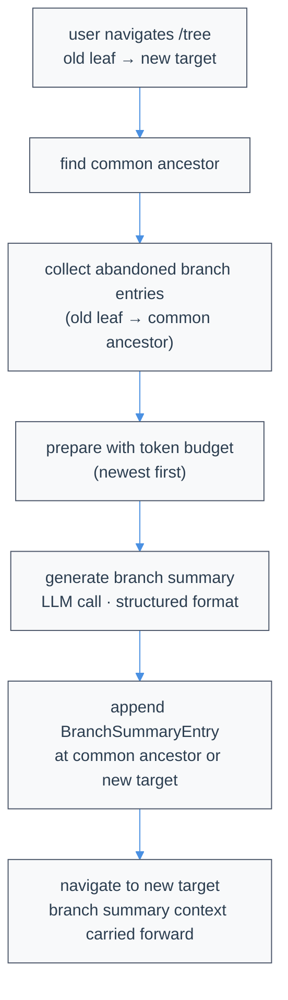

# Compaction & Branch Summarization

LLMs have finite context windows. Atomic reduces transcript context with **verbatim line compaction** while preserving an exact count of recent context-visible messages as ordinary messages. Branch summarization is a separate, intentionally lossy feature used only when navigating away from a branch.

Compaction runs entirely locally; no external compaction service is involved. It normally uses the active session model. If that model cannot rank the lines — a rate limit, a quota exhaustion, a provider error, a context overflow, or an empty plan — Atomic *borrows* the next model from your configured `fallbackModels` for that one planner request. **A configured fallback model may therefore receive the compaction transcript**, and it is sent with that provider's own credentials. Borrowing never changes the session's model or thinking level. The model only selects which lines to delete — Atomic reconstructs the retained text mechanically, so surviving lines are never rewritten.

## On this page and its reference

This page covers the concepts and normal use of compaction and branch summarization. Parameters, persistence, extension hooks, formats, settings, and historical formats live in the [Compaction reference](/compaction/reference).

## Overview

| Mechanism | Trigger | Model output | Durable result |
|---|---|---|---|
| Verbatim compaction | `/compact`, RPC `compact`, or automatic threshold/overflow recovery | Bare `start,end` deletion records (one per line) | A `CompactionEntry` whose `summary` is mechanically reconstructed transcript text |
| Planner fallback borrowing | Any terminal planner outcome on the current planner model | Same deletion records, from a configured `fallbackModels` entry | The same `"planned"` boundary, with `details.plannerModel` naming the borrowed model |
| Fresh context window | Load-bearing compaction after every configured model failed | *(none — no model call)* | A `CompactionEntry` with `details.rung: "fresh"` |
| Branch summarization | Optional `/tree` navigation | Generated summary prose | A `BranchSummaryEntry` |

There is one context-compaction door: `compact`.

## Verbatim Line Compaction

<a id="what-verbatim-means"></a>

### What "verbatim" means

Atomic serializes the compactable part of the conversation into role-tagged lines:

```text
[User]: Fix the failing parser test
[Assistant thinking]: I will inspect the parser.
[Assistant tool calls]: read(path="src/parser.ts")
[Tool result]: export function parse(...) {
...
[Assistant]: The off-by-one error is fixed.
```

The planner sees the same text numbered as `N→content` and returns only one-based, inclusive line ranges as bare records:

```text
2,5
```

Each line is `start,end` — unsigned decimal integers, one comma, no brackets or prose. Atomic safety-normalizes endpoints by swapping reversed pairs, clamping to the transcript, sorting, merging overlap/adjacency, and splitting around explicit protected spans. It then reconstructs from the original input lines. The model never writes, summarizes, reorders, or normalizes retained text. Every retained non-marker line is byte-identical to an input line and remains in input order.

### Markers and repeated compaction

Each deleted span is replaced on its own line with exactly:

```text
(filtered N lines)
```

The spelling is always plural, including `(filtered 1 lines)`. When a later compaction swallows an earlier marker, Atomic adds the earlier marker's count to the new marker. Adjacent old markers are folded too, so counts remain cumulative across repeated compactions. On repeated compaction, the planner receives the prior durable verbatim summary plus every currently active ordinary message except the exact protected tail.

### Protected structure

Role-header lines such as `[User]:` and `[Assistant]:` are ordinary ranked lines and may be deleted. Explicit protected spans, including blank lines, are never deleted. The configured number of newest context-visible messages remains outside the classifier request entirely; all preceding active transcript content is included.

Images in the compactable region become the literal line `[image]`; images in the protected recent tail remain normal image content. Tool-result text remains capped at 16,000 characters before becoming durable compaction text, with an explicit truncation marker for the remainder.

### `keepContext` tags

Wrap any section you never want compressed in `<keepContext>` / `</keepContext>`. Tagged content survives compression verbatim regardless of the compression ratio:

```
<keepContext>
You are researching only. Do not implement code changes.
</keepContext>
```

Every line of the span becomes a protected line, tag lines included, and the guarantee is mechanical rather than advisory: deletion ranges are split around protected lines after the planner responds, so a protected line survives even if the planner ignores its instructions.

Three properties are worth knowing when using this for long-lived instructions:

- **Spans re-arm themselves.** Each compaction re-ranks the previous compaction's output, so a constraint must survive every cycle, not just the first. Because the tag lines are protected too, the span is re-detected on the next boundary and stays protected for the life of the session.
- **Tags are structural and bounded.** Each tag must be the whole line, after the transcript's role header — a tag mentioned inside prose is payload, not syntax. A span opens and closes within one message, and an unclosed span protects through the end of *its own message*, never the rest of the region. User and assistant messages may both protect: prompts, run inputs, and steering arrive as user messages, and an agent may pin its own core information — a restated contract amendment, a decision that changes later behavior. Tags inside **tool results** are inert, because that payload is file contents, fetched pages, and command output, and honoring it would let read material mark itself unreclaimable and persist ahead of real content; restate what matters in your own message instead. A closing tag with no opener is ignored.
- **Kept content counts against the compression budget.** Protection does not raise the keep target. Protect 40% under a `compression_ratio` of `0.5` and the remaining 60% compresses harder to reach the same total, so the ratio stays a real bound on output size. Protecting more therefore costs the surrounding transcript, which is why the guidance is to tag the constraint rather than the material it applies to.

Results report the force-preserved ranges as `keptRanges`, so protection that fired unexpectedly is diagnosable rather than a silent reduction in what compaction reclaimed.

Use it for role constraints, invariants, and anything whose loss would silently change behavior. Prefer it over restating a constraint: without tags, a one-line constraint competes line-by-line against bulky tool output and is the cheaper deletion.

## Parameters

Moved to [Compaction reference](/compaction/reference#parameters).

### Per-model budgets

Use `compaction.modelOverrides` to set `reserveTokens` and/or `preserve_recent` for an exact `"provider/modelId"` key. For example:

```json
{
  "compaction": {
    "reserveTokens": 16384,
    "preserve_recent": 2,
    "modelOverrides": {
      "anthropic/claude-sonnet-4-5": { "reserveTokens": 32768, "preserve_recent": 4 }
    }
  }
}
```

Each field falls back independently to the ordinary setting, then its built-in default. Keys are case-sensitive and do not support wildcards or reasoning suffixes. Both fields require non-negative safe integers. The active session model selects the budgets for manual, automatic, overflow, and post-tool compaction; switching models changes the next resolution, while borrowing a fallback planner does not. Explicit manual parameters take precedence over resolved defaults.

Atomic intentionally differs from upstream pi: the recent-history override is an exact message count (`preserve_recent`), not a token budget (`keepRecentTokens`). Verbatim line reconstruction, `compression_ratio`, and `query` are unchanged; the latter two and `enabled` remain ordinary settings. See [Settings](/settings#compaction) for merge and validation details.

## When compaction runs

- **Manual:** `/compact`, `ctx.compact()`, `session.compact()`, or RPC `{ "type": "compact" }`.
- **Threshold:** automatic compaction starts when estimated context usage exceeds the effective input budget minus `reserveTokens`. Atomic checks both completed responses and the prospective next-turn context after tool results have been appended. When a provider reports all-zero usage, Atomic estimates the visible message size instead of skipping the check. A post-tool crossing is compacted before the active Pi tool loop sends its follow-up provider request.
- **Overflow:** an actual provider context overflow compacts and then retries the interrupted turn.
- **Truncated response:** a `length` stop before the original requested output cap gets one compact-and-retry attempt, independent of reported context-window metadata. If no compactable region exists, Atomic makes at most one direct continuation under that same recovery budget; a later actual context overflow remains eligible for load-bearing recovery. A response that reached the cap keeps Atomic's bounded direct-continuation behavior.

Exactly the configured recent-message tail is outside the compactable region; Atomic does not force the final logical turn to remain outside it. After successful automatic compaction, input queued before compaction started resumes automatically once the active run becomes idle; pressing Escape is not required to release it. Pressing Escape while compaction is active cancels it like other session operations. In isolated interactive mode, cancellation and host UI response frames use an independent RPC control lane, so they can reach the engine while the ordinary `compact` request is still pending instead of waiting behind it. Atomic writes a backup snapshot immediately before appending a compaction boundary.

Automatic continuations belong to the original prompt, including repeated output-cap continuations. The prompt and `agent_settled` lifecycle finish only after the entire chain drains, so status integrations such as [Herdr](/herdr) stay working through quiet response waits and continuation gaps.

Manual compaction is single-flight. A manual request made while another manual compaction is still in flight joins that run and receives its result instead of starting a second model call, so it emits no extra `compaction_start`/`compaction_end` pair and appends no extra boundary; `abortCompaction()` (Escape) still cancels the single owning run for every waiter. A manual request made while automatic compaction is active takes ownership: it cancels unfinished automatic work, abandons any pending automatic continuation, waits for the active turn and automatic state to settle, then runs the requested manual compaction. If the automatic boundary committed first, the manual request runs after it rather than reusing that result or writing concurrently. In the interactive TUI, `/compact` uses this takeover only for automatic compaction; a second manual compaction or branch summary is still refused. Ordinary text typed during compaction remains queued and flushes after its non-mid-turn completion, including cancellation or failure.

The post-tool check stays inside the active Pi loop: it runs the rung ladder once for that completed tool turn, returns the rebuilt context to the loop, and never calls or schedules `agent.continue()`. If the caller installed `prepareNextTurn` or `prepareNextTurnWithContext`, Atomic invokes it after compaction with that rebuilt context and sends the caller's complete replacement context through the normal context transform to the next provider request. A `shouldStopAfterTurn` result of `true` takes precedence over queued steering and follow-up messages, including messages queued while the callback is running: Atomic leaves that work pending until a later explicit prompt or continuation instead of starting another provider request. Normal context reconstruction preserves provider tool-call/result protocol validity. Below-threshold tool turns follow the unchanged request path. Because the same active run resumes without emitting another `agent_start`, the interactive TUI replaces the compaction loader with its working spinner and keeps terminal progress active as soon as successful mid-turn compaction ends; streaming feedback therefore resumes immediately without waiting for another user interaction.

## Planning rungs and failure behavior

Atomic asks a planner model, at the inherited session reasoning level and through the normal session stream/provider wrapper, to rank every eligible line in one global pass and apply one threshold. The entire compactable region is sent in one classifier request; it is never split into chunks. Manual, threshold, and overflow compaction all calculate the line target directly from the prepared `compression_ratio`. Explicit protected lines form a hard keep floor.

**The planner sends no output cap.** Only the provider's own context clamp bounds the response, so reasoning tokens cannot crowd out the deletion records. The reasoning level is inherited from the session and is never modified between attempts; a `model:level` suffix on a `fallbackModels` entry sets the level for that candidate only.

Each planner attempt ends in exactly one typed outcome:

| Outcome | Meaning | What happens next |
|---|---|---|
| ranked | Valid deletion records | Boundary written, `rung: "planned"` |
| recovered | A length-truncated response with usable complete records | Boundary written silently, `rung: "planned"` |
| overflowed | The planner request itself exceeded the context window, including a silent overflow that arrives as an ordinary `stop` or `length` completion whose usage already exceeds the window — classified before the response text is parsed, so valid-looking records or truncation recovery cannot mask it | The oldest region lines are withheld and the *same* model retried, repeatedly, until no strictly smaller view remains; the withheld head becomes a deterministic deletion |
| rateLimited | A limit failure. `category` says which one — `rate_limited` for `429`/rate limit/overloaded/any `5xx`, `quota` for quota, billing, or usage-limit exhaustion — and `exhausted` separately reports whether a retry was actually scheduled | Advance to the next configured model |
| unusable | Malformed output, no usable safe ranges, or reasoning starvation (`starved`) | Advance to the next configured model |
| providerError | Any other provider or transport failure | Advance to the next configured model |

Each trimmed retry halves the remaining suffix, so the walk is finite, and each view
derives its own keep target from `compression_ratio`. Carrying the original
whole-preparation target into a smaller view would ask it to keep every visible
line — a request for zero deletions, whose obedient empty answer then hits the
zero-usable-ranges rejection. The planner
door returns validated line numbers, so no unvalidated model output leaves it,
and the runner still validates once more before writing a boundary.

Generic usage-limit wording, such as `The usage limit has been reached`, is
classified as quota exhaustion (`exhausted: false`). That is a deliberate local
addition rather than a copy of pi-ai's tables: pi-ai lists it in neither its
retryable nor its non-retryable set, so it never spends a backoff, and reporting
it as transient throttling would claim a retry budget that was never used.

Unavailable credentials are ladder control flow, not an early failure. If the
session model has no usable credentials, no request is attempted for it, that
candidate is marked attempted, and a configured fallback with its own working
credentials can still rank the lines. A load-bearing caller with no usable
credentials anywhere still reaches the credential-free fresh rung; a recoverable
caller reports the original authentication error and writes nothing.

`settings.retry` still governs transport attempts *within* one candidate, with its existing backoff. When a candidate is exhausted, Atomic borrows the next entry from `settings.fallbackModels`, resolving that candidate's own credentials. Each candidate is tried at most once per compaction run, in configured order, keyed by `provider/model:thinkingLevel`. That walk is one monotonic pass over the configured list. Each position is inspected at most once — whether it fails to resolve to a model, has no usable credentials, duplicates an earlier identity, or yields a planner — so the order can never rewind to an earlier entry even if the registry or its credentials later change.

Borrowing never mutates the session: no `agent.state.model` write, no model-change or thinking-level entry, no system-prompt refresh, no `model_changed`/`model_select`/`model_fallback_start`, and no `agent.continue()`. After compaction returns, `session.model` is exactly what it was before, and the main chat's own fallback bookkeeping is untouched.

When every configured model is exhausted, what happens depends on how much the caller can afford to lose:

| Call site | Urgency | Can borrow a model | Can start a fresh context window |
|---|---|---|---|
| `/compact`, `ctx.compact()`, `session.compact()`, RPC `compact` | recoverable | yes | no |
| Threshold auto-compaction | recoverable | yes | no |
| Overflow recovery | load-bearing | yes | yes |
| Post-tool preflight | load-bearing | yes | yes |

A recoverable compaction fails honestly: it writes no compaction entry, schedules no continuation, and reports the typed cause through `compaction_end`. Manual compaction's recoverable urgency is fixed at the door: `session.compact()` projects only compaction parameters, so no runtime property on a caller-supplied object can raise it to `load_bearing` and reach the destructive rung. A load-bearing compaction always completes, falling through to the **fresh context window** rung described below.

A syntactically valid usable result is accepted once after safety-only normalization, even when it deletes fewer lines or tokens than requested. Atomic never adds or restores model-selected deletions to force a target. During overflow recovery, the existing one-shot compact-and-retry continuation may therefore surface unresolved overflow naturally.

### The fresh context window rung

`startNewContextWindow` is total: no provider, no credentials, no network, no failure mode. A region below the planner minimum reaches it only when the context is already known not to fit — overflow recovery, or a post-tool preflight whose projected context is over the provider hard input limit — because no planner change could make such a region rankable. A post-tool threshold crossing that still fits is a safe no-op instead: no boundary, no planner call, and the follow-up request proceeds unchanged. Clearing a context that fits would destroy conversation for nothing. It discards the compactable region and any prior durable summary, keeps explicit protected spans, and keeps the `preserve_recent` protected tail — dropping the tail only when the tail **alone** exceeds the provider hard input limit, in which case the boundary persists `firstKeptEntryId: null`. It emits the whole region as one deletion range and hands it to the same validation and reconstruction path as every other rung, so retained lines stay byte-identical.

A committed fresh boundary stays visible even when the following provider hard-input-limit gate reports its own error: `compaction_end` carries `result` and `errorMessage` independently, and the boundary is shown before the status. The fresh rung destroys conversation, so it is loud: the boundary reads `✻ Context cleared (compaction degraded)` instead of `✻ Context compacted`, in the main chat and in attached workflow stage chat alike, and `details.rung` records `"fresh"` durably. The precise cause stays in the `0600` diagnostic sidecar.

The ladder guarantees that *compaction* completes. It does not guarantee the *turn* succeeds: if every configured model is rate limited, the follow-up request will be too. What it buys is that a compaction failure does not additionally destroy the turn, that a healthy fallback model rescues quality when one exists, and that the retry starts from a small context.

During a post-tool preflight, Atomic still gates the rebuilt context: if it is known to exceed the provider's hard input limit even after compaction, Atomic refuses to send the follow-up request and reports the limit failure clearly. The fresh rung's tail-dropping rule exists so that gate is reachable rather than hollow.

### Length-truncated response recovery

When the planner model's output is truncated at the provider's own limit (indicated by `stopReason: "length"`), Atomic silently recovers complete newline-terminated deletion records from the truncated response. Atomic sends no `max_tokens` of its own, so this reflects the provider's context clamp rather than a caller-imposed cap. A deterministic line parser validates each completed line (those followed by a newline) against the strict `start,end` grammar. The final fragment after the last newline is always discarded — even if it looks syntactically complete — because EOF may have cut a multi-digit integer (e.g. `300,30` could have intended `300,305`). If any completed line has invalid syntax or zero usable records survive validation, the attempt becomes an `unusable` outcome and the ladder advances.

Example of truncated output:

```text
120,180
6,40
300,
```

Recovery yields `120,180` and `6,40`; discards `300,` without guessing. The planner prompt instructs the model to emit ranges in descending deletion confidence (lowest continuation value first) so the most important deletions appear earliest and survive truncation.

Successful partial recovery is an ordinary successful compaction: no warning, banner, toast, or special status copy appears. The UI shows the normal spinner then `✻ Context compacted`.

For operational observability, a private recovery diagnostic sidecar is written beside persisted sessions with `0600` permissions. It records the full raw response, stop reason, usage (including `usage.reasoning`), the request `maxTokens` (now always absent, since no cap is sent), model metadata, recovered range count, and recovery category. The sidecar path is never surfaced in the success UI, error messages, or user-visible status. In-memory sessions and sidecar write failures do not affect the successful recovery.

### Planner failure diagnostics

For a persisted session, each failed planner attempt writes its own JSON sidecar beside the session JSONL and carries the path on the typed outcome. When a recoverable compaction exhausts every configured model, the resulting `RangePlanError` includes that path, for example:

```text
Compaction range planning returned malformed output (diagnostic: /path/session-compaction-diagnostic-1785222000000-019fa7….json)
```

The private sidecar uses `0600` permissions where supported and records the full planner response text, stop reason, provider error, usage, the request `maxTokens` (absent — no cap is sent), timestamp, failure category, and non-secret model metadata for **the model that made that attempt**, so a run rescued by a fallback leaves per-model evidence. It does not record API keys, request headers, the planner prompt, or the numbered transcript request. The raw response itself may contain sensitive text if the model echoed input, so treat the sidecar with the same care as its adjacent session file.

Diagnostic categories distinguish malformed output, valid output with no usable ranges, provider errors, stream failures, reasoning starvation (`starved`), transient rate limiting (`rate_limited`), quota exhaustion (`quota`), and context overflow (`context_overflow`) — overflow is a distinct typed outcome in code, so it is distinct in the durable record too rather than folded into a generic provider failure. When a *borrowed* fallback model produces the accepted ranking, a separate `<session>-compaction-success-<timestamp>-<id>.json` sidecar records that model and its effective thinking level, so a rescued run leaves evidence for both the model that failed and the model that succeeded. Quota, billing, and usage-limit exhaustion get their own `quota` category, so they stay distinguishable from transient throttling in the durable record and not only in provider text. A limit record additionally sets `rateLimitExhausted`, derived from observed retry activity: `true` only when a retry was actually scheduled, and `false` for quota or for a throttled request under a disabled or zero retry budget. Atomic classifies the whole HTTP `5xx` class as rate limiting, which is a local broadening — pi-ai lists only selected statuses, so it may schedule no backoff for one Atomic types this way, and `rateLimitExhausted` reports that fact rather than assuming it. Every sidecar filename carries both a timestamp and a per-attempt identifier, and is created exclusively, so two attempts inside the same millisecond — routine across overflow trims or a fast fallback walk — cannot overwrite each other's evidence. In-memory sessions do not create sidecars. If the diagnostic write fails, Atomic preserves the original classification rather than replacing the planner outcome.

Interactive main chat and attached workflow stage chat treat `compaction_end` as the authority for cancellation and failure UI. A failed or cancelled `/compact` stops its spinner, shows the event-provided status or diagnostic path without a duplicate stack trace, writes no boundary, and leaves the session usable for another `/compact` attempt or a normal follow-up turn.

Context thresholds and persisted token-reduction statistics use API-aware normalized usage. OpenAI Responses, Codex Responses, and OpenAI Completions sum uncached input plus cache-read/cache-write partitions. Anthropic Messages alone applies the mirrored-cache guard needed by compatible endpoints that duplicate the same prompt tokens across `input` and cache fields.

## Persistence and resume

Moved to [Compaction reference](/compaction/reference#persistence-and-resume).

## Extension hooks

Moved to [Compaction reference](/compaction/reference#extension-hooks).

### `session_before_compact`

Moved to [Compaction reference](/compaction/reference#session_before_compact).

### `session_compact`

Moved to [Compaction reference](/compaction/reference#session_compact).

### `session_compact_failed`

Moved to [Compaction reference](/compaction/reference#session_compact_failed).

## Branch Summarization

### When It Triggers

When you use `/tree` to navigate to a different branch, Atomic offers to summarize the work you're leaving. This injects context from the left branch into the new branch.

Branch summarization is a separate mechanism from context compaction. It generates a summary of the abandoned branch path and injects it into the new branch position. This is appropriate here because the alternative (losing branch context entirely on navigation) is worse than a lossy summary.

### How It Works

1. **Find common ancestor**: Deepest node shared by old and new positions
2. **Collect entries**: Walk from old leaf back to common ancestor
3. **Prepare with budget**: Include messages up to token budget (newest first)
4. **Generate summary**: Call the LLM with tools disabled; reject tool calls and token-cap-truncated prose
5. **Append entry**: Save `BranchSummaryEntry` at navigation point



```text
Tree before navigation:

         ┌─ B ─ C ─ D (old leaf, being abandoned)
    A ───┤
         └─ E ─ F (target)

Common ancestor: A
Entries to summarize: B, C, D

After navigation with summary:

         ┌─ B ─ C ─ D ─ [summary of B,C,D]
    A ───┤
         └─ E ─ F (new leaf)
```

### Cumulative File Tracking

Branch summarization tracks files cumulatively. When generating a summary, Atomic extracts file operations from:

- Tool calls in the messages being summarized
- Previous branch summary `details` (if any)

This means file tracking accumulates across nested branch summaries, preserving the full history of read and modified files.

### BranchSummaryEntry Structure

Defined in [`session-manager.ts`](https://github.com/bastani-inc/atomic/blob/main/packages/coding-agent/src/core/session-manager.ts):

```typescript
interface BranchSummaryEntry<T = unknown> {
  type: "branch_summary";
  id: string;
  parentId: string | null;
  timestamp: string;  // ISO timestamp
  summary: string;
  fromId: string;      // Entry we navigated from
  fromHook?: boolean;  // true if provided by extension (legacy field name)
  details?: T;         // implementation-specific data
}

// Default branch summarization uses this for details (from branch-summarization.ts):
interface BranchSummaryDetails {
  readFiles: string[];
  modifiedFiles: string[];
}
```

Extensions can store custom data in `details`.

See [`collectEntriesForBranchSummary()`](https://github.com/bastani-inc/atomic/blob/main/packages/coding-agent/src/core/compaction/branch-summarization.ts), [`prepareBranchEntries()`](https://github.com/bastani-inc/atomic/blob/main/packages/coding-agent/src/core/compaction/branch-summarization.ts), and [`generateBranchSummary()`](https://github.com/bastani-inc/atomic/blob/main/packages/coding-agent/src/core/compaction/branch-summarization.ts) for the implementation.

## Branch Summary Format

Moved to [Compaction reference](/compaction/reference#branch-summary-format).

### Message Serialization for Branch Summaries

Moved to [Compaction reference](/compaction/reference#message-serialization-for-branch-summaries).

## Extension Hooks for Branch Summarization

Moved to [Compaction reference](/compaction/reference#extension-hooks-for-branch-summarization).

### session_before_tree

Moved to [Compaction reference](/compaction/reference#session_before_tree).

## Branch Summaries

When `/tree` switches away from one branch to another, Atomic can summarize the abandoned branch and attach that summary at the new position. This preserves important context from the path you left without replaying the whole branch.

When prompted, choose one of:

1. no summary
2. summarize with the default prompt
3. summarize with custom focus instructions

Branch summaries are separate from `/compact`: branch navigation can generate summary prose (optionally with focus instructions), while Verbatim Compaction lets a model select numbered line ranges and reconstructs retained text mechanically.

See [Compaction](/compaction) for Verbatim Compaction, branch summarization internals, and extension hooks.

## Summary request isolation

Verbatim planning and branch summarization are standalone provider requests. Each receives a fresh routing session ID instead of reusing the chat's provider-affinity ID, and sets cache retention to `none` so it cannot write summary/planner prompts into the main prompt cache. All three explicitly set `toolChoice: "none"` and reject returned tool calls. Prose branch/session summaries reject `length` stops rather than persisting partial text; the deletion planner alone may recover complete records from a truncated response, and every recovered range still passes the normal validation airlock. Neither sends a `max_tokens` of its own. Existing API-key, header-only `ANTHROPIC_AUTH_TOKEN`, custom-header, abort, and bounded retry behavior still applies. These controls affect provider request routing/cache writes only; successful results are persisted through the normal Atomic session lifecycle.

**Isolation is per model, not per session.** When compaction borrows a fallback model, that request is built with the borrowed candidate's own API key, headers, and base URL; the session model's credentials are never sent to another provider. The corollary is a real data-flow change: **a model listed in `settings.fallbackModels` may receive the compaction transcript.** The list is user-authored, so the set of providers that can see it is yours to control — remove an entry if you do not want it to see transcript content.

## Settings

Moved to [Compaction reference](/compaction/reference#settings).

## Historical formats

Moved to [Compaction reference](/compaction/reference#historical-formats).
