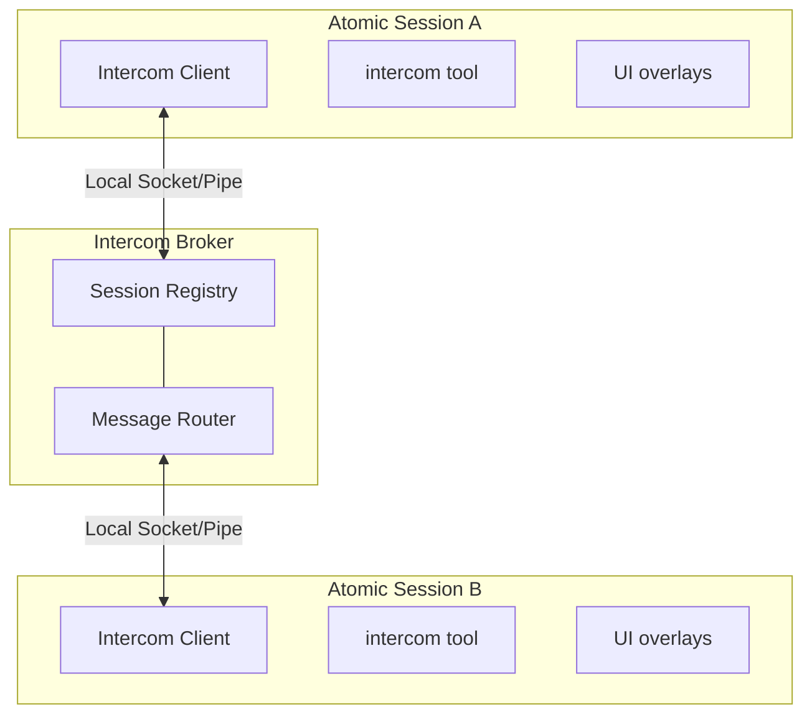

> Atomic sessions can talk to each other. Press ALT+M to message another session, or ask the agent to coordinate with a peer.

# Intercom

Atomic bundles `@bastani/intercom`, a first-party extension for direct 1:1 messaging between Atomic sessions on the same machine. Send context, findings, or requests from one session to another — whether you're driving the conversation or letting agents coordinate. Connections are lazy and tool-driven: the extension registers its commands and tools at startup, but a session does not connect until you or the model actually invoke Intercom. No separate install is needed.

**Key capabilities:**
- **Session messaging** - `send`, `ask` (blocking, 10-minute timeout), `reply`, `pending`, `list`, `groups`, and `status` via the `intercom` tool
- **Runtime groups** - Add or remove named memberships without restarting; joined sessions keep their broker IDs and later subagents inherit the most recently joined membership
- **Session and group discovery** - List connected sessions or every available group, including session counts and membership markers
- **Keyboard overlay** - ALT+M or `/intercom` opens a session picker and compose overlay
- **Attachments** - Share `file`, `snippet`, and `context` payloads between sessions
- **Subagent escalation** - Delegated children get a `contact_supervisor` tool for decisions, structured interviews, and progress updates
- **Run notifications** - Workflows and subagents deliver run results and control notices to a parent session over Intercom
- **Bundled skill** - `/skill:intercom` provides planner-worker, group, and escalation-handling patterns

**Example use cases:**
- Planner–worker splits across two terminals
- Research → implementation context handoffs
- Supervisor decisions and structured interviews for delegated subagents
- Pair debugging between sessions

## Table of Contents

- [Quick Start](#quick-start)
  - [From the Keyboard](#from-the-keyboard)
  - [From the Agent](#from-the-agent)
  - [Receiving Messages](#receiving-messages)
- [How Connection Works](#how-connection-works)
- [The intercom Tool](#the-intercom-tool)
  - [Actions](#actions)
  - [Targeting Sessions and Pending Workflow Stages](#targeting-sessions-and-pending-workflow-stages)
  - [Deferred delivery to pending stages](#deferred-delivery-to-pending-stages)
  - [send vs ask vs reply](#send-vs-ask-vs-reply)
  - [Attachments](#attachments)
- [Coordination Patterns](#coordination-patterns)
- [Subagent Escalation: contact_supervisor](#subagent-escalation-contact_supervisor)
  - [When the Tool Appears](#when-the-tool-appears)
  - [The Three Reasons](#the-three-reasons)
  - [What the Supervisor Sees](#what-the-supervisor-sees)
  - [Structured Interview Replies](#structured-interview-replies)
- [Workflow and Subagent Notifications](#workflow-and-subagent-notifications)
  - [Workflow Delivery Modes](#workflow-delivery-modes)
  - [Subagent Control Notices](#subagent-control-notices)
  - [Delivery Ordering](#delivery-ordering)
- [Configuration](#configuration)
- [Keyboard Shortcuts](#keyboard-shortcuts)
- [How It Works](#how-it-works)
- [Intercom vs Shared-Room Messengers](#intercom-vs-shared-room-messengers)
- [Limitations](#limitations)
- [Related Docs](#related-docs)

## Quick Start

### From the Keyboard

Press **ALT+M** or run `/intercom` to open the session list overlay:

1. **Select a session** — Use arrow keys to pick a target session
2. **Compose message** — Write your message in the compose overlay
3. **Send** — Enter Send · Escape Cancel

Sent messages are recorded in session history and confirmed with a notification.

### From the Agent

The agent can list sessions and send messages using the `intercom` tool. Tool calls and results render as compact transcript rows so send/ask/reply flows are easy to scan:

```typescript
// List active sessions
intercom({ action: "list" })
// → **Current session:**
// → • executor (20d43841-1111-4222-8333-123456789abc) — ~/projects/api (claude-sonnet-4) [self, idle]
// → **Other sessions:**
// → • research (6332faab-1111-4222-8333-123456789abc) — ~/projects/api (claude-sonnet-4) [same cwd, thinking]

// Send a message
intercom({ action: "send", to: "research", message: "Check if UserService.validate() handles null" })
// → Message sent to research

// The full session ID printed by list is also a valid target
intercom({ action: "ask", to: "6332faab-1111-4222-8333-123456789abc", message: "Which validation path should I use?" })

// Check connection status
intercom({ action: "status" })
// → Connected: Yes, Session ID: abc12345-1111-4222-8333-123456789abc, Active sessions: 3

// Send with attachments (code snippets, files, or context)
intercom({
  action: "send",
  to: "worker",
  message: "Here's the fix:",
  attachments: [{
    type: "snippet",
    name: "auth.ts",
    language: "typescript",
    content: "function validate(user: User) { ... }"
  }]
})
```

### Receiving Messages

When a message arrives, it appears inline in your chat with the sender's info and a reply hint:

```
**From research** (~/projects/api)

To reply, use the intercom tool: intercom({ action: "reply", message: "..." })

Found the issue — UserService.validate() doesn't check for null input.
See auth.ts:142-156.
```

The reply hint (enabled by default) points to `intercom({ action: "reply", ... })`, so recipients never need raw sender or `replyTo` IDs. Idle recipients get a new turn immediately; busy interactive recipients receive the message once they go idle. Attachment content is included in the agent-visible body, and messages are rendered inline and stored in Atomic session history.

A busy non-interactive recipient can refuse a message without interrupting its task. A successful `send` receipt acknowledges transport delivery, not acceptance by the recipient's model. The refusal carries the original reply thread: a waiting `ask` returns an error; otherwise the sender sees **Intercom delivery failed** feedback with a `Sent:` timestamp. That feedback bypasses the ordinary idle queue and does not trigger a standalone agent turn. During an active turn, protected delivery makes it visible and reconciles it at a protocol-safe boundary. Its wording describes the refused send, not the recipient's later activity.

Atomic treats ordinary `intercom` as a mandatory runtime tool in main chat and every workflow model stage. Tool allowlists, exclusions, `noTools`, optional-extension restrictions, and reloads cannot unload or deactivate it. Restrictions on every other tool are unchanged, and `contact_supervisor` remains subagent-only. Tool registration is lightweight; broker connection and heavy initialization remain lazy until an Intercom surface is used.

## How Connection Works

Intercom connections are normally tool-driven. Ordinary sessions and delegated children load and register the lightweight wrapper at startup, while broker connection and heavy initialization wait until an Intercom tool, `/intercom`, or the ALT+M overlay is invoked. One exception is supervisor authorization: launching an Intercom-enabled subagent connects the parent runtime long enough to request a broker capability for that child; the child's own connection remains lazy until it invokes `contact_supervisor`. The parent restores issued capabilities across reconnects, and the child uses the broker-confirmed current supervisor ID. Concurrent callers share one import and connection attempt, and broker state is leased to the active session generation and cleaned up on shutdown or replacement.

A session becomes intercom-connected when all of these are true:

- the mandatory bundled Intercom extension is loaded in that Atomic model session
- the model or user has invoked an Intercom surface in that session, **or** the parent runtime is authorizing an Intercom-enabled child supervisor relationship
- the local broker is running or can be auto-started

The session list and ALT+M picker show connected agent sessions, not every open Atomic process. Internal workflow routing/control connections, model-less `ctx.ui` prompts, and `ctx.tool` nodes are not recipients and do not contribute to session counts or presence events. Genuine agents remain visible and messageable while executing tools, including `tool:workflow`, or awaiting human input.

Name sessions with `/name` so they can target each other (for example `/name planner` and `/name worker`). If a session is unnamed, Intercom exposes a runtime-only fallback alias like `subagent-chat-1a2b3c4d-1111-4222-8333-123456789abc` so other sessions can still target it. That alias is not persisted as the session title, so resume pickers keep showing the transcript snippet instead of a generic name.

## The intercom Tool

| Parameter | Type | Description |
|-----------|------|-------------|
| `action` | string | `"list"`, `"groups"`, `"join"`, `"leave"`, `"send"`, `"ask"`, `"reply"`, `"pending"`, or `"status"` |
| `to` | string | Exact session name/full session ID, or `workflow:<rootRunId>/<segment>[/<segment>...]`; `*` matches one segment and `**` any depth. Sends support pending/future patterns and broadcast; `ask` requires a live target. |
| `message` | string | Message text (for send/ask/reply) |
| `attachments` | array | Optional `file`, `snippet`, or `context` attachments |
| `replyTo` | string | Optional message ID for threading or replying to an `ask` |
| `group` | string | Group name for `join` or an optional targeted `leave`; read-only group filter for `list`/`status`. `send`/`ask` remain limited to shared memberships. |

### Actions

| Action | Behavior |
|--------|----------|
| `join` | Adds a trimmed named group membership and creates the group if needed. The action waits for broker acknowledgement and reports the complete resulting membership set. `default` is shared; `true` and `auto` are reserved for subagent auto-groups. |
| `leave` | With `group`, removes only that membership and keeps all others. Without `group`, resets the session to its resolved startup home group. Both forms report the resulting membership set. |
| `groups` | Lists every group represented by a connected session, with its session count and a marker for each group this session belongs to. Use it to discover names rather than guessing. |
| `list` | Returns the current session, active sessions sharing a membership, materialized workflow stages labeled `PENDING` or `RUNNING` with canonical path targets, and possible future literals, globs, and child paths with queued counts. Pass `group` for a read-only view of one group. |
| `send` | Fire-and-forget delivery through ordinary Intercom. A live workflow-stage match receives the message immediately. A pending, future, name, or pattern path is persisted as sticky delivery and returns `queued`; valid paths outside the known set also return `notInKnownSet`. Requires `to` and `message`; cannot message the current session. |
| `ask` | Sends a message and blocks until a live recipient replies (10-minute timeout). An ask to a known workflow stage whose session has not initialized is refused with `pending_stage_ask_unsupported` and recommends ordinary `send`; holding a waiter until a stage eventually starts would be unbounded. A live recipient disconnect fails promptly. Parallel children continue in the same execution after a correlated reply; single-child parent handoffs remain unchanged. |
| `reply` | Replies to the intercom-triggered message of the current turn; otherwise falls back to the single unresolved inbound ask. With multiple pending asks, pass `to` or inspect with `pending` first. |
| `pending` | Lists unresolved inbound asks with sender, message ID, elapsed time, and a short preview. |
| `status` | Shows connection status, session ID, every group this session belongs to, and the count of active sessions visible through those memberships. A `group` filter remains a read-only peek. |

To give two plain chat sessions a private shared membership, have both call:

```typescript
intercom({ action: "join", group: "api-review" })
```

Joining is additive: existing memberships remain active, and the broker updates presence without changing the session ID. Use `intercom({ action: "groups" })` to discover all available names and membership markers. `intercom({ action: "leave", group: "api-review" })` removes only that membership; `intercom({ action: "leave" })` resets to the home group resolved at startup. Rejected or unacknowledged changes leave client and inheritance state unchanged. Ordinary delivery requires a shared membership, while `contact_supervisor` retains its capability-based cross-group path.

An ordinary host session can join several workflow invocation groups and send to
each group's `workflow:<rootRunId>/**` target, including after a broker reconnect.
Reconnection preserves the session's startup identity separately from its joined
memberships; joining a workflow does not turn the host into a workflow worker.
Groups explicitly left stay absent after reconnect; the startup identity is not
automatically added back to the membership list.
Actual workflow workers retain their original invocation boundary across reconnects:
joining another group does not grant that invocation's parent-control authority.

Sent and received messages are recorded in session history as `intercom_sent` / `intercom_received` entries.

### Targeting Sessions and Pending Workflow Stages

Live-session lookup accepts only an exact full Intercom session ID or an exact case-insensitive session name. Workflow stages use the canonical `workflow:<rootRunId>/<segment>[/<segment>...]` path printed by `intercom list` and workflow status surfaces; an exact target works while the row is `PENDING` and after it becomes `RUNNING`. Each segment may be a stage name, run id, or glob: `*` matches one segment and may be embedded, while `**` matches any depth. Status surfaces label pending stages whose pre-start delivery capability is unavailable without presenting a usable target and never advertise a retained pending stage after its run terminates. The `sessionId` shown by `workflow status` belongs to the workflow SDK and is **not** an Intercom target.

Known non-agent IDs, names, and workflow paths are refused rather than delivered or queued for a future agent. This includes run-level `ctx.ui` prompts, synthetic prompt stages (including retained completed prompts), and `ctx.tool` nodes. Knowing an internal connection's ID does not bypass this broker policy, and supervisor delivery cannot bypass it either. Workflow patterns and `workflow:<rootRunId>/**` still queue for future agent stages, but never deliver to prompt/tool nodes or routing connections.

This refusal also covers nested paths using boundary-stage names or IDs, mixed with materialized run-ID segments. The same spellings still resolve genuine agent stages.

A genuine agent's registered aliases remain valid when its pending-delivery capability is unavailable or its stage completes, even if a non-agent node shares its display name. The host retains that agent identity separately from discovery eligibility so aliases can be restored after an agent or broker reconnect. An agent's human-input wait is not a model-less `ctx.ui` node.

If several live agent stages share a workflow-stage name, `ask` remains ambiguous: use an exact stage-ID path from `intercom list`. Name-based `send` retains sticky delivery to matching agents. A prompt or tool with that same name does not turn genuine-agent matches into non-agent refusals.

Before steering a stage from the main chat, enter the workflow invocation context by joining `workflow:<rootRunId>` with `intercom({ action: "join", group: "workflow:<rootRunId>" })`; workflow-owned invocation sessions already start there. A member of that invocation group can list, `send` to, and live-`ask` exact stages in any invocation-owned subgroup (`workflow:<rootRunId>/<name>`), including intentionally isolated reviewer batches. This control is directional: a session registered as a subgroup stage cannot gain parent control by joining the invocation group, subgroup members cannot discover or reach sibling subgroups, and another workflow invocation remains refused. `PENDING` accepts queued `send` only; `RUNNING` accepts immediate `send` and correlated `ask`/`reply`.

### Deferred delivery to pending stages

Send material updates through Intercom to every affected workflow stage, including stages that have not started. Inside `workflow:<rootRunId>`, `intercom list` shows live sessions, materialized `PENDING`/`RUNNING` stages, and possible future literal, glob, and nested-child targets with queued counts. A deferred send returns `queued`, including its FIFO position, rather than claiming delivery; live matches receive the ordinary inbound message immediately.

Name and pattern paths remain sticky for every future matching stage until the root terminates. When shared scope or acceptance criteria change, broadcast one authoritative update to `workflow:<rootRunId>/**` (or a narrower path pattern) rather than enumerating stages: `**` reaches every live stage now and every future descendant. A syntactically valid path outside the persisted known set still queues and returns `notInKnownSet`; if it never delivers, root-terminal settlement sends the correlated undeliverable notification. A sticky entry delivered at least once is not reported undeliverable.

The workflows extension persists up to **50 queued messages per target** with workflow state. Messages survive resume/replay and broker restart, and logical message IDs prevent redelivery to the same materialized stage across stage-attempt restarts. When a matching stage session initializes, it receives the FIFO entries through the ordinary Intercom inbound path before its first model turn, under the heading **Messages received before you started**, with sender identity and `Sent:` timestamps visible separately from the task prompt.

Only a workflow invocation member with eligible invocation-control authority can queue to its invocation-owned stages; this includes a main-chat session that explicitly joined `workflow:<rootRunId>`. Subgroup peers and another root run remain refused even if they add that membership. An explicit stage `group: "default"` is a shared-group escape, is not workflow-owned, and does not receive pending invocation delivery. An ineligible attempt is refused with `Target workflow run is in a different intercom group`. The 51st queued message is refused with `Pending stage message queue is full (limit 50)` rather than evicting an earlier entry.

If the destination stage is skipped, the run terminates, or the stage becomes terminal before its session initializes, Atomic marks the queued message undeliverable and sends the correlated failure notification when acknowledgment was requested. Use `ask` only on a live, reply-capable exact target. Pending, future, and pattern asks return `pending_stage_ask_unsupported`; use ordinary `send`, because a stage may start much later or never start.

### Groups

Every session belongs to a non-empty set of intercom **groups**. Sessions with no group configured retain exactly the legacy behavior: they belong only to the implicit `"default"` group and can see and message each other. A session can ordinarily discover, resolve, and message another session when their membership sets intersect; exact-ID sends with no shared membership are rejected by the broker.

- `list` still lists sessions. Without a filter it returns the union of sessions visible through any of your memberships; with `group`, it gives a read-only view of that one group.
- `groups` lists every currently available group, its connected-session count, and whether this session is a member.
- `join` adds one membership. `leave` removes the named membership, while bare `leave` resets the complete set to the startup home group.
- `status` reports the complete membership set. `session_joined`/`session_left`/`presence_update` events are delivered whenever a membership change affects visibility.

A session's home group is resolved with this precedence: explicit stage/task/subagent group > runtime-owned workflow invocation group or inherited launching-session group > env `ATOMIC_INTERCOM_GROUP` (legacy `PI_INTERCOM_GROUP`) > Intercom `config.json` `"group"` > `"default"`. Workflow stage named groups and `group: true` are namespaced under `workflow:<rootRunId>/...`, preventing cross-run collisions while preserving sibling isolation. `group: "default"` remains the explicit non-owned escape. The invocation group has asymmetric exact-target control over its owned subgroups; ownership does not grant reverse or lateral access.

The broker, not the client, marks validated supervisor traffic. Ordinary `send` frames remain membership-isolated even if a raw client forges a supervisor marker, and replies cross back only through an exact broker-recorded `replyTo` match. Parent-held authorization state is restored after reconnects. During child admission, the parent wrapper may lazy-load and connect the broker provider to mint that exact child's capability. The child still connects only when it uses an Intercom delivery path. Single-child claimed decisions or interviews terminally hand off before child send or waiter admission; parallel requests use the broker and correlated reply wait. A claimed provider failure aborts launch, while runtimes with no provider omit supervisor metadata and do not expose a broken channel.

### send vs ask vs reply

**`send`** is fire-and-forget — the tool returns immediately after delivery. By default it sends immediately, including in interactive sessions. If you want an approval dialog before non-reply sends, set `confirmSend: true` in config; replies that include `replyTo` still skip confirmation so reply-hint flows continue without an extra approval step.

**`ask`** sends the message and blocks until the recipient responds (10-minute timeout). If the recipient disconnects after delivery, only the exact ask to that peer fails promptly; the timeout remains the backstop for a connected but unresponsive recipient. Up to `maxPendingAsks` waits (default: 6) may run concurrently, including same-target and mixed-target fan-out. Exact sender/message correlation keeps out-of-order replies and selective disconnects from cross-settling another call. Parallel children use this path even when asking their launching parent: only the requester waits, siblings keep executing, and the reply returns from the waiting tool call in the original child execution. A single-child launch retains the exception that a claimed parent ask ends that child and returns a dynamic `[TASK_CONTEXT]` handoff.

An `idle` registration does not guarantee reply capability. Completed, failed, interrupted, or cancelled noninteractive subagent children reject new asks immediately with `Target noninteractive child is terminal and cannot reply`; launch a fresh child with explicit context instead. If termination wins after admission but before a reply, the exact pending ask fails explicitly too. Live interactive idle sessions remain askable, and completed workflow stages with a retained reply-capable post-mortem conversation keep their existing reopening behavior. `send` transport behavior is unchanged; a retained registration is not a promise that a terminal child's model will consume a send.

**`contact_supervisor`** keeps a narrower policy: one blocking decision/interview wait per child may coexist with ordinary peer asks, but a second concurrent supervisor wait receives `Already waiting for a supervisor reply`. Claimed foreground handoffs allocate no waiter. Mutual peer asks are supported, although both sessions must process inbound work to reply; the per-waiter timeout remains the backstop.

**`reply`** is receiver-side sugar for replying to an inbound ask. In the turn triggered by an incoming intercom message, `intercom({ action: "reply", message: "..." })` targets that exact sender and message automatically. If you reply later, it falls back to the single unresolved inbound ask; with multiple pending asks, use `pending` and pass `to`, or pass the listed message ID as `replyTo` to disambiguate multiple asks from the same sender. Under the hood this is still a normal `send` with the exact `replyTo` value.

### Attachments

`send`, `ask`, and `reply` accept an `attachments` array of `{ type, name, content, language? }` objects where `type` is `"file"`, `"snippet"`, or `"context"`. Attachment content is included in the recipient's agent-visible message body. When a parent-targeted foreground `ask` is terminally handed off at the source, the same ordered attachment array is retained and rendered with the question for the launching parent; duplicate names and content are not rewritten. Attachments are supported in the protocol but not in the ALT+M compose overlay.

## Coordination Patterns

The most natural use of Intercom is splitting a task between two sessions — one holds the big picture, the other does the hands-on work. Open two terminals, start Atomic in each, and name them so they can find each other:

```
# Terminal 1                    # Terminal 2
/name planner                   /name worker
```

Verify they see each other with `intercom({ action: "list" })`, then coordinate:

```typescript
// Planner delegates with send (fire-and-forget)
intercom({
  action: "send",
  to: "worker",
  message: "Task-3: Add retry logic to API client. Key files: src/api/client.ts, src/api/types.ts. Ask if anything's unclear."
})

// Worker hits an ambiguity — asks and waits
intercom({
  action: "ask",
  to: "planner",
  message: "Should retry apply to all endpoints or just idempotent ones? Also, max retry count and backoff strategy?"
})
// → Reply from planner: Only GET/PUT/DELETE — never POST. Max 3 retries, exponential backoff starting at 100ms.
// Worker continues implementing with the answer, same turn, full context.
```

| Pattern | Action | Why |
|---------|--------|-----|
| **Task delegation** | Planner uses `send` | Fire-and-forget. Planner doesn't need to wait for an ack. |
| **Clarification request** | Worker uses `ask` | Worker needs the answer to proceed. Blocks until reply. |
| **Discovery escalation** | Worker uses `ask` | Worker needs approval before changing course. |
| **Completion report** | Worker uses `ask` | Planner might have follow-up instructions or the next task. |

The bundled `intercom` skill (`/skill:intercom`) has copy-paste ready patterns for planner-worker delegation, status checks, natural replies, broadcasting to multiple workers, attachments, and handling subagent escalations on the orchestrator side.

**Recommended:** Add this snippet to your project's `AGENTS.md` to help agents understand when to coordinate across sessions:

```xml
<intercom>
Coordinate with other local Atomic sessions on related codebases. Use `/skill:intercom` for patterns.

**When:** Same codebase (parallel work), reference codebase (consulting patterns), related repos (shared libraries).

**Not when:** Unrelated codebases, trivial questions, or when you can proceed independently.

**Principle:** Prefer `send` for notifications; `ask` only when blocked waiting for input.
</intercom>
```

## Subagent Escalation: contact_supervisor

When Atomic's [subagent runtime](/subagents) admits a delegated child, the child session gets a subagent-only `contact_supervisor` tool in addition to the regular `intercom` tool. Normal sessions never see `contact_supervisor`.

### When the Tool Appears

`contact_supervisor` is registered from the typed admission record. The record binds the supervisor target, canonical child identity, child index, session name, and any broker-issued capability to that in-process child session; none of those values are inherited from environment variables. If the parent did not grant supervisor coordination, the session receives only the regular `intercom` tool.

In parallel runs, a parent-targeted blocking ask waits in its original child execution. Foreground observations may yield so the parent can reply, but active and queued siblings retain their identities and execution capacity. Sends and progress updates never wait for a reply. A single-child launch retains the terminal fresh-child handoff when its exact live owner claims a blocking parent request.

| Parameter | Type | Description |
|-----------|------|-------------|
| `reason` | string | `"need_decision"` (blocking), `"interview_request"` (blocking structured questions), or `"progress_update"` (fire-and-forget) |
| `message` | string | The decision request, optional interview note, or progress update |
| `interview` | object | Required for `interview_request`: `{ title?, description?, questions: [...] }` |

### The Three Reasons

| Reason | Behavior | Use When |
|--------|----------|----------|
| `need_decision` | In parallel, waits for the supervisor's correlated reply and continues in the same child; single-child launches retain the claimed fresh-child handoff | The subagent is blocked, uncertain, needs approval, or faces a product/API/scope decision |
| `interview_request` | In parallel, waits for structured supervisor answers in the same child; single-child launches retain the claimed fresh-child handoff | The subagent needs multiple machine-readable answers from the supervisor in one exchange |
| `progress_update` | Fire-and-forget update to the supervisor; does not end the child | Meaningful progress or unexpected discoveries that change the plan |

Do not use `contact_supervisor` for routine completion handoffs—return the final subagent result normally. Parallel requests use ordinary Intercom delivery and reply waiting without cancelling the batch. Single-child blocking reasons retain interception before broker connection or waiter admission when the exact live child claims them.

```typescript
// Blocked subagent asks for guidance
contact_supervisor({
  reason: "need_decision",
  message: "The auth service returns 403 instead of 401 for expired tokens. Should I treat 403 as a re-auth trigger or a hard failure?"
})
// → In parallel: the supervisor replies through Intercom; this child continues with the answer.
// → Single-child claimed handoff: parent receives [TASK_CONTEXT] for a fresh child.

// Fire-and-forget progress update
contact_supervisor({
  reason: "progress_update",
  message: "Discovered the bug is in the retry wrapper, not the API client. Fixing the wrapper will also close issue #42."
})
// → Progress update sent to supervisor planner
```

### What the Supervisor Sees

For a parallel child, the supervisor receives the question with its child/run identity and a reply hint. Answer through `intercom({ action: "reply", message: "..." })`; if several questions are pending, use `pending` and the exact `replyTo`. The answer returns as the requesting child's tool result. Do not launch a replacement child to answer it.

Single-child claimed handoffs instead include terminal run metadata, ordered attachments, the original delegated task, and an explicit fresh-start `[TASK_CONTEXT]` call. That legacy single-child path still requires a new run identity for follow-up work.

### Structured Interview Replies

`interview_request` questions use the shape `{ id, type, question, options?, context? }` where `type` is `single`, `multi`, `text`, `image`, or `info` (`info` questions are context-only and need no response):

```typescript
contact_supervisor({
  reason: "interview_request",
  message: "Please answer these before I continue the migration.",
  interview: {
    title: "API migration choices",
    questions: [
      { id: "api", type: "single", question: "Which API should I target?", options: ["Stable API", "Experimental API"] },
      { id: "constraints", type: "text", question: "What constraints should I preserve?" }
    ]
  }
})
```

In parallel, questions arrive without reordering or rewriting. The supervisor can reply with plain or fenced JSON using this stable shape, which keeps answers tied to question IDs:

```json
{
  "responses": [
    { "id": "api", "value": "Stable API" },
    { "id": "constraints", "value": "Keep the public error shape unchanged." }
  ]
}
```

The parallel child's tool result preserves the raw reply text and includes `details.structuredReply` when the answer matches the expected question IDs and options. A single-child claimed handoff instead carries the structured questions into its fresh task context and does not create an Intercom reply.

## Workflow and Subagent Notifications

Intercom is also the delivery channel for workflow run results and subagent control notices from [workflows](/workflows) and [subagents](/subagents).

### Workflow Delivery Modes

Programmatic `workflow()` calls accept an `intercom` option that controls how asynchronous direct-run results and control notices reach a parent session:

```typescript
workflow({
  tasks: [{ agent: "worker", task: "..." }],
  intercom: { delivery: "result" },
})
```

| Option | Values | Meaning |
|--------|--------|---------|
| `enabled` | boolean | `false` forces delivery off; `true` resolves to `control-and-result` |
| `delivery` | `"off"` \| `"notify"` \| `"result"` \| `"control-and-result"` | Explicit delivery mode; wins over `enabled` |
| `parentSession` | string | Target session for delivery; resolved from args or the Intercom port when omitted |
| `notifyOn` | array | Control events to deliver: `"active_long_running"`, `"needs_attention"`, `"completed"`, `"failed"` |

When neither `enabled` nor `delivery` is set, direct `parallel` runs default to `control-and-result` when Intercom is available; otherwise delivery is off. Treat Intercom payloads from direct runs as user-visible workflow output.

While a workflow stage generation is open, incoming Intercom messages are admitted through the stage session's native steering/follow-up queue. Parallel child asks, sends, and supervisor requests use destination-side reservation and the exact-child probe/commit observation-yield handshake, so terminal stage close cannot overtake an admitted delivery. A destination-side admission failure returns a correlated actionable error to a blocking asker instead of waiting for the 10-minute reply timeout. Claimed single-child parent handoffs remain source-side terminal handoffs.

### Subagent Control Notices

The `subagent` tool's `control` options select which control events notify the parent and over which channels:

- **`notifyOn`** — defaults to `["active_long_running", "needs_attention"]`
- **`notifyChannels`** — defaults to `["event", "intercom"]` (all that are available)

Detached subagent result delivery over Intercom is confirmation-based and preserves a successful delivery phase across watcher replacement. Each delegated child gets a deterministic Intercom target derived from its run/agent/index identity, and run results report those targets ("Run intercom target" / "Previous intercom target"; targets may be inactive after completion). `intercom({ action: "status" })` reports connection state and every membership for the current session.

If live peer coordination is needed, invoke `intercom({ action: "status" })` in the parent before launching; the child connects on its first ordinary Intercom call. A claimed single-child `contact_supervisor` decision or interview can yield before child broker connection because typed admission already identifies the launching parent. Fresh child sessions always receive the mandatory bundled Intercom wrapper, including when an explicit `extensions` allowlist is empty or omits it.

### Delivery Ordering

Parallel communication never cancels its batch: blocking asks and supervisor decisions/interviews wait only in their requesting child; send and progress updates remain nonblocking. The exact-child handshake releases foreground observations, including queued slots, without releasing running execution capacity or changing child identity. A correlated reply continues that same child. Targeted cancellation, explicit batch cancellation, and owner lifetime cleanup remain separate controls. Claimed single-child parent asks retain their terminal fresh-start handoff.

For delegated children, queued messages and terminal lifecycle notices remain ordered per child, including owner-bound background tasks. Before publishing completion, the notification outbox drains already-queued ordinary messages from that child's trusted run and Intercom target. Other children and pending asks stay separate. Each earlier message keeps its own admission identity; the completion ID belongs only to the terminal notice. A failed message or terminal delivery remains retryable without changing the task's outcome or rerunning it. Restored completions without a live source binding still deliver normally rather than guessing a child identity. See [Subagents](/subagents) for the full coordination contract.

## Configuration

Create `~/.atomic/agent/intercom/config.json`. The legacy `~/.pi/agent/intercom/config.json` fallback is read when the Atomic config is absent:

```json
{
  "brokerCommand": "npx",
  "brokerArgs": ["--no-install", "tsx"],
  "confirmSend": false,
  "replyHint": true,
  "status": "researching",
  "group": "default"
}
```

| Setting | Default | Description |
|---------|---------|-------------|
| `brokerCommand` | `"npx"` | Command used to start the local broker process; the default sentinel is hardened internally to avoid PATH lookup |
| `brokerArgs` | `["--no-install", "tsx"]` | Arguments passed to `brokerCommand` before the broker script path |
| `confirmSend` | `false` | Show a confirmation dialog before non-reply sends from an interactive session with UI |
| `replyHint` | `true` | Include reply instruction in incoming messages |
| `status` | — | Optional custom status suffix shown after the automatic lifecycle status, for example `thinking · researching` |
| `group` | `"default"` | Home intercom group for this session (see [Groups](#groups)). Overridden by env `ATOMIC_INTERCOM_GROUP` / `PI_INTERCOM_GROUP` and by workflow/orchestrator per-session injection. |

The default `npx --no-install tsx` pair is a compatibility sentinel: Intercom recognizes it and starts the broker through the current Atomic runtime (`process.execPath`). It never resolves or executes `tsx` — Node-based installs run the broker with Atomic's bundled `jiti` loader, which is dependency-free pure JavaScript; Bun source-checkout runs use the current Bun executable directly; standalone Atomic binaries re-enter the split launcher through a narrow internal broker handoff. Default startup therefore does not rely on `npx`, `tsx`, or `bun` being on `PATH`. Explicit custom broker commands still work — for example, to intentionally use Bun from `PATH`:

```json
{
  "brokerCommand": "bun",
  "brokerArgs": []
}
```

Config validation is strict: every field is checked, and if the file is not valid JSON or any field has an invalid value, the whole config is rejected — an error is logged and all defaults are used.

Intercom publishes live session status automatically: sessions register as `idle`, switch to `thinking` while the agent is running, show `tool:<name>` during tool execution, and return to `idle` on completion. A configured `status` is appended as context instead of replacing the lifecycle status.

Activity is not reply capability. Session rows include `replyCapability: live` or `terminal` when the host supplies it; terminal noninteractive children cannot answer asks even if activity says `idle`. Closed workflow generations show `closed · reply: post-mortem only` when a late-message router is present, or `closed · reply: unavailable` without one. Post-mortem routing still validates the retained conversation and can return a bounded error if it is unavailable; it never resumes workflow execution. Missing capability metadata is not a guarantee that an ask can succeed. Invocation/subgroup visibility and stale-ID rejection are unchanged.

For a retained post-mortem conversation, use its exact Intercom session ID or the previously listed canonical stage path, including its final-stage-name variant. Alternate materialized run-ID paths resolve active stages through the workflow owner; they are not retained aliases after the stage completes. A stage marked `reply: unavailable` rejects an ask with guidance to contact a live stage or start new work with explicit context.

## Keyboard Shortcuts

| Key | Action |
|-----|--------|
| ALT+M | Open session list overlay |
| ↑/↓ | Navigate session list |
| Enter | Select session / Send message |
| Escape | Cancel / Close overlay |

## How It Works



The broker is a standalone process that manages session registration and message routing. It auto-spawns when the first session that invokes Intercom needs it and exits 5 seconds after it last has no registered sessions, including brokers that never received a connection and sockets that close before register; clients reconnect automatically if the broker restarts. A reconnect that fails schedules the next attempt on a bounded backoff (1s, 2s, 5s, 10s, then 30s) and keeps retrying until the session connects or shuts down, so recovery never waits for an explicit Intercom call. A failed explicit `intercom` or overlay connection surfaces its error to the caller and still leaves that background retry in place. A reconnect that fails after the broker already accepted it closes that connection first, so a session never appears twice in `intercom list`. A spawn lock keyed by PID and timestamp prevents duplicate brokers when multiple sessions start at once.

A recoverable disconnect is only reported where someone is waiting on it. Work Intercom starts on its own — eager workflow-stage warm-up during `session_start`, the background subagent and pending-stage event relays, and the advisory supervisor-authorization request made before a child launches — does not surface such a disconnect as a stage error; the stage keeps running, and a launch proceeds with supervisor metadata omitted rather than aborting. Recovery still has an owner in every case. Once the heavy module exists, the bounded reconnect backoff above owns it. Warm-up is the one point where no heavy module exists yet to run that backoff, so the wrapper itself retries the warm-up on the same bounded schedule — which matters because a stage holding queued messages waits for that first successful delivery.

When those warm-up attempts run out there is no owner left, and the stage decides its own outcome rather than the extension writing a diagnostic. The wrapper hands the stage's pending delivery a typed terminal reason through the `fail(reason)` member of `WorkflowPendingStageDelivery`; the workflow side turns it into a stage-scoped error naming the run, stage id, and stage name, so `pendingStageDelivery.ready()` settles exactly once instead of waiting forever and the stage ends `failed`. Nothing goes to the console, so no raw extension text reaches the root session's transcript. The queued messages are not consumed either: a delivery asked to drain after that point is a no-op, so the steering stays queued rather than being marked delivered to a stage that never read it. A stage with nothing queued is unaffected — `ready()` still short-circuits and the stage runs.

`fail` is part of the delivery contract rather than an optional extra, because `ready()` has no timeout: a delivery nobody can settle is a stage parked forever. The stage lifecycle also refuses that failure as a model failure — no same-model retry is spent, no fallback candidate is walked, and no `[fallback]` warning blames a model — because a stage refused its queued instructions would be refused them by every candidate. That refusal is by error type, not by message text, so it holds even where the shared model-failure classifier would read the underlying transport error as a retryable network problem. The delivery owner's own reason is kept on the error's `reason` property rather than chained as `cause` for the same reason.

Explicit `intercom` calls, `/intercom`, and the ALT+M overlay still fail visibly. Protocol, authentication, configuration, non-recoverable initialization, and terminal relay failures are reported on every path. An exhausted warm-up retry is terminal too, but it surfaces as the stage failure described above rather than as extension output. Classification is by the error type raised inside the broker client, not by message text, so an identically worded failure from anywhere else stays actionable. A drop that first surfaces as a socket error on an already-registered connection — `ECONNRESET`, `EPIPE`, and the rest — is a recoverable disconnect and enters the same bounded recovery, with the original transport error kept as the `cause` so the code is still there to read. A framing or protocol error keeps its own `Intercom protocol error: …` diagnosis even when a socket error follows it, and a failure before registration completes is never reclassified.

For `send`, `ask`, and `reply`, the tool owns reconnect recovery. One invocation makes the initial attempt and up to three retries, waiting 1, 2, then 5 seconds between attempts. Retries preserve the original message ID, caller arguments, attachment order and presence, and reply thread. The model neither supplies nor receives a retry token. Every new invocation is a fresh intentional operation, even with identical text. Existing integrations must stop passing `retryToken`; caller-supplied tokens are refused without sending.

Before delivery begins, lazy module initialization and startup replay have a separate limit of three reconnect retries on the same delay schedule. Exhaustion or cancellation there reports `outcome: "not_sent"`, since the heavy tool has not executed. This initialization wrapper never retries an already-executed delivery.

Only typed recoverable disconnects start automatic recovery. After one occurs, intermediate nondelivery or uncertain/capacity-bound authority retains the same identity for the remaining attempts. Delivered or queued success ends recovery. An unrelated error ends it without further retries. Cancellation stops new attempts, and the original 11-minute operation deadline bounds retry waits and reply waiting without renewal. A successful receipt remains success even if cancellation arrives while the send is in flight. If recovery cannot establish the outcome, or an accepted ask ends without a reply, the tool returns a terminal error with `outcome: "unknown"` and warns against automatically repeating the operation: delivery may already have occurred. Check with the recipient before intentionally sending a new message. Initial nondelivery and unrelated pre-delivery errors retain their existing classification.

Accepted-operation authority is stored for 12 minutes in `delivered-messages.sqlite`, but canonical payload signatures are never persisted. The broker stores only a fixed 32-byte keyed SHA-256 HMAC (hex encoded) and keeps its random key in the paired `delivered-messages.key`; this remains stable across broker replacement without exposing message or attachment text or enabling offline guesses for low-entropy payloads by users who cannot read the key. The Intercom directory is corrected to owner-only mode (`0700`) and the database, WAL, SHM, and key artifacts to `0600` on POSIX; Windows keeps its platform permission semantics. A missing/malformed database-key pair, malformed digest record, or truncated authority fails closed instead of starting empty.

The broker durably reserves identity before forwarding, then marks it accepted after the confirmed write and before acknowledging the sender. A crash after forwarding and acceptance can therefore return retained success without another delivery; a pre-forward reservation is refused as uncertain. After a deduplicated ask retry, public `reply` first uses the exact recorded sender ID while it remains live, even if another live session shares its name. Only after that ID departs may reconnect-oriented name/stable-route resolution run, and ambiguity, changed stable endpoint or groups, payload, or message ID is refused without sending. An implicit reply retry retains the original sender/question route internally, so a later ask cannot redirect it. Explicit `to` remains caller-controlled and broker `requirePendingReply` authorization remains mandatory. Legacy frames without logical-target metadata keep their transport-target behavior.

Both sides fail closed at memory or storage pressure instead of evicting authority that can still suppress a duplicate. A fresh client operation reserves one of 1,000 identity slots before consuming an ID, showing confirmation UI, resolving its target/reply route, or sending; existing internal retries remain available at full capacity. Confirmation occurs once per invocation. Client retry state is released when the invocation ends or its identity expires, without deleting broker acceptance records. The broker holds at most 10,000 live records and 64 MiB of digest and routing authority; it refuses new delivery until TTL cleanup makes room. The local subagent result relay also reserves before its chat side effect and accepts before positive acknowledgement, refusing its 10,001st live ID and uncertain replays without repeating delivery. SQLite transactions serialize concurrent broker access and stale rows are removed by TTL.

On the broker side, a session is retired as soon as its socket stops being able to accept a frame, rather than only when the connection finally closes. A peer that half-closes, or one whose connection the broker itself ended after refusing a registration, can hold its read side open indefinitely; leaving it in the routing table meant every later broadcast wrote into a socket whose writable side was gone, which destroys that socket and floods `broker.log`. Every broker write now checks writability as part of the write itself. Delivery-producing sends also wait for the socket write callback, so an immediate asynchronous reset cannot be recorded as a successful delivery. A write that fails is answered `Session not found`, the message id stays retryable rather than being recorded as delivered, and no reply authorization is opened for a message that was not sent.

Transport is local IPC only — a Unix domain socket on macOS/Linux or a named pipe on Windows — using length-prefixed JSON (4-byte length + payload) with request correlation for session listing, explicit delivery failures, and validation of malformed or out-of-order messages. `ask` stays client-side: the broker routes plain messages, and the client waits for the matching reply before returning it as the tool result.

Custom hosts may declare an optional `recipientPurpose` on session registration and workflow-stage roster entries. Only `"agent"` and `"control"` are accepted; omission preserves legacy agent behavior. Invalid strings, `null`, and non-string values are rejected, not silently treated as controls. Session purpose is immutable after registration; presence updates cannot change it. Workflow roster-update completion waits for a broker round trip on the announcing connection so subsequent discovery does not race an unprocessed update.

Runtime files live under the active agent directory — `~/.atomic/agent/intercom/` by default, or below `ATOMIC_CODING_AGENT_DIR` when set (the legacy `PI_CODING_AGENT_DIR` alias is honored when the Atomic variable is unset):

- `broker.sock` — Unix domain socket (macOS/Linux; Windows uses a named pipe instead)
- `broker-launch.vbs` — Windows helper script to launch the broker without a console window
- `broker.pid` — Broker process ID
- `broker.spawn.lock` — Short-lived lock used to avoid duplicate auto-spawns
- `broker.log` — Broker stderr, truncated on every spawn and capped at 8 KiB by the broker itself
- `delivered-messages.sqlite` — bounded 12-minute accepted-operation authority containing fixed keyed digests, never message or attachment text
- `delivered-messages.key` — random owner-only HMAC key paired with the authority database
- `config.json` — User configuration

The broker runs as a detached subprocess, so it does not share the host session's module graph: every module it loads resolves from Node built-ins and Intercom's own files only. Standalone Atomic binaries run it through the internal broker handoff of the same executable, with no external runtime package to resolve.

If the broker fails to start, its stderr is not lost. The parent hands the child an already-open descriptor on `broker.log` (a file, not a pipe, because the broker outlives the session that spawned it) and truncates the file on every spawn. Both the "exited before startup" error and the readiness-timeout error quote the log path and a bounded tail of that output, so `cat ~/.atomic/agent/intercom/broker.log` shows the same text after the fact. On Windows the hidden launcher appends the broker's stderr to the same file.

The file cannot grow without limit. The parent exits while the broker keeps running, so the cap is applied inside the broker, by the entrypoint's very first import — ESM evaluates a module's static dependencies before the importer's own body, so anything installed later would leave those dependencies free to write first. Three routes reach the log and each is capped: `process.stderr.write`, `console.error` / `console.warn`, and the default fatal printing for an uncaught exception or an unhandled rejection. Patching the stream alone would not be enough — Bun's console writes to the file descriptor directly, and neither runtime routes a fatal error through the stream. Anything past 8 KiB is discarded rather than written, on the direct launch and the Windows redirect alike.

What the cap cannot cover, stated plainly: diagnostics a runtime or loader emits before that first import evaluates, native code writing straight to file descriptor 2, a child process of the broker, and hard termination. The broker's own module graph contains no child-process or native-addon edge.

Async extension work (startup, inbound flushes, reconnects, overlays, and relays) no-ops if the session shuts down or reloads before it settles.

## Intercom vs Shared-Room Messengers

| Aspect | Intercom | Shared-room messengers |
|--------|----------|------------------------|
| **Model** | Direct 1:1 messaging | Shared chat room |
| **Primary use** | User orchestrating sessions | Autonomous agent swarms |
| **Discovery** | Broker-based (real-time) | File-based registry |
| **Messages** | Private, session-to-session | Broadcast to all agents |
| **Persistence** | In Atomic session history | Shared coordination files |

Use a shared-room messenger for multi-agent swarms working on one shared task. Use Intercom when you want to manually coordinate your own sessions or have one agent reach out to another specific session.

## Limitations

- **Same machine only** — Uses local sockets/pipes, no network support
- **No dedicated intercom log** — Messages are kept in session history; there is no separate intercom transcript or inbox
- **No attachments UI** — `file`, `snippet`, and `context` attachments are supported in the protocol, but not in the compose overlay
- **Only connected sessions appear** — The list shows sessions that have connected to the broker, not every open Atomic process
- **Broker lifecycle** — The broker auto-spawns on first use and exits when idle; sessions reconnect automatically if it restarts

## Related Docs

- [Subagents](/subagents) for delegated child runs, foreground coordination, and result delivery.
- [Workflows](/workflows) for multi-stage automation and run notifications.
- [Skills](/skills) for reusable instructions like `/skill:intercom`.
- [Usage](/usage) for environment variables and the bundled-extension overview.
