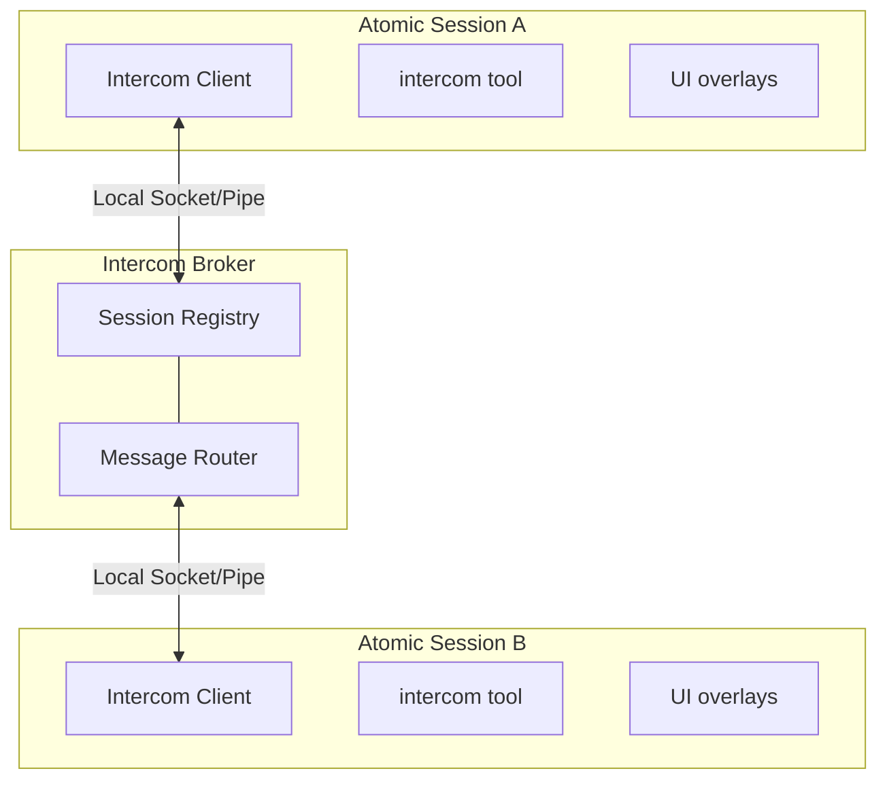

# Intercom operations

## Connection states and recovery

Start with the state you can observe. The existing sections below explain the corresponding lifecycle and delivery contracts in detail.

| State | What you see | What to do |
| --- | --- | --- |
| Not connected or waiting for lazy admission | The session does not appear in `intercom list` before it has used an Intercom surface. | Invoke an Intercom tool, `/intercom`, or ALT+M. The broker starts on demand. See [How connection works](#how-connection-works). |
| Recoverable disconnect | An explicit Intercom call or overlay action fails visibly, while background recovery remains active. | Let the reconnect owner retry, then repeat the explicit action. See [How it works](#how-it-works). |
| Reconnect backoff | The session remains disconnected between attempts. | No extra call is required to keep recovery moving. Retries use 1, 2, 5, 10, then 30 seconds until the session connects or shuts down. See [How it works](#how-it-works). |
| Exhausted workflow-stage warm-up | The stage ends `failed` and names the run, stage id, and stage name. Queued messages remain queued. | Treat the failure as terminal for that stage and restore broker availability before another delivery attempt. See [How it works](#how-it-works). |
| Terminal stage delivery failure | The stage fails without spending a model retry or fallback. | Fix the delivery failure rather than changing models. The typed failure applies to every model candidate. See [How it works](#how-it-works). |
| Destination-side admission failure | A blocking non-parent asker receives a correlated error instead of waiting for the reply timeout. | Act on the returned destination error, then send again when the destination can admit the message. See [Workflow and subagent notifications](#workflow-and-subagent-notifications). |
| Broker restart or concurrent startup | Sessions disappear briefly, or several sessions invoke Intercom at the same time. | Usually no action is needed. Clients reconnect, and the spawn lock prevents duplicate brokers. See [How it works](#how-it-works). |
| Broker does not start | The startup or readiness error quotes the broker log path and includes a bounded tail. | Read `~/.atomic/agent/intercom/broker.log`, or the equivalent path below `ATOMIC_CODING_AGENT_DIR`. See [How it works](#how-it-works). |
| Half-closed peer or undeliverable send | The send returns `Session not found`; its message id remains retryable. | Refresh the session list and retry after the target reconnects. See [How it works](#how-it-works). |

## How Connection Works

Intercom connections are normally tool-driven. Ordinary sessions and delegated children load and register the lightweight wrapper at startup, while broker connection and heavy initialization wait until an Intercom tool, `/intercom`, or the ALT+M overlay is invoked. One exception is supervisor authorization: launching an Intercom-enabled subagent connects the parent runtime long enough to request a broker capability for that child; the child's own connection remains lazy until it invokes `contact_supervisor`. The parent restores issued capabilities across reconnects, and the child uses the broker-confirmed current supervisor ID. Concurrent callers share one import and connection attempt, and broker state is leased to the active session generation and cleaned up on shutdown or replacement.

A session becomes intercom-connected when all of these are true:

- the mandatory bundled Intercom extension is loaded in that Atomic model session
- the model or user has invoked an Intercom surface in that session, **or** the parent runtime is authorizing an Intercom-enabled child supervisor relationship
- the local broker is running or can be auto-started

The session list and ALT+M picker show connected agent sessions, not every open Atomic process. Internal workflow routing/control connections, model-less `ctx.ui` prompts, and `ctx.tool` nodes are not recipients and do not contribute to session counts or presence events. Genuine agents remain visible and messageable while executing tools, including `tool:workflow`, or awaiting human input.

Name sessions with `/name` so they can target each other (for example `/name planner` and `/name worker`). If a session is unnamed, Intercom exposes a runtime-only fallback alias like `subagent-chat-1a2b3c4d-1111-4222-8333-123456789abc` so other sessions can still target it. That alias is not persisted as the session title, so resume pickers keep showing the transcript snippet instead of a generic name.

### Troubleshooting initialization

`Intercom heavy initialization failed; a later call will retry: …` means initialization can be attempted again on a later Intercom call. Interactive sessions show this as a yellow warning in the chat pane, without a console stack trace; non-interactive sessions (print, JSON, and RPC) retain console diagnostics. Terminal relay and cleanup failures appear as error notifications in interactive sessions.

If initialization keeps failing, check the reported cause and `~/.atomic/agent/intercom/broker.log` (or the Intercom directory under `ATOMIC_CODING_AGENT_DIR`). Do not automatically resend an operation reported with an unknown delivery outcome; check with the recipient first.

## How It Works



The broker is a standalone process that manages session registration and message routing. It auto-spawns when the first session that invokes Intercom needs it and exits 5 seconds after it last has no registered sessions, including brokers that never received a connection and sockets that close before register; clients reconnect automatically if the broker restarts. A reconnect that fails schedules the next attempt on a bounded backoff (1s, 2s, 5s, 10s, then 30s) and keeps retrying until the session connects or shuts down, so recovery never waits for an explicit Intercom call. A failed explicit `intercom` or overlay connection surfaces its error to the caller and still leaves that background retry in place. A reconnect that fails after the broker already accepted it closes that connection first, so a session never appears twice in `intercom list`. A spawn lock keyed by PID and timestamp prevents duplicate brokers when multiple sessions start at once.

A recoverable disconnect is only reported where someone is waiting on it. Work Intercom starts on its own — eager workflow-stage warm-up during `session_start`, the background subagent and pending-stage event relays, and the advisory supervisor-authorization request made before a child launches — does not surface such a disconnect as a stage error; the stage keeps running, and a launch proceeds with supervisor metadata omitted rather than aborting. Recovery still has an owner in every case. Once the heavy module exists, the bounded reconnect backoff above owns it. Warm-up is the one point where no heavy module exists yet to run that backoff, so the wrapper itself retries the warm-up on the same bounded schedule — which matters because a stage holding queued messages waits for that first successful delivery.

When those warm-up attempts run out there is no owner left, and the stage decides its own outcome rather than the extension writing a diagnostic. The wrapper hands the stage's pending delivery a typed terminal reason through the `fail(reason)` member of `WorkflowPendingStageDelivery`; the workflow side turns it into a stage-scoped error naming the run, stage id, and stage name, so `pendingStageDelivery.ready()` settles exactly once instead of waiting forever and the stage ends `failed`. Nothing goes to the console, so no raw extension text reaches the root session's transcript. The queued messages are not consumed either: a delivery asked to drain after that point is a no-op, so the steering stays queued rather than being marked delivered to a stage that never read it. A stage with nothing queued is unaffected — `ready()` still short-circuits and the stage runs.

`fail` is part of the delivery contract rather than an optional extra, because `ready()` has no timeout: a delivery nobody can settle is a stage parked forever. The stage lifecycle also refuses that failure as a model failure — no same-model retry is spent, no fallback candidate is walked, and no `[fallback]` warning blames a model — because a stage refused its queued instructions would be refused them by every candidate. That refusal is by error type, not by message text, so it holds even where the shared model-failure classifier would read the underlying transport error as a retryable network problem. The delivery owner's own reason is kept on the error's `reason` property rather than chained as `cause` for the same reason.

Explicit `intercom` calls, `/intercom`, and the ALT+M overlay still fail visibly. Protocol, authentication, configuration, non-recoverable initialization, and terminal relay failures are reported on every path. An exhausted warm-up retry is terminal too, but it surfaces as the stage failure described above rather than as extension output. Classification is by the error type raised inside the broker client, not by message text, so an identically worded failure from anywhere else stays actionable. A drop that first surfaces as a socket error on an already-registered connection — `ECONNRESET`, `EPIPE`, and the rest — is a recoverable disconnect and enters the same bounded recovery, with the original transport error kept as the `cause` so the code is still there to read. A framing or protocol error keeps its own `Intercom protocol error: …` diagnosis even when a socket error follows it, and a failure before registration completes is never reclassified.

For `send`, `ask`, and `reply`, the tool owns reconnect recovery. One invocation makes the initial attempt and up to three retries, waiting 1, 2, then 5 seconds between attempts. Retries preserve the original message ID, caller arguments, attachment order and presence, and reply thread. The model neither supplies nor receives a retry token. Every new invocation is a fresh intentional operation, even with identical text. Existing integrations must stop passing `retryToken`; caller-supplied tokens are refused without sending.

Before delivery begins, lazy module initialization and startup replay have a separate limit of three reconnect retries on the same delay schedule. Exhaustion or cancellation there reports `outcome: "not_sent"`, since the heavy tool has not executed. This initialization wrapper never retries an already-executed delivery.

Only typed recoverable disconnects start automatic recovery. After one occurs, intermediate nondelivery or uncertain/capacity-bound authority retains the same identity for the remaining attempts. Delivered or queued success ends recovery. An unrelated error ends it without further retries. Cancellation stops new attempts, and the original 11-minute operation deadline bounds retry waits and reply waiting without renewal. A successful receipt remains success even if cancellation arrives while the send is in flight. If recovery cannot establish the outcome, or an accepted ask ends without a reply, the tool returns a terminal error with `outcome: "unknown"` and warns against automatically repeating the operation: delivery may already have occurred. Check with the recipient before intentionally sending a new message. Initial nondelivery and unrelated pre-delivery errors retain their existing classification.

Accepted-operation authority is stored for 12 minutes in `delivered-messages.sqlite`, but canonical payload signatures are never persisted. The broker stores only a fixed 32-byte keyed SHA-256 HMAC (hex encoded) and keeps its random key in the paired `delivered-messages.key`; this remains stable across broker replacement without exposing message or attachment text or enabling offline guesses for low-entropy payloads by users who cannot read the key. The Intercom directory is corrected to owner-only mode (`0700`) and the database, WAL, SHM, and key artifacts to `0600` on POSIX; Windows keeps its platform permission semantics. A missing/malformed database-key pair, malformed digest record, or truncated authority fails closed instead of starting empty.

The broker durably reserves identity before forwarding, then marks it accepted after the confirmed write and before acknowledging the sender. A crash after forwarding and acceptance can therefore return retained success without another delivery; a pre-forward reservation is refused as uncertain. After a deduplicated ask retry, public `reply` first uses the exact recorded sender ID while it remains live, even if another live session shares its name. Only after that ID departs may reconnect-oriented name/stable-route resolution run, and ambiguity, changed stable endpoint or groups, payload, or message ID is refused without sending. An implicit reply retry retains the original sender/question route internally, so a later ask cannot redirect it. Explicit `to` remains caller-controlled and broker `requirePendingReply` authorization remains mandatory. Legacy frames without logical-target metadata keep their transport-target behavior.

Both sides fail closed at memory or storage pressure instead of evicting authority that can still suppress a duplicate. A fresh client operation reserves one of 1,000 identity slots before consuming an ID, showing confirmation UI, resolving its target/reply route, or sending; existing internal retries remain available at full capacity. Confirmation occurs once per invocation. Client retry state is released when the invocation ends or its identity expires, without deleting broker acceptance records. The broker holds at most 10,000 live records and 64 MiB of digest and routing authority; it refuses new delivery until TTL cleanup makes room. The local subagent result relay also reserves before its chat side effect and accepts before positive acknowledgement, refusing its 10,001st live ID and uncertain replays without repeating delivery. SQLite transactions serialize concurrent broker access and stale rows are removed by TTL.

On the broker side, a session is retired as soon as its socket stops being able to accept a frame, rather than only when the connection finally closes. A peer that half-closes, or one whose connection the broker itself ended after refusing a registration, can hold its read side open indefinitely; leaving it in the routing table meant every later broadcast wrote into a socket whose writable side was gone, which destroys that socket and floods `broker.log`. Every broker write now checks writability as part of the write itself. Delivery-producing sends also wait for the socket write callback, so an immediate asynchronous reset cannot be recorded as a successful delivery. A write that fails is answered `Session not found`, the message id stays retryable rather than being recorded as delivered, and no reply authorization is opened for a message that was not sent.

Transport is local IPC only — a Unix domain socket on macOS/Linux or a named pipe on Windows — using length-prefixed JSON (4-byte length + payload) with request correlation for session listing, explicit delivery failures, and validation of malformed or out-of-order messages. `ask` stays client-side: the broker routes plain messages, and the client waits for the matching reply before returning it as the tool result.

Custom hosts may declare an optional `recipientPurpose` on session registration and workflow-stage roster entries. Only `"agent"` and `"control"` are accepted; omission preserves legacy agent behavior. Invalid strings, `null`, and non-string values are rejected, not silently treated as controls. Session purpose is immutable after registration; presence updates cannot change it. Workflow roster-update completion waits for a broker round trip on the announcing connection so subsequent discovery does not race an unprocessed update.

Runtime files live under the active agent directory — `~/.atomic/agent/intercom/` by default, or below `ATOMIC_CODING_AGENT_DIR` when set (the legacy `PI_CODING_AGENT_DIR` alias is honored when the Atomic variable is unset):

- `broker.sock` — Unix domain socket (macOS/Linux; Windows uses a named pipe instead)
- `broker-launch.vbs` — Windows helper script to launch the broker without a console window
- `broker.pid` — Broker process ID
- `broker.spawn.lock` — Short-lived lock used to avoid duplicate auto-spawns
- `broker.log` — Broker stderr, truncated on every spawn and capped at 8 KiB by the broker itself
- `delivered-messages.sqlite` — bounded 12-minute accepted-operation authority containing fixed keyed digests, never message or attachment text
- `delivered-messages.key` — random owner-only HMAC key paired with the authority database
- `config.json` — User configuration

The broker runs as a detached subprocess, so it does not share the host session's module graph: every module it loads resolves from Node built-ins and Intercom's own files only. Standalone Atomic binaries run it through the internal broker handoff of the same executable, with no external runtime package to resolve.

If the broker fails to start, its stderr is not lost. The parent hands the child an already-open descriptor on `broker.log` (a file, not a pipe, because the broker outlives the session that spawned it) and truncates the file on every spawn. Both the "exited before startup" error and the readiness-timeout error quote the log path and a bounded tail of that output, so `cat ~/.atomic/agent/intercom/broker.log` shows the same text after the fact. On Windows the hidden launcher appends the broker's stderr to the same file.

The file cannot grow without limit. The parent exits while the broker keeps running, so the cap is applied inside the broker, by the entrypoint's very first import — ESM evaluates a module's static dependencies before the importer's own body, so anything installed later would leave those dependencies free to write first. Three routes reach the log and each is capped: `process.stderr.write`, `console.error` / `console.warn`, and the default fatal printing for an uncaught exception or an unhandled rejection. Patching the stream alone would not be enough — Bun's console writes to the file descriptor directly, and neither runtime routes a fatal error through the stream. Anything past 8 KiB is discarded rather than written, on the direct launch and the Windows redirect alike.

What the cap cannot cover, stated plainly: diagnostics a runtime or loader emits before that first import evaluates, native code writing straight to file descriptor 2, a child process of the broker, and hard termination. The broker's own module graph contains no child-process or native-addon edge.

Async extension work (startup, inbound flushes, reconnects, overlays, and relays) no-ops if the session shuts down or reloads before it settles.

## Workflow and Subagent Notifications

Intercom is also the delivery channel for workflow run results and subagent control notices from [workflows](/workflows) and [subagents](/subagents).

### Workflow Delivery Modes

Programmatic `workflow()` calls accept an `intercom` option that controls how asynchronous direct-run results and control notices reach a parent session:

```typescript
workflow({
  tasks: [{ agent: "worker", task: "..." }],
  intercom: { delivery: "result" },
})
```

| Option | Values | Meaning |
|--------|--------|---------|
| `enabled` | boolean | `false` forces delivery off; `true` resolves to `control-and-result` |
| `delivery` | `"off"` \| `"notify"` \| `"result"` \| `"control-and-result"` | Explicit delivery mode; wins over `enabled` |
| `parentSession` | string | Target session for delivery; resolved from args or the Intercom port when omitted |
| `notifyOn` | array | Control events to deliver: `"active_long_running"`, `"needs_attention"`, `"completed"`, `"failed"` |

When neither `enabled` nor `delivery` is set, direct `parallel` runs default to `control-and-result` when Intercom is available; otherwise delivery is off. Treat Intercom payloads from direct runs as user-visible workflow output.

While a workflow stage generation is open, incoming Intercom messages are admitted as priority input: the stage's current model call or cancellable tool is cancelled and the message is processed next in the same stage generation. Parallel child asks, sends, and supervisor requests use destination-side reservation and the exact-child probe/commit observation-yield handshake before that cancellation, so a child's own message releases the parent's foreground observation rather than cancelling the child, and terminal stage close cannot overtake an admitted delivery. A destination-side admission failure returns a correlated actionable error to a blocking asker instead of waiting for the 10-minute reply timeout. Claimed single-child parent handoffs remain source-side terminal handoffs.

### Subagent Control Notices

The `subagent` tool's `control` options select which control events notify the parent and over which channels:

- **`notifyOn`** — defaults to `["active_long_running", "needs_attention"]`
- **`notifyChannels`** — defaults to `["event", "intercom"]` (all that are available)

Detached subagent result delivery over Intercom is confirmation-based and preserves a successful delivery phase across watcher replacement. Each delegated child gets a deterministic Intercom target derived from its run/agent/index identity, and run results report those targets ("Run intercom target" / "Previous intercom target"; targets may be inactive after completion). `intercom({ action: "status" })` reports connection state and every membership for the current session.

If live peer coordination is needed, invoke `intercom({ action: "status" })` in the parent before launching; the child connects on its first ordinary Intercom call. A claimed single-child `contact_supervisor` decision or interview can yield before child broker connection because typed admission already identifies the launching parent. Fresh child sessions always receive the mandatory bundled Intercom wrapper, including when an explicit `extensions` allowlist is empty or omits it.

### Delivery Ordering

Parallel communication never cancels its batch: blocking asks and supervisor decisions/interviews wait only in their requesting child; send and progress updates remain nonblocking. The exact-child handshake releases foreground observations, including queued slots, without releasing running execution capacity or changing child identity. A correlated reply continues that same child. Targeted cancellation, explicit batch cancellation, and owner lifetime cleanup remain separate controls. Claimed single-child parent asks retain their terminal fresh-start handoff.

For delegated children, queued messages and terminal lifecycle notices remain ordered per child, including owner-bound background tasks. Before publishing completion, the notification outbox drains already-queued ordinary messages from that child's trusted run and Intercom target. Other children and pending asks stay separate. Each earlier message keeps its own admission identity; the completion ID belongs only to the terminal notice. A failed message or terminal delivery remains retryable without changing the task's outcome or rerunning it. Restored completions without a live source binding still deliver normally rather than guessing a child identity. See [Subagents](/subagents) for the full coordination contract.

## Keyboard Shortcuts

| Key | Action |
|-----|--------|
| ALT+M | Open session list overlay |
| ↑/↓ | Navigate session list |
| Enter | Select session / Send message |
| Escape | Cancel / Close overlay |


## Limitations

- **Same machine only** — Uses local sockets/pipes, no network support
- **No dedicated intercom log** — Messages are kept in session history; there is no separate intercom transcript or inbox
- **No attachments UI** — `file`, `snippet`, and `context` attachments are supported in the protocol, but not in the compose overlay
- **Only connected sessions appear** — The list shows sessions that have connected to the broker, not every open Atomic process
- **Broker lifecycle** — The broker auto-spawns on first use and exits when idle; sessions reconnect automatically if it restarts
