# Evals

Atomic's model-selection docs are keyed to two live external eval sources rather than a hand-maintained table of scores. This page lists each eval, what it measures, the measured numbers for the models in Atomic's catalog, and **when to reference it** for a given workflow role — so an agent authoring a workflow can pick a model for a task type from evidence rather than from an aggregate rank.

<Warning>
No single benchmark is the source of truth. Validate these inputs against Atomic's own workflow evals. Artificial Analysis was retrieved on **2026-09-08**, after its **September 7 Intelligence Index v4.3** announcement. The AA tables and charts below use that read; source pages show no separate per-measurement publication date. DeepSWE retains its **2026-09-03** snapshot, read on **2026-09-05**, and was not revalidated in this refresh. Values preserve the displayed source precision; a rounded lead is not a significance claim.
</Warning>

## The two sources at a glance

| Source | URL | What it is | Reference it for |
| --- | --- | --- | --- |
| DeepSWE | [deepswe.datacurve.ai](https://deepswe.datacurve.ai/) | Long-horizon, contamination-free software-engineering tasks (113 tasks, 91 repos, 5 languages), all run on `mini-swe-agent` for consistency | The primary signal for coding-agent routing: real `pass@1`, cost, output tokens, and agent steps on engineering-loop work |
| Artificial Analysis | [artificialanalysis.ai](https://artificialanalysis.ai/) | Model intelligence and professional capability indices, individual evaluations, and a separate coding-agent leaderboard | Cross-domain intelligence, tool use, knowledge reliability, long context, and agent/model comparisons |

## Pick by task type

Start here when a stage needs a model. Each row names a relevant benchmark and selected candidates, not a universal winner or a guarantee that the cheaper option stays close. "Measured" means the exact configuration named; a different effort level or agent is a different experiment.

Practical workflow default: use `low` or `medium` for coding, and `high` or `xhigh` for code review, test design and failure analysis, where the configured model supports those levels. Run actual tests as tool calls, not model judgments. `max` is usually overkill and is not preferred in practice. These are starting recommendations, not conclusions that every benchmark proves; the rows below preserve the exact measured settings. See [role-based thinking effort](/models/model-selection#role-based-thinking-effort).

| Task type | Benchmark to read | Selected measured candidates | Cost-conscious alternative |
| --- | --- | --- | --- |
| Implementing features and fixing bugs | September 3 Datacurve DeepSWE | Astra xhigh, Gemini 3.8 Flash high and Opus 5 max display 74% | Luna max 67% / $0.61; GLM-5.3-Flash max 63% / $0.24 |
| Terminal work and shell debugging | Terminal-Bench v4.0 | Astra xhigh 60%, max 59%; Fable 5.1 xhigh with fallback 55% | GLM-5.3-Flash 33% at $0.25 per Index task; task-specific quality is materially lower |
| Knowledge-work deliverables | AA-Briefcase / GDPval-AA v2, normalized Elo, not pass rates | Fable 5.1 max with fallback 58% / 63%; Opus 5 max 57% / 62% | GLM-5.3-Flash 48% / 58% at $0.25 per Index task |
| SaaS workflows through REST APIs | AutomationBench-AA | Astra max 68%; Astra high and xhigh, Grok 4.6 high 67% | GLM-5.3-Flash 60%; Luna max 50% |
| Long PDFs and professional documents | GDP.pdf All-pass | Astra xhigh 32%; max and high 31% | Astra low 30%; Luna max 24% |
| Long-context extraction and synthesis | AA-LCR v1.1 | Kimi K3 max 89%; Fable 5.1 max with fallback 85% | Luna max 84% at $0.18 per Index task |
| Facts where a wrong answer is worse than a partial answer or abstention | AA-Omniscience non-hallucination | GLM-5.3-Flash 72%; GLM-5.3 max 70%; Muse Spark 1.3 xhigh 69% | GLM-5.3-Flash; verify claims regardless of benchmark rank |
| Raw factual recall with external verification | AA-Omniscience accuracy | Fable 5.1 max with fallback 67%; Fable 5 with fallback 65% | Gemini 3.8 Flash high and Gemini 3.7 Flash high 55% |
| Scientific programming | SciCode | Fable 5.1 max with fallback 63%; Fable 5 with fallback 61% | Gemini 3.8 Flash high and Gemini 3.7 Flash high 57% |
| Hard reasoning and physics | Humanity's Last Exam / CritPt | Fable 5.1 max with fallback 59% HLE; Astra max and Sol max 32% CritPt | Astra medium 53% HLE / 29% CritPt |
| Whole coding-agent products | Coding Agent Index v1.4 | Claude Code + Fable 5.1 max with fallback 70; Claude Code + Opus 5 xhigh and Muse Code + Muse Spark 1.3 max 68 | Opencode + Gemini 3.8 Flash high 61 / $2.04; Codex + Luna max 57 / $0.29 |

The new terminal benchmark changes the practical cross-check. Astra is strongest among these displayed terminal and PDF configurations, while Fable 5.1 retains stronger normalized Elo on knowledge-work deliverables. Luna remains a low-cost long-context candidate but its 7% non-hallucination metric calls for external verification. AA task costs are not Datacurve or Atomic task costs. All abbreviated Fable labels in charts retain the table's default-fallback setting.

## DeepSWE — coding-agent performance

DeepSWE is the closest public proxy for what Atomic actually does. Tasks are written from scratch (not scraped from PRs), so no model has seen the solutions; solutions require substantially more code than SWE-bench-style suites; and verifiers test behavior rather than implementation.

- **Current snapshot:** DeepSWE v1.1, 113 tasks across 91 repositories and 5 languages, updated September 3, 2026. The site reports 28 measured models and displays 21 leaderboard rows by default, out of 70 published model/effort configurations.
- **Metric:** `pass@1`, plus average cost per task, output tokens, and agent steps.
- **When to reference:** default weighting for debugger, worker, and any code-writing role. This is the table that drives [Model Selection](/models/model-selection) and [Pareto Efficiency](/models/pareto-efficiency).
- **Watch:** cost and step count, not just score — a model that passes but takes 268 steps (e.g. sonnet-5) is a poor worker even at a good pass rate, and the two accuracy leaders sit at opposite ends of that axis: Gemini 3.8 Flash leads the highest-published-effort reading the linked pages use at 166 average steps, while the live default Best view's leader, GPT-6 Astra [xhigh], averages 29.

### Live leaderboard, Best view

DeepSWE's default table is the **Best** view: the best-scoring effort configuration per model. These are the 21 rows it displayed on 2026-09-05 for the September 3, 2026 snapshot. [Model Selection](/models/model-selection) instead tabulates the highest published effort per model, so four rows differ there (`gpt-6-astra [max]`, `claude-fable-5 [max]`, `grok-4.6 [xhigh]`, `gemini-3.7-flash [high]`). Confidence intervals are DeepSWE's displayed ±.

| Model [effort] | pass@1 | Avg $/task | Output tokens | Steps |
| --- | --- | --- | --- | --- |
| gpt-6-astra [xhigh] | 74% ±3 | $6.52 | 30k | 29 |
| gemini-3.8-flash [high] | 74% ±1 | $2.36 | 143k | 166 |
| claude-opus-5 [max] | 74% ±4 | $11.84 | 118k | 99 |
| gpt-5.6-sol [max] | 73% ±3 | $6.46 | 60k | 61 |
| claude-fable-5 [xhigh] | 70% ±3 | $13.41 | 80k | 68 |
| glm-5.3 [max] | 69% ±3 | $3.99 | 80k | 124 |
| kimi-k3 [max] | 69% ±5 | $4.65 | 81k | 98 |
| grok-4.6 [medium] | 67% ±2 | $3.45 | 50k | 70 |
| gpt-5.6-luna [max] | 67% ±4 | $0.61 | 73k | 102 |
| gpt-5.5 [xhigh] | 67% ±6 | $7.23 | 46k | 82 |
| gemini-3.7-flash [medium] | 65% ±3 | $2.03 | 94k | 117 |
| glm-5.3-flash [max] | 63% ±4 | $0.24 | 73k | 123 |
| deepseek-v4-pro [max] | 63% ±6 | $1.67 | 106k | 155 |
| claude-opus-4.8 [max] | 59% ±2 | $13.22 | 135k | 120 |
| qwen3.8-max [xhigh] | 57% ±3 | $3.73 | 95k | 111 |
| muse-spark-1.2 [xhigh] | 55% ±2 | $3.70 | 99k | 101 |
| claude-sonnet-5 [max] | 54% ±4 | $26.40 | 214k | 268 |
| deepseek-v4-flash [max] | 53% ±4 | $0.46 | 108k | 153 |
| gemini-3.6-flash [high] | 47% ±4 | $2.21 | 96k | 117 |
| glm-5.2 [max] | 44% ±2 | $3.92 | 78k | 129 |
| gemini-3.5-flash [high] | 36% ±4 | $3.45 | 76k | 105 |

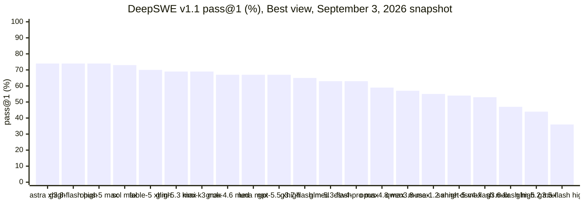

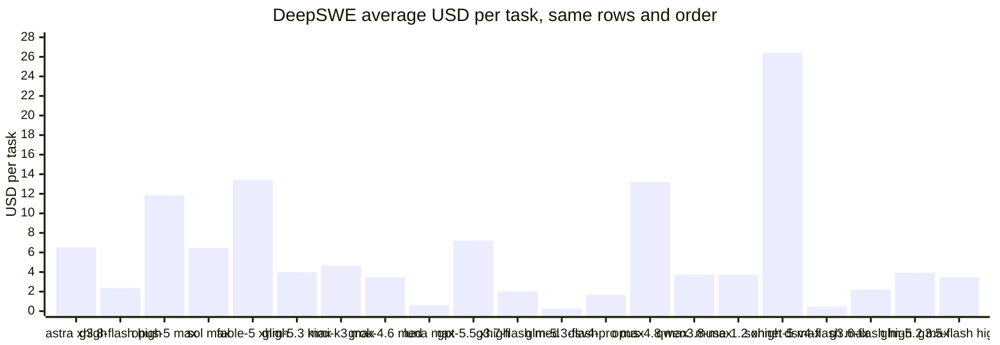

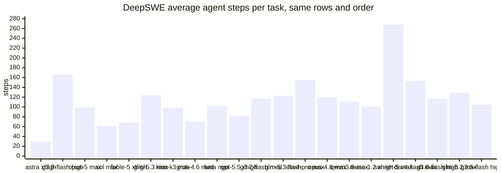

What the three charts say together:

- **Accuracy is flat at the top.** Three models display 74% and a fourth 73%, all inside each other's confidence intervals. Choose among them on cost and steps, not score.
- **The displayed 74% rows span about fivefold in cost.** Gemini 3.8 Flash [high] costs $2.36 and Opus 5 [max] $11.84. Luna [max] reaches 67% for $0.61. Sonnet 5 [max] costs $26.40 for 54% and 268 steps in this snapshot.
- **Steps predict wall time and tool-call load.** Astra [xhigh] (29) and Sol [max] (61) finish in a third of the steps that Gemini 3.8 Flash [high] (166) or DeepSeek V4 Pro [max] (155) need. For a worker loop that pays per tool call or that a reviewer must audit, prefer the low-step row at the same accuracy.
- **The cheap tier is honest about its ceiling.** GLM-5.3-Flash [max] 63% at $0.24 and DeepSeek V4 Flash [max] 53% at $0.46 are the only rows under $1 besides Luna; they are budget workers, not judgment gates.

## Artificial Analysis: current measures

### Intelligence Index v4.3

The [September 7, 2026 announcement](https://artificialanalysis.ai/articles/artificial-analysis-intelligence-index-v4-3), [current index](https://artificialanalysis.ai/evaluations/artificial-analysis-intelligence-index) and [methodology](https://artificialanalysis.ai/methodology/intelligence-benchmarking), retrieved 2026-09-08, identify **Artificial Analysis Intelligence Index v4.3**. It replaces 𝜏³-Banking with AutomationBench-AA and Terminal-Bench v2.1 with v4.0. Category weights remain unchanged from v4.2; evaluations with private questions or answers now account for 45% rather than 40%. Do not compare scores across revisions as though only the models changed. The announcement still describes v5 as future work.

The ten evaluations and their contributions are:

| Category and total weight | Evaluation | Index weight | Use it for |
| --- | --- | --- | --- |
| Agents, 30% | AA-Briefcase | 15% | Multi-week knowledge-work projects and file deliverables |
| Agents | GDPval-AA v2 | 10% | Economically realistic professional work |
| Agents | AutomationBench-AA | 5% | SaaS workflow automation with REST API tools; objective completion with zero credit on a guardrail violation |
| Coding, 20% | Terminal-Bench v4.0 | 10% | Terminal execution and debugging |
| Coding | SciCode | 10% | Scientific programming |
| Scientific Reasoning, 20% | Humanity's Last Exam | 10% | Hard reasoning and knowledge |
| Scientific Reasoning | CritPt | 10% | Physics reasoning |
| General, 30% | AA-Omniscience | 15% | Knowledge accuracy, 10%, and non-hallucination, 5%, as separate components |
| General | GDP.pdf | 10% | Professional document reasoning; headline All-pass requires every criterion to pass |
| General | AA-LCR v1.1 | 5% | Long-context reasoning |

AutomationBench-AA uses a private 657-task held-out split from dataset v1.0.6, one attempt per task and a 50-turn cap. Terminal-Bench v4.0 uses 66 tasks, mini-SWE-agent v2.4.6 and three repeats per task. These are different experiments from both the older Terminal-Bench v2.1 results and the Coding Agent Index below. The suite remains primarily text-based and English-language, not a universal measure of multimodal or multilingual quality. Additional evaluations such as AA-AnalystAgent and ITBench-AA can be better matches for spreadsheet analysis or incident diagnosis; their presence on the site does not make them index components. GPQA Diamond remains separate.

### Headline leaderboard rows for catalog models

From the [LLM leaderboard](https://artificialanalysis.ai/leaderboards/models), retrieved 2026-09-08. Cost is AA's weighted **cost per Intelligence Index task**, not a token price. Speed is output tokens per second on the default 10k-input workload. First-chunk latency can refer to a reasoning token; end-to-end includes thinking and a 500-token answer. `—` means the source does not report the value.

| AA configuration | Intelligence Index | $/Index task | Output tok/s | First chunk (s) | End-to-end 500 tok (s) |
| --- | --- | --- | --- | --- | --- |
| Claude Fable 5.1 (max with fallback) | 53 | $7.63 | 69 | 276.82 | 284.07 |
| Claude Fable 5.1 (xhigh with fallback) | 53 | $5.98 | 58 | 107.33 | 115.95 |
| GPT-6 Astra (max) | 53 | $3.26 | 62 | 322.48 | 330.48 |
| GPT-6 Astra (xhigh) | 53 | $2.31 | 58 | 131.86 | 140.46 |
| Claude Fable 5.1 (high with fallback) | 51 | $3.91 | 56 | 23.85 | 32.77 |
| GPT-6 Astra (high) | 51 | $1.72 | 59 | 44.97 | 53.48 |
| Claude Opus 5 (max) | 51 | $5.86 | 52 | 63.60 | 73.24 |
| Claude Fable 5 (with fallback) | 50 | $8.75 | 63 | 83.30 | 91.24 |
| GPT-6 Astra (medium) | 50 | $1.54 | 56 | 5.21 | 14.19 |
| Claude Opus 5 (xhigh) | 50 | $4.88 | 50 | 29.99 | 39.93 |
| Claude Fable 5.1 (medium with fallback) | 49 | $2.98 | 54 | 7.99 | 17.17 |
| Claude Opus 5 (high) | 48 | $3.61 | 52 | 17.45 | 27.04 |
| Muse Spark 1.3 (max) | 48 | $1.60 | 232 | 26.75 | 37.50 |
| GPT-5.6 Sol (max) | 47 | $1.99 | 74 | 127.52 | 134.27 |
| Claude Fable 5.1 (low with fallback) | 47 | $2.37 | 52 | 6.35 | 15.92 |
| GPT-6 Astra (low) | 46 | $0.82 | 55 | 2.55 | 11.72 |
| GPT-6 Astra (Non-reasoning) | 45 | $1.71 | — | — | — |
| Muse Spark 1.3 (xhigh) | 45 | $1.37 | 185 | 31.75 | 45.28 |
| GLM-5.3 (max) | 45 | $2.01 | 71 | 2.44 | 37.51 |
| Grok 4.6 (high) | 44 | $1.86 | 56 | 38.16 | 47.12 |
| GPT-5.6 Sol (xhigh) | 44 | $1.18 | 69 | 45.41 | 52.63 |
| Kimi K3 (max) | 44 | $2.00 | 42 | 3.26 | 63.43 |
| GPT-5.6 Sol (high) | 42 | $0.81 | 68 | 10.61 | 17.96 |
| GPT-5.6 Terra (max) | 42 | $1.40 | 116 | 139.61 | 143.94 |
| GLM-5.3-Flash | 42 | $0.25 | 58 | 1.51 | 44.66 |
| Gemini 3.8 Flash (high) | 41 | $1.24 | 286 | 17.36 | 19.11 |
| Qwen3.8 Max | 40 | $2.67 | 41 | 2.44 | 63.94 |
| Muse Spark 1.2 (xhigh) | 40 | $0.97 | 217 | 14.78 | 26.28 |
| Gemini 3.7 Flash (high) | 39 | $0.93 | 319 | 9.50 | 11.07 |
| Claude Sonnet 5 (max) | 38 | $5.09 | 80 | 183.11 | 189.40 |
| GPT-5.6 Luna (max) | 38 | $0.18 | 121 | 136.55 | 140.67 |
| DeepSeek V4 Pro 0813 (max) | 36 | $0.67 | 75 | 1.64 | 34.88 |
| GPT-5.6 Luna (xhigh) | 35 | $0.09 | 109 | 58.50 | 63.10 |
| DeepSeek V4 Flash 0731 (max) | 35 | $0.22 | 128 | 0.91 | 20.49 |
| Gemini 3.6 Flash | 34 | $0.93 | 218 | 14.04 | 16.33 |

Four configurations display 53 index points. This rounded tie does not establish identical underlying scores or statistically significant differences. Astra xhigh costs $2.31 per Index task versus $3.26 at max and has lower measured end-to-end latency. Fable 5.1 xhigh similarly costs less and responds sooner than max. Gemini 3.8 Flash now has reported API performance; its 286 tok/s is not a coding-agent completion rate.

The live leaderboard also lists **Qwen3.8 2.4T A95B** at 40 index points and $2.16 per Index task, and **DeepSeek V4 Flash Vision (max)** at 35 and $0.31. These are separate model identities, not replacements for Qwen3.8 Max or DeepSeek V4 Flash 0731. Their appearance on AA does not establish Atomic catalog availability. Check the exact model page and provider access before choosing either; no predecessor score is transferred here.

### Per-evaluation scores for catalog models

Read on 2026-09-08 from the rendered "Intelligence Evaluations" charts on [Astra](https://artificialanalysis.ai/models/gpt-6-astra), [GLM-5.3-Flash](https://artificialanalysis.ai/models/glm-5-3-flash), [Gemini 3.7 Flash](https://artificialanalysis.ai/models/gemini-3-7-flash), [Sonnet 5](https://artificialanalysis.ai/models/claude-sonnet-5) and [Terra](https://artificialanalysis.ai/models/gpt-5-6-terra). AA-Briefcase and GDPval-AA v2 are normalized Elo scores displayed as `100 × clamp((Elo - 500) / 2000, 0, 1)`, **not pass percentages**. For index inclusion, the [methodology](https://artificialanalysis.ai/methodology/intelligence-benchmarking) freezes each evaluation's Elo at model addition. Rounded displays cannot be inverted into exact Elo: 58% corresponds to approximately 1660, not an exact rating. AA-Omniscience non-hallucination is one minus the [hallucination rate](https://artificialanalysis.ai/evaluations/omniscience): `(partial answers + not attempted) / (incorrect + partial answers + not attempted)`, expressed as a percentage. It includes partial answers and not-attempted responses among non-correct responses, not just abstentions or a fraction of all answers.

Sol's additional efforts were read from its [xhigh](https://artificialanalysis.ai/models/gpt-5-6-sol-xhigh) and [high](https://artificialanalysis.ai/models/gpt-5-6-sol-high) pages. Selection is explicit: the tables retain the previously documented configurations and add Fable 5.1's lower efforts and Astra's Non-reasoning row. A source label does not establish that Atomic exposes that configuration through every provider.

**Agentic and coding evaluations**

| AA configuration | AA-Briefcase, normalized Elo | GDPval-AA v2, normalized Elo | AutomationBench-AA | Terminal-Bench v4.0 | SciCode |
| --- | --- | --- | --- | --- | --- |
| Claude Fable 5.1 (max with fallback) | 58% | 63% | 59% | 52% | 63% |
| Claude Fable 5.1 (xhigh with fallback) | 58% | 62% | 58% | 55% | 61% |
| Claude Fable 5.1 (high with fallback) | 54% | 57% | 55% | 52% | 59% |
| Claude Fable 5.1 (medium with fallback) | 52% | 54% | 55% | 45% | 56% |
| Claude Fable 5.1 (low with fallback) | 49% | 50% | 52% | 40% | 57% |
| Claude Opus 5 (max) | 57% | 62% | 57% | 49% | 56% |
| Claude Opus 5 (xhigh) | 56% | 60% | 53% | 46% | 56% |
| Claude Opus 5 (high) | 53% | 56% | 54% | 46% | 55% |
| Claude Fable 5 (with fallback) | 51% | 57% | 54% | 42% | 61% |
| GPT-6 Astra (max) | 53% | 54% | 68% | 59% | 56% |
| GPT-6 Astra (xhigh) | 52% | 53% | 67% | 60% | 56% |
| GPT-6 Astra (high) | 50% | 51% | 67% | 54% | 55% |
| GPT-6 Astra (medium) | 48% | 50% | 65% | 49% | 54% |
| GPT-6 Astra (low) | 38% | 46% | 59% | 42% | 54% |
| GPT-6 Astra (Non-reasoning) | 49% | 52% | 62% | 51% | 53% |
| GPT-5.6 Sol (max) | 49% | 56% | 60% | 40% | 57% |
| GPT-5.6 Sol (xhigh) | 47% | 54% | 55% | 25% | 57% |
| GPT-5.6 Sol (high) | 43% | 51% | 55% | 21% | 58% |
| GPT-5.6 Terra (max) | 42% | 49% | 60% | 35% | 55% |
| GPT-5.6 Luna (max) | 42% | 49% | 50% | 12% | 54% |
| Muse Spark 1.3 (max) | 54% | 60% | 58% | 33% | 59% |
| Muse Spark 1.3 (xhigh) | 49% | 58% | 57% | 17% | 60% |
| Grok 4.6 (high) | 52% | 57% | 67% | 21% | 56% |
| Kimi K3 (max) | 50% | 54% | 58% | 13% | 59% |
| GLM-5.3 (max) | 51% | 59% | 62% | 42% | 59% |
| GLM-5.3-Flash | 48% | 58% | 60% | 33% | 52% |
| Gemini 3.8 Flash (high) | 35% | 48% | 60% | 20% | 57% |
| Gemini 3.7 Flash (high) | 31% | 47% | 62% | 14% | 57% |
| Claude Sonnet 5 (max) | 43% | 50% | 37% | 14% | 54% |
| DeepSeek V4 Pro 0813 (max) | 38% | 50% | 57% | 14% | 51% |
| DeepSeek V4 Flash 0731 (max) | 38% | 48% | 54% | 12% | 50% |

**Reasoning, knowledge and document evaluations**

| AA configuration | Humanity's Last Exam | CritPt | GDP.pdf All-pass | AA-Omniscience accuracy | AA-Omniscience non-hallucination | AA-LCR v1.1 |
| --- | --- | --- | --- | --- | --- | --- |
| Claude Fable 5.1 (max with fallback) | 59% | 30% | 26% | 67% | 27% | 85% |
| Claude Fable 5.1 (xhigh with fallback) | 59% | 31% | 26% | 66% | 29% | 83% |
| Claude Fable 5.1 (high with fallback) | 56% | 30% | 27% | 65% | 31% | 84% |
| Claude Fable 5.1 (medium with fallback) | 54% | 29% | 27% | 63% | 31% | 85% |
| Claude Fable 5.1 (low with fallback) | 49% | 28% | 28% | 60% | 34% | 82% |
| Claude Opus 5 (max) | 55% | 29% | 22% | 61% | 39% | 79% |
| Claude Opus 5 (xhigh) | 54% | 28% | 21% | 60% | 40% | 80% |
| Claude Opus 5 (high) | 53% | 28% | 20% | 59% | 39% | 79% |
| Claude Fable 5 (with fallback) | 55% | 29% | 24% | 65% | 36% | 82% |
| GPT-6 Astra (max) | 55% | 32% | 31% | 63% | 49% | 81% |
| GPT-6 Astra (xhigh) | 55% | 31% | 32% | 62% | 52% | 80% |
| GPT-6 Astra (high) | 53% | 29% | 31% | 61% | 55% | 80% |
| GPT-6 Astra (medium) | 53% | 29% | 30% | 61% | 53% | 80% |
| GPT-6 Astra (low) | 49% | 26% | 30% | 60% | 53% | 80% |
| GPT-6 Astra (Non-reasoning) | 37% | 20% | 27% | 56% | 35% | 71% |
| GPT-5.6 Sol (max) | 49% | 32% | 27% | 59% | 8% | 84% |
| GPT-5.6 Sol (xhigh) | 47% | 29% | 28% | 59% | 8% | 82% |
| GPT-5.6 Sol (high) | 46% | 26% | 28% | 58% | 9% | 82% |
| GPT-5.6 Terra (max) | 43% | 30% | 24% | 47% | 12% | 83% |
| GPT-5.6 Luna (max) | 39% | 21% | 24% | 43% | 7% | 84% |
| Muse Spark 1.3 (max) | 49% | 25% | 27% | 44% | 67% | 83% |
| Muse Spark 1.3 (xhigh) | 47% | 26% | 24% | 42% | 69% | 83% |
| Grok 4.6 (high) | 43% | 17% | 17% | 48% | 66% | 80% |
| Kimi K3 (max) | 47% | 23% | 22% | 48% | 47% | 89% |
| GLM-5.3 (max) | 42% | 19% | 11% | 34% | 70% | 80% |
| GLM-5.3-Flash | 40% | 15% | 15% | 28% | 72% | 80% |
| Gemini 3.8 Flash (high) | 48% | 18% | 21% | 55% | 45% | 81% |
| Gemini 3.7 Flash (high) | 48% | 14% | 24% | 55% | 35% | 82% |
| Claude Sonnet 5 (max) | 41% | 17% | 13% | 40% | 61% | 82% |
| DeepSeek V4 Pro 0813 (max) | 41% | 18% | 11% | 49% | 5% | 80% |
| DeepSeek V4 Flash 0731 (max) | 39% | 17% | 11% | 40% | 8% | 80% |

### Benchmark charts

These charts use the dated tables above, not a new live retrieval. The first seven use the same selected configurations in the same order for comparison across benchmarks. Fable 5.1 retains its measured default fallback. Normalized Elo is not a pass rate. The following charts cover the remaining Intelligence Index components, including separate accuracy and non-hallucination views for AA-Omniscience.

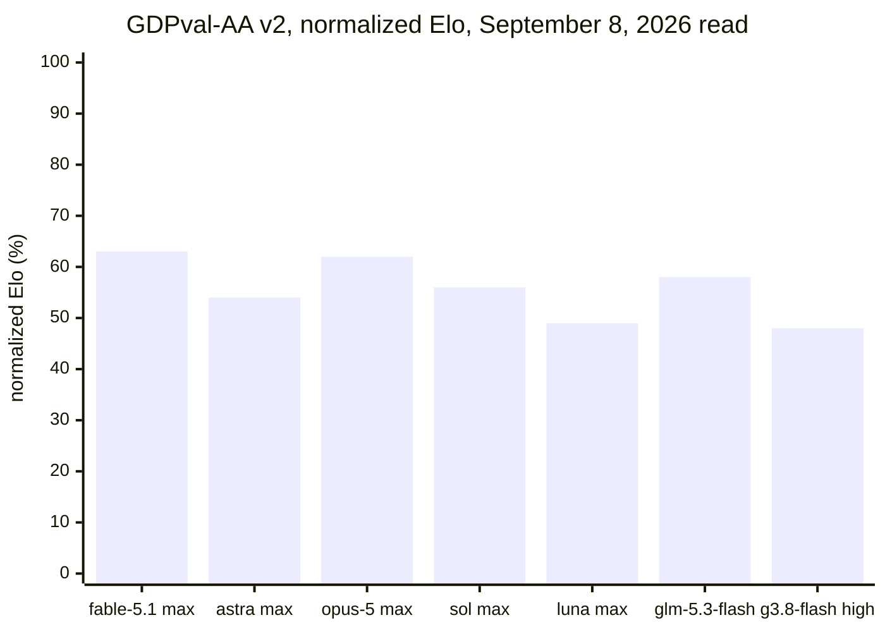

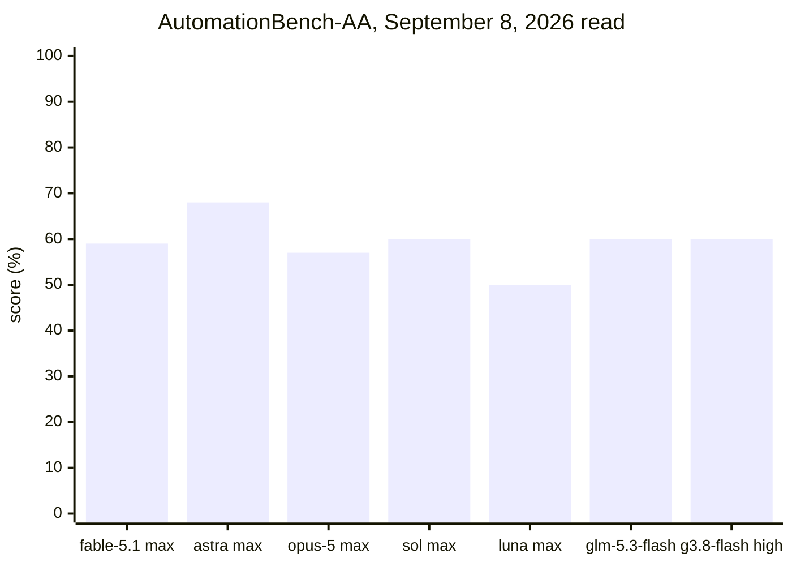

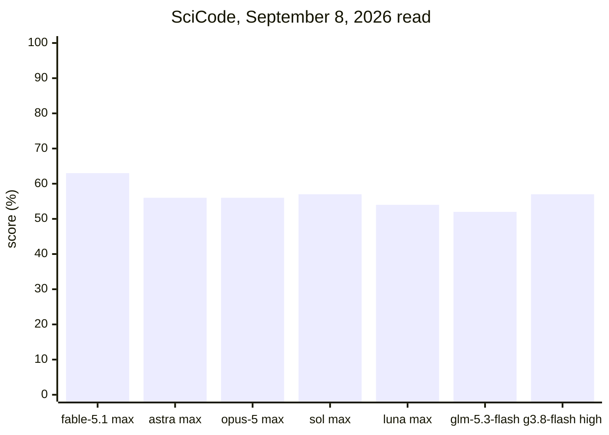

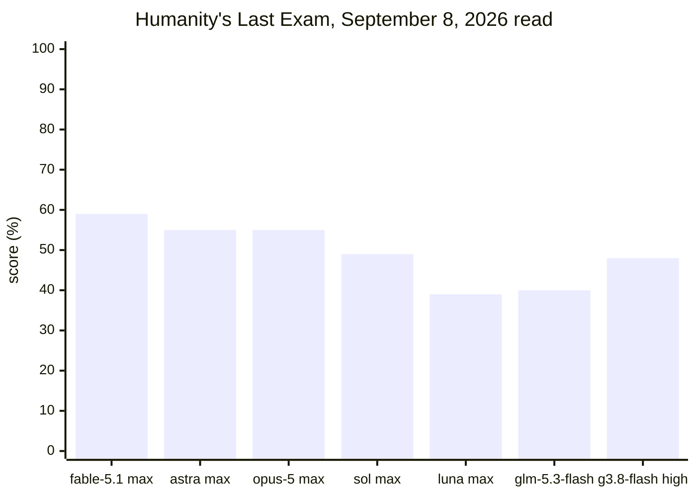

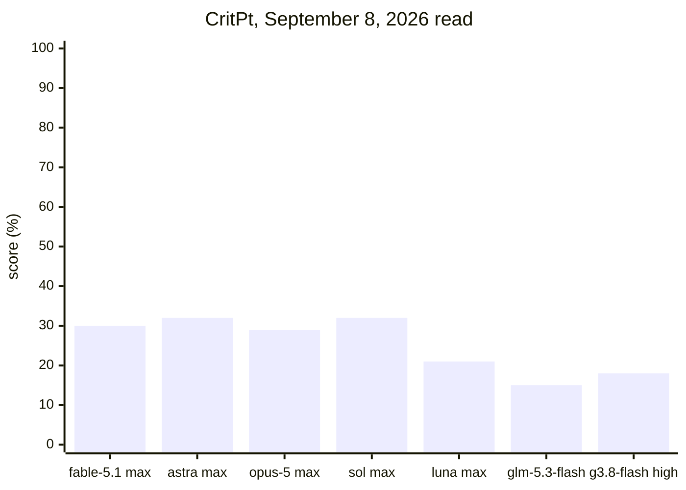

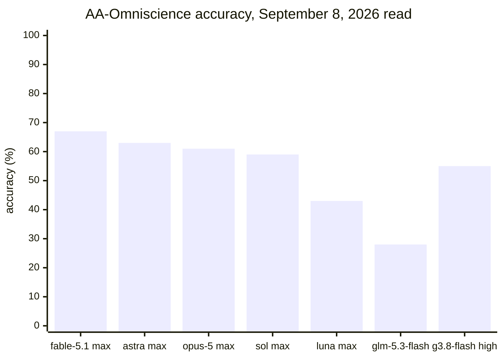

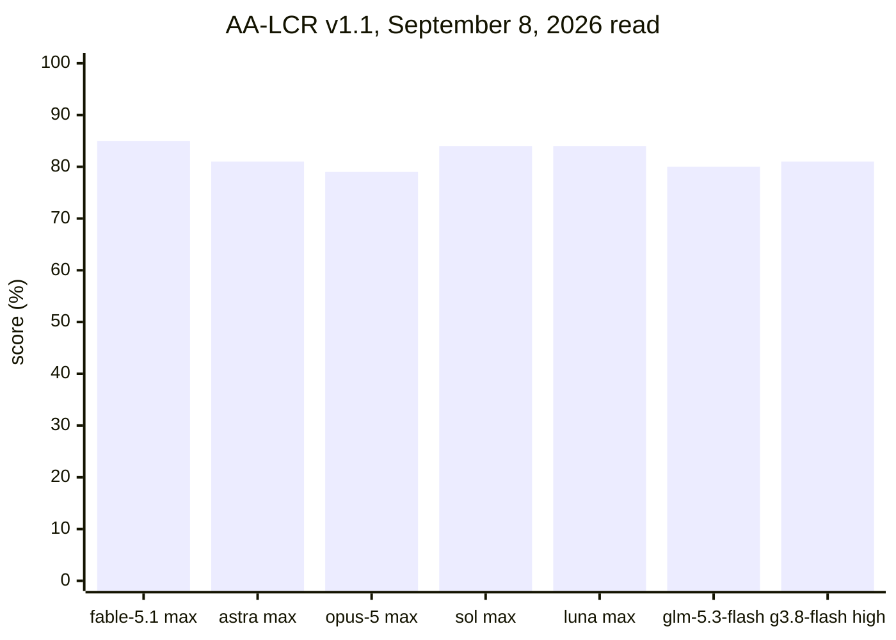

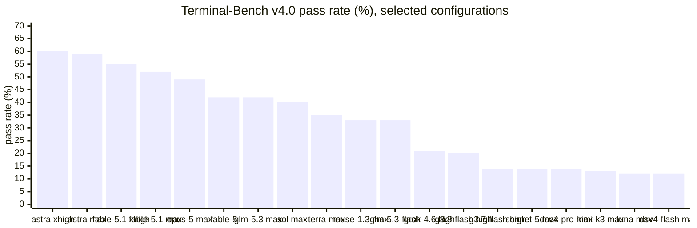

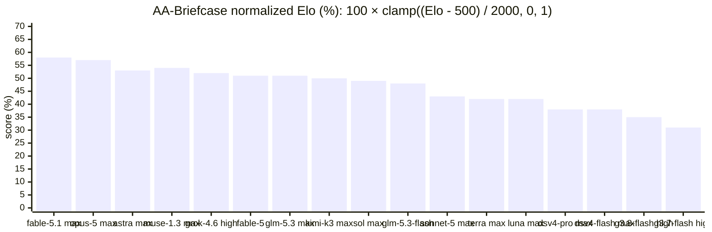

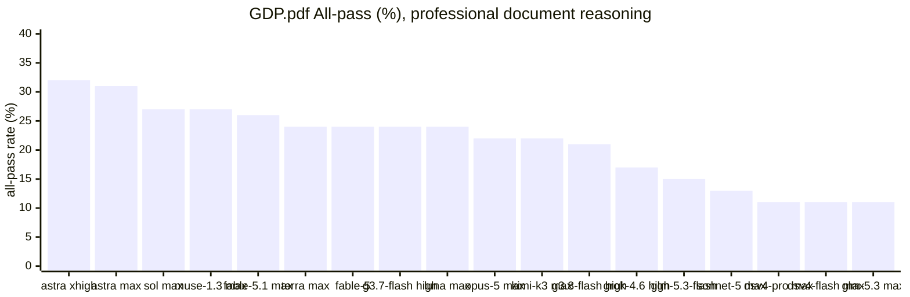

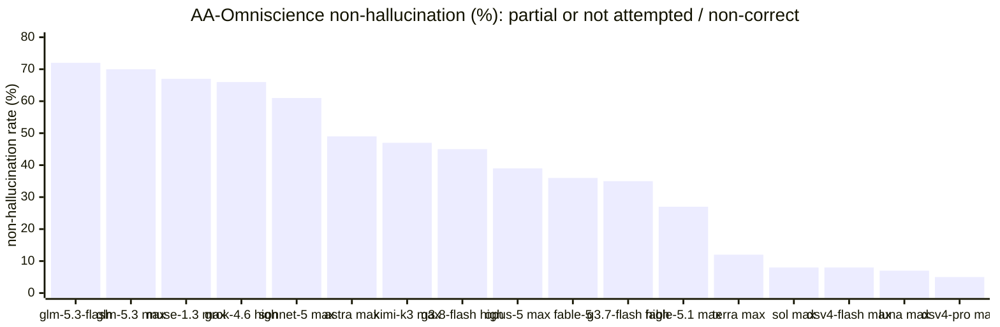

How to read the per-evaluation tables:

- **Effort is not monotonic.** Astra xhigh scores 60% on Terminal-Bench v4.0 and 32% on GDP.pdf, versus 59% and 31% at max. Fable 5.1 xhigh also exceeds max on Terminal-Bench, 55% versus 52%. These are displayed differences, not significance claims.
- **Harness and task mix matter.** Gemini 3.8 Flash high retains 74% in the September 3 Datacurve snapshot, but scores 20% on AA's new Terminal-Bench v4.0 and 35% normalized Elo on AA-Briefcase. Gemini 3.7 Flash is lower on Briefcase at 31%. Neither result invalidates the other experiment.
- **Verify uncertain facts.** Luna max has a 7% non-hallucination rate (partial answers or not attempted among non-correct responses). Its 84% AA-LCR score does not remove the need to check factual claims. Non-hallucination is not a general security or reliability guarantee.
- **Do not infer a missing configuration.** These are selected rendered comparison rows, not every effort on AA. The headline table includes further configurations; omitted per-evaluation rows are not evidence that AA has no measurement.

### Additional evaluations for catalog models

These are not Intelligence Index v4.3 components. AutomationBench-AA has moved into the component table above. A blank means no result was present for that exact configuration in the rendered comparison charts inspected on 2026-09-08, not zero or a claim that no result exists anywhere on AA. GPQA and MMMU-Pro remain separate evaluations.

| AA configuration | Harvey LAB-AA | EnterpriseOps-Gym-AA | AA-AnalystAgent | IFBench | APEX-Agents-AA | ITBench-AA | GPQA Diamond | MMMU-Pro |
| --- | --- | --- | --- | --- | --- | --- | --- | --- |
| Claude Fable 5.1 (max with fallback) | 93% | | 57% | | | | 94% | |
| Claude Fable 5 (with fallback) | 94% | 51% | 49% | 63% | | | 93% | |
| Claude Opus 5 (max) | 93% | 47% | 54% | | | | 93% | 85% |
| Claude Sonnet 5 (max) | 90% | 45% | 46% | | | | 91% | 77% |
| GPT-6 Astra (max) | | | 51% | | | | 96% | 87% |
| GPT-5.6 Sol (max) | 87% | 43% | 48% | 73% | | 56% | 94% | 83% |
| GPT-5.6 Terra (max) | 85% | 38% | | 71% | 39% | 51% | 93% | 81% |
| GPT-5.6 Luna (max) | 88% | 41% | | | 36% | 40% | 91% | 79% |
| Muse Spark 1.3 (xhigh) | 95% | | | | | | 94% | 82% |
| Grok 4.6 (high) | | 48% | 41% | | | | 95% | |
| Kimi K3 (max) | 95% | 45% | 39% | | 41% | 48% | 94% | 81% |
| GLM-5.3 (max) | | 36% | | | | | 92% | |
| GLM-5.3-Flash | | 33% | | | | | 91% | |
| Gemini 3.8 Flash (high) | | | | | | | 95% | 86% |
| Gemini 3.7 Flash (high) | 91% | | 60% | | | | 95% | 85% |
| DeepSeek V4 Pro 0813 (max) | | 50% | | | | | 93% | |
| DeepSeek V4 Flash 0731 (max) | | | | | | | 91% | |

Gemini 3.7 Flash high leads the displayed AA-AnalystAgent rows at 60%; Fable 5.1 max now has 57% and Astra max 51%. Sol max leads the displayed IFBench and ITBench rows at 73% and 56%. [APEX-Agents-AA](https://artificialanalysis.ai/evaluations/apex-agents-aa) adds a separate long-horizon agentic-work comparison; among the three configurations listed here Kimi K3 max scores 41%, Terra max 39% and Luna max 36%. These are candidates for task-specific testing, not universal role winners.

### Coding Agent Index v1.4 is a different comparison

The [Artificial Analysis Coding Agent Index](https://artificialanalysis.ai/agents/coding-agents) evaluates named **agent + model + settings** combinations, not interchangeable base-model rows. Its [methodology](https://artificialanalysis.ai/methodology/coding-agents-benchmarking), retrieved 2026-09-08, still identifies **v1.4**, current since August 2026. It equally weights DeepSWE, Terminal-Bench v2.1 and SWE-Atlas-QnA, not the Intelligence Index's new Terminal-Bench v4.0. The components contain 113, 89 and 124 tasks respectively, each with three attempts per task. Per-evaluation pass@1 averages attempts within each task, then tasks within an evaluation. Reward-hacked Terminal-Bench attempts receive zero.

Cost and execution time instead pool task attempts across the suite. Cost uses pay-per-token API pricing, including supported cache charges, not subscription-plan prices. Execution time is measured wall time; missing telemetry is excluded from the relevant average, not treated as zero. Agent defaults apply unless the row specifies other settings.

The fourteen rows on the rendered leaderboard, read 2026-09-08. Component values are pass@1 percentages; the composite is index points.

| Agent + model (settings) | Coding Agent Index | DeepSWE | Terminal-Bench v2.1 | SWE-Atlas-QnA | $/task | Wall time/task |
| --- | --- | --- | --- | --- | --- | --- |
| Claude Code + Fable 5.1 (max, with fallback) | **70** | 66 | 89 | **56** | $9.18 | 24.0 min |
| Claude Code + Opus 5 (xhigh) | 68 | 60 | **89** | 55 | $8.17 | 23.7 min |
| Muse Code + Muse Spark 1.3 (max) | 68 | **68** | 84 | 52 | $1.58 | 24.6 min |
| Codex + GPT-6 Astra (max) | 67 | 67 | 83 | 51 | $4.72 | 26.8 min |
| Muse Code + Muse Spark 1.3 (xhigh) | 64 | 67 | 82 | 44 | $1.62 | 12.8 min |
| Grok Build + Grok 4.5 (high) | 64 | 60 | 84 | 48 | $2.44 | 15.5 min |
| Kimi Code CLI + Kimi K3 | 63 | 64 | 88 | 37 | $3.08 | 24.1 min |
| Claude Code + Qwen3.8 Max | 61 | 52 | 84 | 48 | $3.23 | 29.9 min |
| Opencode + Gemini 3.8 Flash (high) | 61 | 62 | 84 | 38 | $2.04 | 11.9 min |
| Codex + GPT-5.6 Luna (max) | 57 | 63 | 75 | 33 | $0.29 | 8.0 min |
| Devin CLI + SWE-1.7 Lightning Max | 52 | 40 | 79 | 37 | $8.52 | 10.6 min |
| Codex + DeepSeek V4 Flash 0731 (max) | 50 | 43 | 68 | 39 | $0.06 | 14.5 min |
| Claude Code + GLM-5.2 | 43 | 29 | 72 | 29 | $1.91 | 25.1 min |
| Cursor CLI + Composer 2.5 Fast | 38 | 16 | 68 | 31 | $0.56 | 7.9 min |

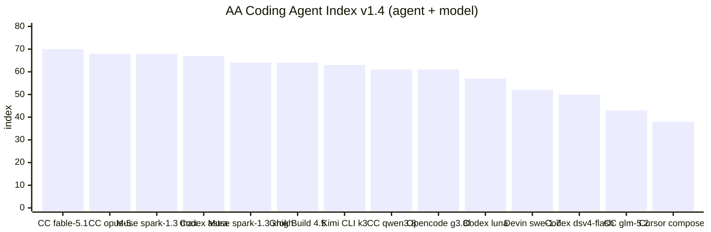

Three reads from the agent table:

- **SWE-Atlas-QnA favors the two displayed Anthropic-model rows.** Fable 5.1 and Opus 5 score 55–56% on repository-understanding questions against 29–52% for the other rows. These are named agent experiments, not proof that the base models will retain the same ordering in Atomic.
- **Muse Spark 1.3 is the value row.** Muse Code + Muse Spark 1.3 (max) ties Opus 5 on the index for $1.58 per task, and leads DeepSWE inside AA's harness at 68. Its `xhigh` row halves wall time to 12.8 minutes for four index points.
- **Cheap and fast is a real trade.** Codex + Luna (max) at 57 costs $0.29 and finishes in 8.0 minutes; it sits three points behind Fable 5.1 on DeepSWE and loses its gap on SWE-Atlas-QnA and Terminal-Bench instead. Codex + DeepSeek V4 Flash at 50 costs $0.06 but trails on all three components.

AA's DeepSWE component uses the DeepSWE dataset with the named agent. It is not the same experiment as Datacurve's `mini-swe-agent` leaderboard, and the two disagree: inside AA's harness Muse Code + Muse Spark 1.3 (68) edges Codex + Astra (67), while Datacurve's Best view has Astra [xhigh] at 74% and has not published Muse Spark 1.3 at all (its Muse Spark 1.2 [xhigh] row sits at 55%). Neither its component score nor its composite belongs in the [DeepSWE frontier](/models/pareto-efficiency).

Earlier versions of these docs referred to a base-model **Coding Index** and **Agentic Index**. Neither is listed in the [capability directory](https://artificialanalysis.ai/models/capabilities) or [capability methodology](https://artificialanalysis.ai/methodology/capability-indices) inspected on 2026-09-08. We do not silently rename either to Coding Agent Index. Use the named coding and agentic evaluations above instead.

### Professional capability indices

The directory inspected on 2026-09-08 lists Finance & Accounting, Strategy & Ops, Legal, Healthcare & Medical, Engineering, and Economics. The [capability methodology](https://artificialanalysis.ai/methodology/capability-indices) specifies domain-dependent components and weights and displays no version identifier. Some domains still use 𝜏³-Banking; Engineering still lists Terminal-Bench v2.1. Do not apply the Intelligence Index v4.3 substitutions to these separate indices.

### Price, task cost and latency

Read the [definitions](https://artificialanalysis.ai/methodology#definitions) and [API performance methodology](https://artificialanalysis.ai/methodology/performance-benchmarking), retrieved 2026-09-08, before comparing efficiency charts:

- Token prices are USD per million native tokens. AA's blended price assumes cache-hit, input and output tokens in a **7:2:1** ratio. That synthetic mix is not your workflow's bill.
- Intelligence Index cost per task uses actual token consumption, provider prices and typical measured cache hit rates, weighted by the index's evaluation weights. It is neither the total cost of running the suite nor DeepSWE dollars per task. The leaderboard's `$` column above is this value.
- Output speed uses standardized `o200k_base` tokens after the first chunk. The default workload is **10k input tokens**; the usual displayed result is the median over **72 hours**. The **100k** workload instead uses a **14-day** median. These are API measurements, not coding-agent completion times.
- Time to first token can mean the first reasoning token. Time to first answer token includes thinking time. Compare these separately from output speed when interactive latency matters.
- The homepage's Intelligence Index **Time per Task** estimates weighted decode time from output tokens and speed; it excludes TTFT and overhead. Do not call it measured end-to-end wall time. The Coding Agent Index execution-time metric does measure wall time.

## Role to benchmark map

| Role | Primary evidence | Cross-check | Selected AA measurements on 2026-09-08 |
| --- | --- | --- | --- |
| Debugger / coding worker | September 3 Datacurve DeepSWE pass@1, cost and steps | Terminal-Bench v4.0 | Astra xhigh 60%; Fable 5.1 xhigh with fallback 55% |
| Reviewer / judgment gate | Task-specific Atomic evals | Named-agent SWE-Atlas-QnA and knowledge reliability | Claude Code + Fable 5.1 max with fallback 56%; not a security-review guarantee |
| Planner / orchestrator | AA-Briefcase, GDPval-AA v2 | AutomationBench-AA for SaaS tools | Fable 5.1 max with fallback 58% / 63% normalized Elo; Astra max 68% AutomationBench |
| Research | AA-LCR v1.1, GDP.pdf | AA-Omniscience | Astra xhigh 32% GDP.pdf; Kimi K3 max 89% AA-LCR; GLM-5.3-Flash 72% non-hallucination |
| Domain-specific work | Matching capability index and task evals | Additional evaluations | Gemini 3.7 Flash high 60% AA-AnalystAgent; Sol max 56% ITBench-AA |

See [Model Selection](/models/model-selection) for a small dated shortlist and production effort guidance. Benchmark settings are measurement configurations, not instructions to raise every role's effort.

## Keeping the docs fresh

1. Record each source's retrieval date separately from its publication or snapshot date. Follow the rendered charts and methodology, not just an old article's score.
2. Preserve exact model, reasoning configuration, agent, benchmark version and units. A changed index or agent can change the ranking without a new model release.
3. Say **unmeasured on the named benchmark and date**. Missing text extraction is not evidence of absence; inspect the rendered page. Never transfer a predecessor's score.
4. Check the configured catalog and live provider access separately. These docs do not change runtime routing or model defaults.
5. AA's per-evaluation numbers are only in client-rendered Recharts bar charts, so a plain HTTP fetch returns headings without values. To refresh them, open the model page in a headless browser, scroll the whole page so every chart animates in, then read each chart's `foreignObject` labels (model names, in bar order) alongside its `svg text` nodes (values, in the same order). The DeepSWE leaderboard and the AA evaluation leaderboards (AA-Briefcase, GDPval-AA v2) render as text and fetch cleanly.

## Related

- [Model Selection](/models/model-selection)
- [Pareto Efficiency](/models/pareto-efficiency)
