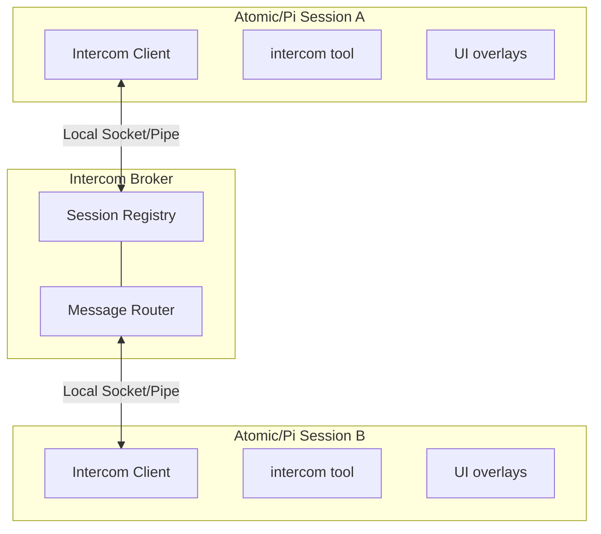

<p>
  
</p>

# Pi / Atomic Intercom

Direct 1:1 messaging between Atomic or pi sessions on the same machine. Send context, findings, or requests from one session to another — whether you're driving the conversation or letting agents coordinate.

```text
User flow: ALT+M or run /intercom to pick a session and send a message
```

## Why

Sometimes you're running multiple Atomic/pi sessions — one researching, one executing, one reviewing. Intercom lets you:

- **User-driven orchestration** — Send context or findings from your research session to your execution session
- **Agent collaboration** — An agent can reach out to another session when it needs help or wants to share results
- **Session awareness** — See what other Atomic/pi sessions are running and their current status

Unlike pi-messenger (a shared chat room for multi-agent swarms), intercom is for targeted 1:1 communication where you pick the recipient.

Intercom also integrates with delegated subagents: in-process children receive a typed admission-issued identity for `contact_supervisor`, including their canonical run/agent/index metadata and any supervisor capability. The child identity is bound to its `IntercomClient` when it connects, so each message uses the same client-owned source and a descendant cannot inherit a parent's capability through process environment. Atomic-prefixed bridge environment variables and legacy `PI_*` metadata remain compatible for older integrations only. Use `reason: "need_decision"` for blocking clarification, `reason: "interview_request"` for multiple structured supervisor answers, and `reason: "progress_update"` for meaningful plan-changing updates. Normal sessions only see the regular `intercom` tool.

## In One Minute

Intercom connections are normally tool-driven. A bridged child still keeps its own broker connection lazy until it invokes `contact_supervisor`, but Atomic connects the parent Intercom runtime while launching the child to issue a child-bound supervisor capability. The parent retains and restores that capability across broker reconnects, and the broker confirms the supervisor's current session ID when the child registers. Concurrent first-use callers share one import and connection attempt, and broker state is leased to the active session generation and cleaned up on shutdown or replacement.

## Install

Atomic bundles `@bastani/intercom` as a first-party extension; no separate install is needed for normal Atomic sessions. For legacy pi installations of the upstream package:

```bash
pi install npm:pi-intercom
```

Then restart Atomic or Pi. The extension registers the bundled `intercom` skill and lightweight tools at startup, but it does not connect the session until the model or user invokes Intercom.

**Recommended:** Add this snippet to your project's `AGENTS.md` to help agents understand when to coordinate across sessions:

```xml
<intercom>
Coordinate with other local Atomic/pi sessions on related codebases. Use `/skill:intercom` for patterns.

**When:** Same codebase (parallel work), reference codebase (consulting patterns), related repos (shared libraries).

**Not when:** Unrelated codebases, trivial questions, or when you can proceed independently.

**Principle:** Prefer `send` for notifications; `ask` only when blocked waiting for input.
</intercom>
```

A session becomes intercom-connected when all of these are true:
- the mandatory bundled Intercom extension is loaded in that Atomic model session
- the model or user has invoked an Intercom tool, `/intercom`, or the `ALT+M` overlay in that session
- the local broker is running or can be auto-started

The session list, ALT+M picker, and group counts include connected agent sessions only. Internal workflow routing/control connections, model-less `ctx.ui` prompts, and `ctx.tool` nodes are hidden and cannot receive ordinary messages, even by a known ID or through a supervisor route. This includes run-level prompts and retained completed synthetic prompt stages. An agent executing a tool, including `tool:workflow`, or awaiting human input remains visible and messageable.

If a session is unnamed, intercom exposes a runtime-only fallback alias like `subagent-chat-1a2b3c4d-1111-4222-8333-123456789abc` so other sessions can still target it. That alias is not persisted as the session title, so resume pickers can keep showing the transcript snippet instead of a generic `session-...` name.

## Quick Start

### From the Keyboard

**ALT+M** Open or type `/intercom` to open the session list overlay:

1. **Select a session** — Use arrow keys to pick a target session
2. **Compose message** — Write your message in the compose overlay
3. **Send** — Enter Send · Escape Cancel

### From the Agent

The agent can list sessions and send messages using the `intercom` tool. Tool calls and results render as compact transcript rows so send/ask/reply flows are easy to scan. For common patterns like planner-worker delegation, the bundled `pi-intercom` skill provides copy-paste ready examples:

```typescript
// List active sessions
intercom({ action: "list" })
// → **Current session:**
// → • executor (20d43841-1111-4222-8333-123456789abc) — ~/projects/api (claude-sonnet-4) [self, idle]
// → **Other sessions:**
// → • research (6332faab-1111-4222-8333-123456789abc) — ~/projects/api (claude-sonnet-4) [same cwd, thinking]

// Add a named membership (it is created if no session is there yet)
intercom({ action: "join", group: "api-review" })
// → Joined intercom group "api-review". Memberships: default, api-review.

// Discover all available groups and see which ones you belong to
intercom({ action: "groups" })

// Leave one membership, or omit group to reset to the startup home group
intercom({ action: "leave", group: "api-review" })

// Send a message
intercom({ action: "send", to: "research", message: "Check if UserService.validate() handles null" })
// → Message sent to research

// The full session ID printed by list is also a valid target
intercom({ action: "ask", to: "6332faab-1111-4222-8333-123456789abc", message: "Which validation path should I use?" })

// Check connection status
intercom({ action: "status" })
// → Connected: Yes, Session ID: abc12345-1111-4222-8333-123456789abc, Active sessions: 3

// Send with attachments (code snippets, files, or context)
intercom({
  action: "send",
  to: "worker",
  message: "Here's the fix:",
  attachments: [{
    type: "snippet",
    name: "auth.ts",
    language: "typescript",
    content: "function validate(user: User) { ... }"
  }]
})
```

### Receiving Messages

When a message arrives, it appears inline in your chat with the sender's info and a reply hint:

```
**From research** (~/projects/api)

To reply, use the intercom tool: intercom({ action: "reply", message: "..." })

Found the issue — UserService.validate() doesn't check for null input.
See auth.ts:142-156.
```

The reply hint (enabled by default) points to `intercom({ action: "reply", ... })`, so recipients do not need raw sender or `replyTo` IDs. Idle recipients get a new turn immediately; busy interactive recipients receive the message once they go idle. Attachment content is included in the agent-visible body, and messages are rendered inline and stored in Pi session history.

When a blocking `intercom.ask` targets a workflow stage that has already completed, Atomic uses the stage's retained conversation as a post-mortem chat. It automatically schedules a new turn in that exact conversation, preserving the original ask text and sender/thread correlation, so the target can answer with ordinary `intercom.reply` and the waiting sibling continues without a manual workflow follow-up. The completed stage and workflow DAG remain terminal. The workflow router has single-owner completion semantics: once it claims the ask, later late-message listeners preserve its completion promise regardless of bundled extension registration order. Parent and unrelated sessions cannot satisfy the child-to-child waiter. Deleted, unavailable, non-resumable, or failed-to-reopen targets return a bounded actionable ask error.

When a blocking ask reaches a sibling workflow stage during an active model/tool turn, the target reserves it synchronously in the open stage generation before any asynchronous foreground-owner detach handshake. Queue insertion waits inside that reservation, and stage finalization drains it before publishing the terminal snapshot. This prevents a structured-output or other terminal tool call from overtaking a mid-turn ask. If destination-side admission genuinely cannot complete, the asker receives an exact-thread actionable error instead of consuming the full 10-minute timeout.

For delegated children, queued messages and terminal lifecycle notices are ordered per child. Intercom claims the terminal child's pre-terminal ordinary entries in FIFO order and atomically admits that prelude together with the interrupted, completed, or failed notice. A process-local companion bridge covers lazily loaded extensions whose event buses are distinct, while exact terminal-identity deduplication prevents double admission even when the successful terminal dispatch has no queued prelude. Failed dispatches remain retryable, and each terminal child identity is admitted only once. Other children's entries remain independently queued, messages are not discarded, terminal admission does not wait for a separate model turn, and correlated ask replies still bypass unrelated queued sends.

## Workflow: Planner-Worker Coordination

The most natural use of pi-intercom is splitting a task between two sessions — one holds the big picture, the other does the hands-on work. When the worker hits an ambiguity ("should I optimize for readability or performance here?"), they ask without losing context.

### Setup

Open two terminals and start pi in each. Name them so they can find each other:

```
# Terminal 1                    # Terminal 2
/name planner                   /name worker
```

Verify they see each other from either session:

```typescript
intercom({ action: "list" })
// → • worker — ~/projects/api (claude-sonnet-4) [idle]
```

### The Conversation

Here's how a typical exchange looks. The planner delegates with `send` (fire-and-forget). The worker uses `ask` for anything that needs a response — questions, discoveries, completion reports. `ask` sends the message and blocks until the planner replies, so the worker gets the answer as a tool result and continues in the same turn.

**Planner sends a task:**
```typescript
intercom({
  action: "send",
  to: "worker",
  message: "Task-3: Add retry logic to API client. Key files: src/api/client.ts, src/api/types.ts. Ask if anything's unclear."
})
```

**Worker hits an ambiguity — asks and waits:**
```typescript
intercom({
  action: "ask",
  to: "planner",
  message: "Should retry apply to all endpoints or just idempotent ones? Also, max retry count and backoff strategy?"
})

// → Reply from planner: Only GET/PUT/DELETE — never POST. Max 3 retries, exponential backoff starting at 100ms.
// Worker continues implementing with the answer, same turn, full context.
```

To coordinate two plain chat sessions without changing startup config, have each call `intercom({ action: "join", group: "NAME" })`. Joining adds a membership without changing the session ID or removing existing memberships. Calls to `list`, `send`, and `ask` can then reach any session sharing at least one membership. Use `intercom({ action: "groups" })` to discover every available name, connected-session count, and membership marker. Call `intercom({ action: "leave", group: "NAME" })` to remove one membership while keeping the others, or bare `leave` to reset to the original home group. `contact_supervisor` keeps its dedicated capability-based cross-group behavior.

Joined memberships survive broker reconnects without replacing the session's
startup identity. An ordinary host can therefore control several joined workflow
invocations, while a workflow worker cannot gain another invocation's parent-control
authority by joining its group and reconnecting.

**Worker finds something unexpected — escalates and waits:**
```typescript
intercom({
  action: "ask",
  to: "planner",
  message: "Found: fetchWithTimeout swallows network errors. Fixing this changes the error shape. OK to proceed?"
})
// → Reply from planner: Yes, surface the error types. The current behavior is a bug.
```

**Worker reports completion:**
```typescript
intercom({
  action: "ask",
  to: "planner",
  message: "Task-3 done. Added RetryPolicy type, applied to GET/PUT/DELETE, surfaced NetworkError, 4 tests passing."
})
// → Reply from planner: Looks good. Move on to task-4.
```

### Communication Patterns

| Pattern | Action | Why |
|---------|--------|-----|
| **Task Delegation** | Planner uses `send` | Fire-and-forget. Planner doesn't need to wait for an ack. |
| **Clarification Request** | Worker uses `ask` | Worker needs the answer to proceed. Blocks until reply. |
| **Discovery Escalation** | Worker uses `ask` | Worker needs approval before changing course. |
| **Completion Report** | Worker uses `ask` | Planner might have follow-up instructions or the next task. |

### Reply Hints

When `replyHint` is enabled (the default), incoming messages include the exact `intercom()` call to respond:

```
**From planner** (~/projects/api)

To reply, use the intercom tool: intercom({ action: "reply", message: "..." })

Only GET/PUT/DELETE — never POST. Max 3 retries with exponential backoff starting at 100ms.
```

This matters because the agent receiving the message doesn't need to reconstruct raw `to` and `replyTo` IDs — the hint is right there. Combined with idle-gated `triggerTurn` delivery, it enables real back-and-forth conversation without interrupting work in progress. If the reply happens later instead of in the triggered turn, `intercom({ action: "reply" })` falls back to the single unresolved inbound ask, and `intercom({ action: "pending" })` shows who is still waiting.

### `send` vs `ask`

`send` is fire-and-forget — the tool returns immediately after delivery. By default, it sends immediately even in interactive sessions. If you want an approval dialog before non-reply sends, set `confirmSend: true` in config. Replies that include `replyTo` still skip confirmation so reply-hint flows can continue without an extra approval step.

`ask` sends the message and blocks until the recipient responds (10-minute timeout). If the recipient disconnects after delivery, the ask fails promptly with an error naming that session; the timeout remains the backstop for a connected but unresponsive recipient. The reply comes back as the tool result, so the agent continues in the same turn with full context. No confirmation dialog — if you're asking and waiting, the intent is clear. A completed workflow-stage target with a retained conversation is automatically reopened for one post-mortem turn; unavailable or non-resumable completed targets fail actionably without consuming the full reply timeout.

`reply` is receiver-side sugar for replying to an inbound ask. In the turn triggered by an incoming intercom ask, `intercom({ action: "reply", message: "..." })` targets that exact sender and message automatically. If you reply later, it falls back to the single unresolved inbound ask. If multiple asks are pending, use `intercom({ action: "pending" })` to inspect them and then call `reply` with `to` to disambiguate.

The planner typically uses `send`. If you prefer manual approval for outgoing non-reply messages, turn on `confirmSend: true`. The worker uses `ask` for everything (no confirmation needed, gets answers inline), so it can operate autonomously either way.

## Workflow: Subagent-to-Supervisor Escalation

This workflow uses Atomic's in-process subagent admission. When the runtime admits a delegated child with supervisor coordination, the child session gets a subagent-only `contact_supervisor` tool in addition to the regular `intercom` tool. Normal sessions never see `contact_supervisor`.

### When the Tool Appears

`contact_supervisor` is registered from the typed admission record. The record binds the supervisor target, canonical child identity, child index, session name, and broker-issued capability to the child session; these values are not inherited from environment variables. If the parent does not grant supervisor coordination, the session falls back to the regular `intercom` tool.

Parent-targeted decisions, interviews, and `intercom.ask` make the current child terminal for continuation. The parent receives the original question, ordered attachments, agent identity, and a dynamic `[TASK_CONTEXT]` handoff for a fresh child with a new run identity. Ordinary Intercom detach for sends, progress updates, and non-parent asks remains separate.

### Three Reasons

| Reason | Behavior | Use When |
|--------|----------|----------|
| `need_decision` | In a claimed foreground run, ends the child and returns a fresh-child handoff; otherwise uses the normal ask fallback | The subagent is blocked, uncertain, needs approval, or faces a product/API/scope decision |
| `interview_request` | In a claimed foreground run, ends the child and returns structured questions in a fresh-child handoff | The subagent needs multiple machine-readable answers from the supervisor in one exchange |
| `progress_update` | Fire-and-forget update to the supervisor | Meaningful progress or unexpected discoveries that change the plan |

Do not use `contact_supervisor` for routine completion handoffs. Return the final subagent result normally.

Cross-group delivery uses a dedicated broker protocol. Ordinary raw `send` frames always remain group-isolated and are rejected if they include a forged `channel: "supervisor"` marker. A child can cross groups only after its broker-issued capability has bound its registered socket to the exact supervisor. The broker adds the `supervisor` channel marker to validated inbound traffic so parent relays can distinguish it. Replies cross back only when `replyTo` matches a recorded supervisor message in the exact reverse direction; fabricated thread IDs do not bypass isolation.

During a foreground subagent run, parent-targeted decisions, interviews, and asks are claimed before broker delivery or reply-waiter admission. The current child ends and its parent tool call receives the fresh-start handoff. Parallel claims interrupt active siblings, prevent queued tasks from launching, and retain no sibling set for later bare-run-ID continuation. Sends, progress updates, and asks to other peers retain the exact-child probe/commit detach path and ordinary Intercom delivery behavior.

### Example: Blocked Subagent Asks for Guidance

```typescript
contact_supervisor({
  reason: "need_decision",
  message: "The auth service returns 403 instead of 401 for expired tokens. Should I treat 403 as a re-auth trigger or a hard failure?"
})
// → Parent receives a [TASK_CONTEXT] handoff and launches a fresh child with the answer.
```

### Example: Structured Supervisor Interview

```typescript
contact_supervisor({
  reason: "interview_request",
  message: "Please answer these before I continue the migration.",
  interview: {
    title: "API migration choices",
    questions: [
      { id: "api", type: "single", question: "Which API should I target?", options: ["Stable API", "Experimental API"] },
      { id: "constraints", type: "text", question: "What constraints should I preserve?" }
    ]
  }
})
// → Parent includes the structured supervisor answer in a fresh child's task.
```

### Example: Progress Update

```typescript
contact_supervisor({
  reason: "progress_update",
  message: "Discovered the bug is in the retry wrapper, not the API client. Fixing the wrapper will also close issue #42."
})
// → Progress update sent to supervisor planner
```

### What the Supervisor Sees

The supervisor receives a formatted message with run metadata:

```
**From subagent-worker-78f659a3-1**

Subagent needs a supervisor decision.
Run: 78f659a3
Agent: worker
Child index: 0

Which API should I use?
```

Reply hints work the same as regular `intercom` ask/reply flows. The supervisor can reply with `intercom({ action: "reply", message: "..." })` and the subagent receives the answer as the tool result.

For `interview_request`, the supervisor message includes the structured questions plus a fenced JSON answer example using this stable shape:

```json
{
  "responses": [
    { "id": "api", "value": "Stable API" },
    { "id": "constraints", "value": "Keep the public error shape unchanged." }
  ]
}
```

The supervisor can reply with plain JSON or a fenced `json` block. If the reply matches the `{ "responses": [...] }` shape and references valid question ids/options, the child tool result includes it in `details.structuredReply` while still showing the raw reply text.

## Tool Reference

### intercom

| Parameter | Type | Description |
|-----------|------|-------------|
| `action` | string | `"list"`, `"groups"`, `"join"`, `"leave"`, `"send"`, `"ask"`, `"reply"`, `"pending"`, or `"status"` |
| `to` | string | Exact session name/full session ID, or `workflow:<rootRunId>/<segment>[/<segment>...]`; `*` matches one segment and `**` any depth. Sends support pending/future patterns and broadcast; `ask` requires a live target. |
| `message` | string | Message text (for send/ask/reply) |
| `attachments` | array | Optional `file`, `snippet`, or `context` attachments |
| `replyTo` | string | Optional message ID for threading or replying to an `ask` |
| `retryToken` | string | Opaque claim returned by a retryable `send`/`ask`/`reply` failure; valid only with the exact same caller arguments. Omit it for fresh operations. |
| `group` | string | Group name for `join` or optional targeted `leave`; read-only filter for `list`/`status`. `send`/`ask` require a shared membership. |

### contact_supervisor

Only registered in sessions where `pi-subagents` supplied the required child bridge metadata. Contacts the supervisor session that delegated the current task.

| Parameter | Type | Description |
|-----------|------|-------------|
| `reason` | string | `"need_decision"` (blocking), `"interview_request"` (blocking structured questions), or `"progress_update"` (fire-and-forget) |
| `message` | string | The decision request, optional interview note, or progress update |
| `interview` | object | Required for `interview_request`: `{ title?, description?, questions: [...] }` |

**`need_decision`** — Sends a formatted ask to the supervisor and blocks until it replies (10-minute timeout). If the supervisor disconnects after delivery, the wait fails promptly instead. The reply comes back as the tool result. Includes run metadata in the message so the supervisor knows which subagent is asking.

**`interview_request`** — Sends a formatted, agent-readable interview to the supervisor and blocks until it replies. Questions use a local pi-interview-like shape: `{ id, type, question, options?, context? }` where `type` is `single`, `multi`, `text`, `image`, or `info`. `info` questions are context-only and do not need responses. The supervisor reply should be JSON with `{ "responses": [{ "id": "...", "value": ... }] }`. Parsed JSON replies are returned in `details.structuredReply`.

**`progress_update`** — Sends a non-blocking update to the supervisor. Returns immediately after delivery. Use only for meaningful progress or unexpected discoveries that change the plan.

### intercom actions

**`join`** — Adds a trimmed named membership and creates that group when no peer is there yet. The result reports the complete membership set. `default` is shared; `true` and `auto` remain reserved.

**`leave`** — With `group`, removes only that membership. Without `group`, resets the complete set to the startup home group. The result reports the memberships that remain.

**`groups`** — Lists every group represented by a connected session, with session counts and membership markers, so callers can discover names instead of guessing.

**`list`** — Keeps session-listing semantics: returns the current session and every active session sharing at least one membership. Pass `group` for a read-only view of one group.

Live target lookup accepts only an exact full Intercom session ID or an exact case-insensitive session name. Join `workflow:<rootRunId>` and use `intercom list` to see materialized `PENDING`/`RUNNING` workflow stages with canonical `workflow:<rootRunId>/<segment>[/<segment>...]` paths, plus possible future literals, globs, nested paths, and their queued counts. `*` matches one segment and `**` any depth. `workflow:<rootRunId>/**` reaches live stages now and remains sticky for every future stage until root termination; narrower patterns behave the same for their matches. A valid path outside the known set queues with `notInKnownSet` and settles undeliverable at terminal only if never delivered. Use `ask` only on live targets. An eligible invocation member has directional list/send/live-ask control over stages in owned `workflow:<rootRunId>/...` subgroups. A subgroup stage or another workflow root cannot turn a mutable join into parent control; sibling subgroups stay isolated, and explicit `group: "default"` remains non-owned.

**`send`** — Sends through ordinary Intercom. Live workflow-stage sessions receive messages immediately and return `delivered`. Known pending invocation-owned stages queue durably and return the distinct `queued` result with its FIFO position; a main-chat session that explicitly joined the owning invocation group may use that route. Pending `group: "default"` stages remain ineligible, and an ineligible attempt is refused with `Target workflow run is in a different intercom group`. Each exact run/stage key retains at most 50 queued messages; the next send is refused rather than evicting an older one. Delivery occurs before the first model turn under **Messages received before you started**, with sender identity and `Sent:` timestamp separate from the task prompt. Resume/replay, broker restart, and stage-attempt restart preserve exactly-once delivery by logical message ID. Skipped, cancelled, and terminal-before-initialization destinations make pending messages undeliverable and notify the sender. If the sender reconnects with a new broker UUID, notification fallback requires one unique same-group match for the immutable registration-time name; mutable presence names/groups, cross-group matches, and ambiguous duplicates are rejected. The broker trusts that initial name/group as host-orchestration metadata, while the original display/provenance remains unchanged in the durable record. Live sends remain immediate by default; `confirmSend: true` still enables confirmation for non-reply sends.

**`ask`** — Sends a message and waits for a live recipient to reply (10-minute timeout). Invocation control supports a live ask into an owned isolated subgroup, and the exact broker-recorded reply resolves the waiting tool call at the asker without opening reverse or lateral group access. Ask to an uninitialized stage remains refused with `pending_stage_ask_unsupported`; use queued `send` instead, because holding a reply waiter until a stage eventually starts would be unbounded. A recipient disconnect after live delivery fails only that peer's exact wait promptly; the timeout remains the backstop while the recipient stays connected. Up to `maxPendingAsks` blocking asks (default: 6) may run concurrently, including same-target and mixed-target fan-out. Replies resolve by exact sender and message ID, so out-of-order replies cannot cross-settle another call. When capacity is full, new asks receive a structured refusal.

**`reply`** — Replies to the current intercom-triggered message if there is one. Otherwise it falls back to the single unresolved inbound ask. If multiple asks are pending, pass an exact name/full session ID in `to`, or the listed message ID in `replyTo`; use `pending` to inspect them first. `replyTo` also disambiguates multiple asks from the same sender. Under the hood this is still a normal `send` with the exact `replyTo` value.

**`pending`** — Lists unresolved inbound asks with sender, message ID, elapsed time, and a short preview. Useful when replying after the original triggered turn.

`contact_supervisor` decisions and interviews are deliberately exclusive per child: one supervisor wait may coexist with ordinary peer asks, but a second concurrent supervisor wait receives `Already waiting for a supervisor reply`. Claimed foreground parent handoffs remain first-claim-wins and do not allocate a waiter. Multiple children can contact the same parent independently because inbound asks and handoffs are keyed by child/message identity. Mutual peer asks are supported, but each side must process inbound work to reply; the per-waiter timeout remains the deadlock backstop.

**`status`** — Shows connection status, session ID, every current membership, and the total visible-session count. A `group` filter remains a read-only peek.

## Keyboard Shortcuts

| Key | Action |
|-----|--------|
| ALT+M | Open session list overlay |
| ↑/↓ | Navigate session list |
| Enter | Select session / Send message |
| Escape | Cancel / Close overlay |

## Config

Create `~/.atomic/agent/intercom/config.json` for Atomic. Legacy pi-compatible installs and fallbacks continue to read `~/.pi/agent/intercom/config.json` when the Atomic config is absent:

```json
{
  "brokerCommand": "npx",
  "brokerArgs": ["--no-install", "tsx"],
  "confirmSend": false,
  "replyHint": true,
  "status": "researching"
}
```

The default `npx --no-install tsx` pair is a compatibility sentinel: intercom recognizes it and starts the broker through the current Atomic/Pi runtime (`process.execPath`). It never resolves or executes `tsx` — Node-based installs run the broker with Atomic's bundled `jiti` loader, which is dependency-free pure JavaScript; Bun source-checkout runs use the current Bun executable directly; standalone Atomic Bun binaries re-enter the split launcher through a narrow internal broker handoff. Default startup therefore does not rely on `npx`, `tsx`, or `bun` being on `PATH`.

| Setting | Default | Description |
|---------|---------|-------------|
| `brokerCommand` | `"npx"` | Command used to start the local broker process; the default sentinel is hardened internally to avoid PATH lookup |
| `brokerArgs` | `["--no-install", "tsx"]` | Arguments passed to `brokerCommand` before the broker script path |
| `confirmSend` | false | Show a confirmation dialog before non-reply sends from an interactive session with UI |
| `replyHint` | true | Include reply instruction in incoming messages |
| `status` | — | Optional custom status suffix shown after the automatic lifecycle status, for example `thinking · researching` |

Existing pi-compatible configs that set a custom broker command still work. For example, if you intentionally want to use Bun from `PATH`, configure it explicitly:

```json
{
  "brokerCommand": "bun",
  "brokerArgs": []
}
```

Intercom publishes live session status automatically. Sessions register as `idle`, switch to `thinking` while the agent is running, show `tool:<name>` during tool execution, and return to `idle` on agent completion. If `status` is set in config, it is appended as context instead of replacing the lifecycle status.

## How It Works



The broker is a standalone TypeScript process that manages session registration and message routing. It auto-spawns when the first session that invokes Intercom needs it and exits after 5 seconds when it last has no registered sessions, including brokers that never received a connection and sockets that close before register. Clients reconnect automatically if the broker disappears and later comes back. A failed reconnect schedules the next attempt on a bounded backoff (1s, 2s, 5s, 10s, then 30s) once it releases reconnect ownership, so a transient failure never leaves a live session with nothing owning recovery; a failed explicit tool or overlay connection still returns its error to the caller and leaves the retry behind. A reconnect that fails after the broker already accepted it closes that connection first, so a session never appears twice in `intercom list`.

An explicit `send`, `ask`, or `reply` that reports the typed `Client disconnected` failure returns an opaque `retryToken`. Retry the exact action and arguments with that token, up to three claimed attempts. A tokenless call is always a fresh intentional operation even if byte-identical, and concurrent failures receive separate tokens. Tokens are unguessable and process-local, scoped to this tool registration/session and one canonical operation; invalid, expired, foreign, mismatched, in-flight, exhausted, and settled claims fail before sending. Attachment object member order is canonical, but omission is distinct from an explicit empty array and attachment array order/duplicates remain exact. The identity expires at the original 11-minute deadline (the 10-minute `ask` window plus one minute), which retries never extend.

A token-claimed retry preserves the same token and message ID after `delivered: false`, `Session not found`, durable-authority uncertainty/capacity refusal, or another typed disconnect; each claim consumes one of the three attempts. It settles on delivered/queued success or a genuinely conclusive non-recoverable outcome. Initial tokenless nondelivery and unrelated/non-recoverable error classification stay unchanged.

The broker keeps accepted-operation authority for 12 minutes in `delivered-messages.sqlite`. It stores canonical signatures only as fixed keyed SHA-256 HMAC digests, with the random key in `delivered-messages.key`; message text and attachment contents never reach SQLite, and the key prevents offline guesses for low-entropy messages by other local users. On POSIX the Intercom directory is corrected to `0700` and database/WAL/SHM/key artifacts to `0600`; missing or malformed key/database pairs and corrupt digest records fail closed. The broker retains at most 10,000 live authority records and 64 MiB of digest/routing authority.

The broker reserves an identity durably before forwarding, then marks it accepted after confirmed write and before acknowledging the sender. This survives broker replacement without redelivery. A deduplicated ask remains answerable after reconnect: implicit public `reply` uses the exact recorded sender ID while it is live, even alongside a same-name peer; only a departed ID falls back to authorized reconnect/name resolution, where ambiguity and changed identity/groups fail without sending. An implicit reply retry also retains its original sender/question snapshot, so later inbound asks cannot redirect or invalidate it. Explicit `to` and `replyTo` remain verbatim and `requirePendingReply` still binds the exact pending thread. Legacy sends without logical-target metadata retain transport-target behavior.

Retry state is independently bounded and fails closed at pressure. A fresh client operation reserves one of 1,000 identity slots before consuming an ID, showing confirmation UI, resolving its target/reply route, or sending; existing token claims remain available when full. Capacity reopens when an in-flight or retained identity is released or expires, and settled tombstones are discarded without evicting live authority. The broker likewise refuses new delivery rather than evicting live authority, then accepts again after TTL cleanup. The local subagent result relay applies the same order in memory—reserve before its chat side effect, accept before positive acknowledgement—and refuses the 10,001st live ID or an uncertain replay without performing the side effect. SQLite transactions serialize replacement-broker access.

A workflow stage warming up before its heavy module exists is the one case the reconnect backoff cannot own, so the lightweight wrapper retries that warm-up on the same bounded schedule. When those attempts run out it writes nothing to the console: it hands the stage's pending delivery a typed terminal reason through the delivery contract's required `fail(reason)`, and the workflow side fails that stage with a stage-scoped, non-retryable error instead of leaving it waiting on `pendingStageDelivery.ready()`. No model retry or fallback candidate is spent on it, since every candidate would be refused the same instructions. Queued messages are left queued rather than delivered to a stage that will not read them.

Messages use length-prefixed JSON over a local socket/pipe transport (4-byte length + JSON payload) to handle fragmentation properly. The protocol includes request correlation for session listing, explicit delivery failures, and validation for malformed or out-of-order messages.

Host registrations may declare the immutable `recipientPurpose` as `"agent"` or `"control"`; omission retains legacy agent behavior. Dedicated pending-stage route clients register as controls. Presence, name, status, and membership updates cannot change that purpose. The broker keeps control connections for route ownership while excluding them from recipient discovery and ordinary delivery. Known `ctx.ui` prompt and `ctx.tool` paths are rejected before speculative future-stage queueing; wildcard queues remain available for future agents.

Workflow roster announcements keep node `recipientPurpose` separate from `routeEligible`: a hidden pending row does not make a genuine live agent ineligible. Internal run-parent metadata carries the uniquely resolved boundary names and IDs, so nested tool paths are refused by the broker before invoking their route owner. Materialized run-ID segments retain their existing precedence and may occur at any depth.

Async extension work (startup, inbound flushes, reconnects, overlays, and relays) no-ops if the session shuts down or reloads before it settles.

Runtime files live under the active agent directory. Atomic defaults to `~/.atomic/agent/intercom/`; setting `ATOMIC_CODING_AGENT_DIR` moves the broker socket, PID, spawn lock, Windows launcher, and config below that directory. The legacy `PI_CODING_AGENT_DIR` alias remains supported when the Atomic variable is unset. Legacy pi-compatible defaults use `~/.pi/agent/intercom/`.

- `broker.sock` — Unix domain socket for communication (macOS/Linux only; Windows uses a named pipe instead)
- `broker-launch.vbs` — Windows helper script used to launch the broker without a console window
- `broker.pid` — Broker process ID
- `delivered-messages.sqlite` — bounded durable authority containing keyed digests, never plaintext payloads
- `delivered-messages.key` — random owner-only HMAC key paired with the authority database
- `broker.spawn.lock` — Short-lived lock used to avoid duplicate auto-spawns
- `broker.log` — Broker stderr, truncated on every spawn and capped at 8 KiB by the broker itself
- `config.json` — User configuration

The broker is a detached subprocess and never inherits the host's extension-loader module aliases, so every module reachable from `broker/broker.ts` resolves to Node built-ins or Intercom's own files. Its stderr is captured to `broker.log` through an already-open file descriptor rather than a pipe, because a pipe to a process that outlives its parent breaks once the parent exits. Startup failures — both an early exit and a readiness timeout — quote the log path and a bounded tail of that output.

The broker caps the file from the inside, since nothing on the parent side can bound a child that outlives it. `broker/bounded-stderr-install.ts` is the entrypoint's first import, so the cap is in place before any other broker module evaluates, and it applies an 8 KiB byte budget to `process.stderr.write`, to `console.error` / `console.warn` (Bun's console writes to the descriptor directly and would otherwise bypass the stream), and to the default fatal printing for an uncaught exception or an unhandled rejection. It cannot cover output emitted before that import evaluates, native writes to file descriptor 2, child processes, or hard termination.

## Design Decisions

**Local IPC instead of TCP.** Same-machine only by design. `pi-intercom` uses Unix sockets on macOS/Linux and a named pipe on Windows, which keeps setup simple and avoids port management.

**Auto-spawn with file lock.** The broker starts on first connection and exits after 5 seconds idle. There is no daemon to manage. A spawn lock file, keyed by PID and timestamp, prevents duplicate brokers when multiple sessions start at once.

**`ask` stays client-side.** The broker still routes plain messages; it does not have a special request/response mode for `ask`. The client waits for a matching reply before it triggers a new turn, then returns that reply as the tool result. Reply hints make that flow practical by showing the recipient the exact `send` call to use. Separately, `list` / `sessions` now carry a `requestId` so a delayed session-list reply cannot be mistaken for a newer one.

## pi-intercom vs pi-messenger

| Aspect | pi-intercom | pi-messenger |
|--------|-------------|--------------|
| **Model** | Direct 1:1 messaging | Shared chat room |
| **Primary use** | User orchestrating sessions | Autonomous agent coordination |
| **Discovery** | Broker-based (real-time) | File-based registry |
| **Messages** | Private, session-to-session | Broadcast to all agents |
| **Persistence** | In Pi session history | Shared coordination files |

Use pi-messenger for multi-agent swarms working on a shared task. Use pi-intercom when you want to manually coordinate your own sessions or have one agent reach out to another specific session.

## File Structure

```
~/.pi/agent/extensions/pi-intercom/
├── package.json
├── index.ts              # Extension entry point
├── types.ts              # SessionInfo, Message, protocol types
├── config.ts             # Config loading
├── broker/
│   ├── broker.ts         # Broker process
│   ├── client.ts         # IntercomClient class
│   ├── framing.ts        # Length-prefixed JSON protocol
│   ├── paths.ts          # Platform-specific socket/pipe paths
│   ├── spawn.ts          # Auto-spawn logic with lock file
│   ├── spawn.test.ts     # Broker spawn tests
│   └── paths.test.ts     # Path resolution tests
├── ui/
│   ├── session-list.ts   # Session selection overlay
│   ├── compose.ts        # Message composition overlay
│   └── inline-message.ts # Received message display
└── skills/
    └── pi-intercom/
        └── SKILL.md      # Bundled skill for common patterns
```

## Limitations

- **Same machine only** — Uses local sockets/pipes, no network support
- **No dedicated intercom log** — Messages are kept in Pi session history, but there is no separate intercom transcript or inbox
- **No attachments UI** — `file`, `snippet`, and `context` attachments are supported in the protocol, but not in the compose overlay
- **Only connected sessions appear** — The list shows Pi sessions that have loaded `pi-intercom` and successfully registered with the broker, not every open Pi process on the machine
- **Broker lifecycle** — The broker auto-spawns on first use and exits when idle; sessions reconnect automatically if the broker restarts
